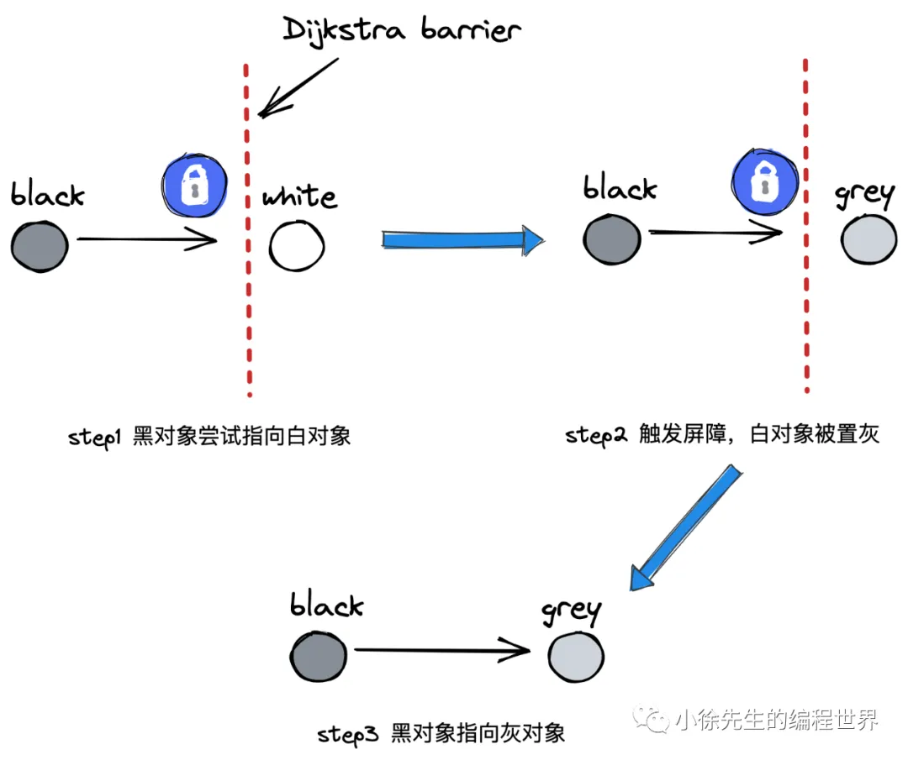
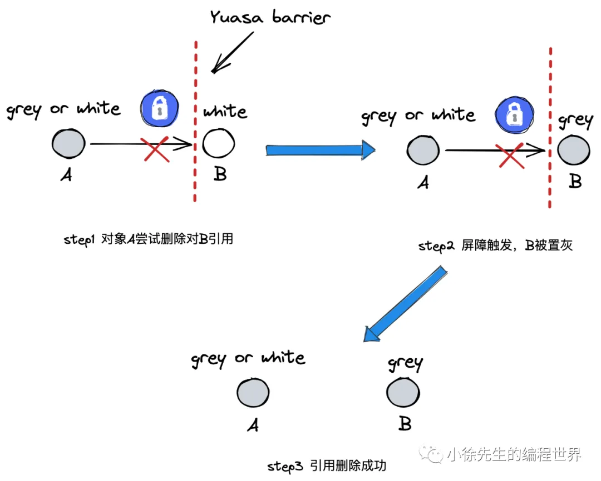
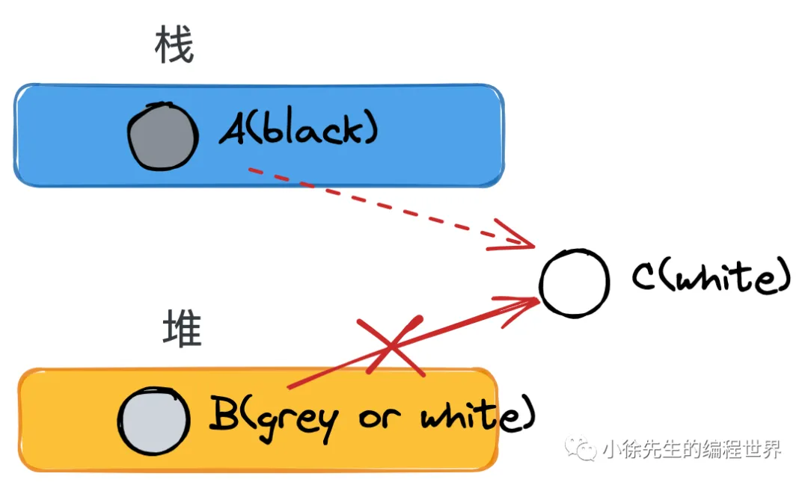
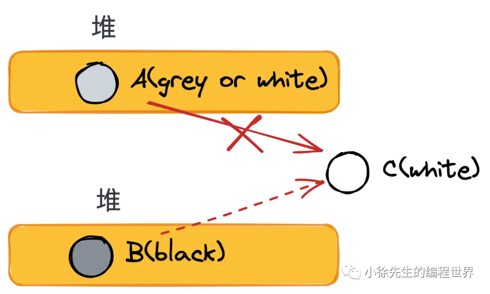
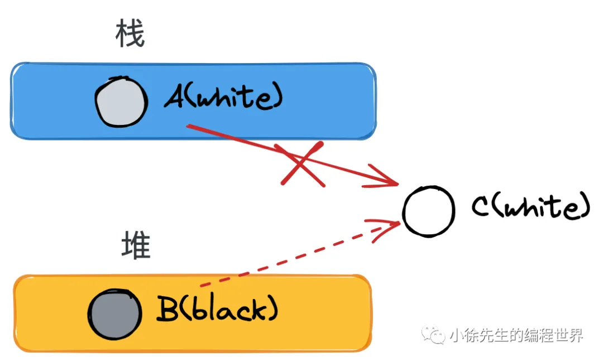
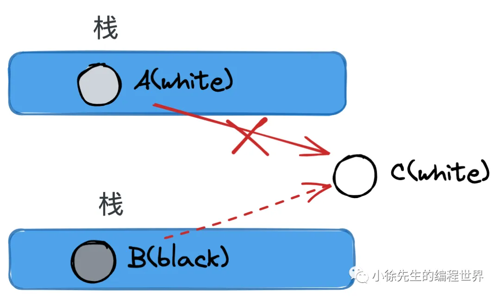

# 垃圾回收算法
## 标记清除算法

分为两步走：

- **标记**：标记出当前还存活的对象

- **清除**：清扫掉未被标记到的垃圾对象

**缺点**：会产生内存碎片。如果有大对象需要分配内存，可能会因为没有内存空间导致分配失败

## 标记压缩算法

也是两步走：

- **标记**：标记出当前还存活的对象

- **清除\+压缩**：在清除掉未被标记的垃圾对象的同时，对存活对象进行压缩整合，使得整体空间更为紧凑，解决内存空间问题

**缺点**：实现复杂

## 半空间复制算法

核心点：

- **分配两个相等大小的空间**，称为fromspace和tospace

- **每轮只使用fromspace空间**，以GC作为分水岭划分轮次

- **GC时，将fromspace中的存活对象转移到tospace中**，然后对tospace空间的对象进行压缩整合，同时清除fromspace空间中的垃圾对象

- **GC后，交换fromspace和tospace**，开启新的轮次

**优点**：解决了内存碎片问题

**缺点**：比较浪费空间

# Go的三色标记法

三色标记法的过程如下：

1. 每次新创建的对象，默认的颜色都是标记为【白色】

2. 每次GC回收开始，会从根节点开始遍历（非递归遍历，只遍历一次）所有对象，把遍历到的对象从【白色】集合放入【灰色】集合

3. 遍历【灰色】集合，将【灰色】对象引用的对象从【白色】集合放入【灰色】集合，之后将此【灰色】对象放入【黑色】集合

4. 重复第三步，直到【灰色】集合中没有对象为止

5. 此时全部内存的数据只有【黑色】和【白色】对象，回收所有【白色】标记的对象，因为它是不可达对象

# Go并发垃圾回收

在Go1\.5之前，GC时需要停止全部的用户协程，专注完成GC工作后，再恢复用户协程。

Go1\.5之后，引入了并发垃圾回收机制，允许用户协程和GC协程同时运行。

## 存在问题

### 可能存在漏标问题

漏标问题指的是在用户协程与GC协程并发执行的场景下，**部分存活对象未被标记从而被误删的情况**。这一问题产生的过程如下：

- 条件：初始时刻，对象B持有对象C的引用

- moment1：GC协程下，对象A被扫描完成，置黑；此时对象B是灰色，还未完成扫描

- moment2：用户协程下，对象A建立指向对象C的引用

- moment3：用户协程下，对象B删除指向对象C的引用

- moment4：GC协程下，开始执行对对象B的扫描

在上述场景中，由于GC协程在B删除C的引用后才开始扫描B，因此无法到达C\. 又因为A已经被置黑，不会再重复扫描，因此从扫描结果上看，C是不可达的

然而事实上，C应该是存活的（被A引用），而GC结束后会因为C仍为白色，因此被GC误删\.

漏标问题是无法接受，其引起的误删现象可能会导致程序出现致命的错误。**针对漏标问题，Golang 给出的解决方案是屏障机制的使用**。

### 可能存在多标问题

多标问题指的是在用户协程与GC协程并发执行的场景下，**部分垃圾对象被误标记从而导致GC未按时将其回收的问题**。这一问题产生的过程如下：

- 条件：初始时刻，对象A持有对象B的引用

- moment1：GC协程下，对象A被扫描完成，置黑；由于对象B被对象A引用，因此被置灰

- moment2：用户协程下，对象A删除指向对象B的引用

上述场景引发的问题是，在事实上，B在被A删除引用后，已成为垃圾对象，但由于其事先已被置灰，因此最终会更新为黑色，不会被GC删除

多标问题对比于漏标问题而言，是相对可以接受的。其导致本该被删但仍侥幸存活的对象被称为“浮动垃圾”，至多到下一轮GC，这部分对象就会被GC回收，因此错误可以得到弥补

# 屏障机制

## 强弱三色不变式

漏标问题的本质就是，**一个已经扫描完成的黑对象指向了一个被灰/白对象删除引用的白色对象**。构成这一场景的要素拆分如下：

1. 黑色对象指向了白色对象

2. 灰、白对象删除了白色对象

3. 1、2 步中谈及的白色对象是同一个对象

4. 1 发生在 2 之前

一套用于解决漏标问题的方法论称之为**强弱三色不变式**：

- **强三色不变式**：**白色对象不能被黑色对象直接引用**（直接破坏 1）

- **弱三色不变式**：**白色对象可以被黑色对象引用，但要从某个灰对象出发仍然可达该白对象**（间接破坏了 1、2 的联动）

## 插入写屏障

屏障机制类似于一个回调保护机制，指的是在完成某个特定动作前，会先完成屏障成设置的内容。

插入写屏障（Dijkstra）的目标是**实现强三色不变式**，**保证当一个黑色对象指向一个白色对象前，会先触发屏障将白色对象置为灰色，再建立引用。**

## 删除写屏障

删除写屏障（Yuasa barrier）的目标是**实现弱三色不变式，保证当一个白色对象即将被上游删除引用前，会触发屏障将其置灰，之后再删除上游指向其的引用。**

## 混合写屏障

插入写屏障、删除写屏障二者择其一，即可解决并发GC的漏标问题，**至于错标问题，则采用容忍态度，放到下一轮GC中进行延后处理即可。**

然而真实场景中，需要补充一个新的设定——**屏障机制无法作用于「栈对象」**

这是因为栈对象可能涉及频繁的轻量操作，倘若这些高频度操作都需要一一触发屏障机制，那么所带来的成本将是无法接受的。

在这一背景下，单独看插入写屏障或删除写屏障，都无法真正解决漏标问题，除非我们引入额外的Stop the world（STW）阶段，对栈对象的处理进行兜底。

**为了消除这个额外的 STW 成本，Golang 1\.8 引入了混合写屏障机制**，可以视为糅合了插入写屏障\+删除写屏障的加强版本，要点如下：

- **GC 开始前**，**以栈为单位分批扫描**，**将栈中所有对象置黑**

- **GC 期间**，**栈上新创建对象直接置黑**

- **堆对象正常启用插入写屏障**

- **堆对象正常启用删除写屏障**

下面通过几个 case，来论证混合写屏障机制是否真的能解决并发GC下的各种极端场景问题。

### Case1

堆对象删除引用，栈对象建立引用

- 背景：

    - 存在栈上对象A，黑色（扫描完）；

    - 存在堆上对象B，白色（未被扫描）；

    - 存在堆上对象C，白色（未被扫描），被堆上对象B引用

- moment1：A建立对C的引用，由于**栈无屏障机制**，因此正常建立引用，无额外操作

- moment2：B尝试删除对C的引用，删除写屏障被触发，C被置灰，因此不会漏标

### Case2

一个堆对象删除引用，成为另一个堆对象下游

- 背景：

    - 存在堆上对象A，白色（未被扫描）；

    - 存在堆上对象B，黑色（已完成扫描）；

    - 存在堆上对象C，白色（未被扫描），被堆上对象B引用

- moment1：B尝试建立对C的引用，插入写屏障被触发，C被置灰

- moment2：A删除对C的引用，此时C已置灰，因此不会漏标

### Case3

栈对象删除引用，成为堆对象下游

- 背景：

    - 存在栈上对象A，白色（未完成扫描，说明对应的栈未扫描）；

    - 存在堆上对象B，黑色（已完成扫描）；

    - 存在堆上对象C，白色（未被扫描），被栈上对象A引用

- moment1：B尝试建立对C的引用，插入写屏障被触发，C被置灰

- moment2：A删除对C的引用，此时C已置灰，因此不会漏标

### Case4

一个栈中对象删除引用，另一个栈中对象建立引用

- 背景：

    - 存在栈上对象A，白色（未扫描，这是因为对应的栈还未开始扫描）；

    - 存在栈上对象B，黑色（已完成扫描，说明对应的栈均已完成扫描）；

    - 存在堆上对象C，白色（未被扫描），被栈上对象A引用

- moment1：B建立对C的引用；

- moment2：A删除对C的引用\.

- 结论：这种场景下，C要么已然被置灰，要么从某个灰对象触发仍然可达C\.

- 原因在于，对象的引用不是从天而降，一定要有个来处。当前 case 中，对象B能建立指向C的引用，至少需要满足如下三个条件之一：

    1. 栈对象B原先就持有C的引用，如若如此，C就必然已处于置灰状态（因为B已是黑色）

    2. 栈对象B持有A的引用，通过A间接找到C。然而这也是不可能的，因为倘若A能同时被另一个栈上的B引用到，那样A必然会升级到堆中，不再满足作为一个栈对象的前提；

    3. B同栈内存在其他对象X可达C，此时从X出发，必然存在一个灰色对象，从其出发存在可达C的路线\.

综上，我们得以证明混合写屏障是能够胜任并发GC场景的解决方案，并且满足栈无须添加屏障的前提。
