# 概念梳理

## 线程

通常语义中的线程，指的是**内核级线程**，核心点如下：

（1）是操作系统**最小调度单元**；

（2）创建、销毁、调度交**由内核完成**，**cpu 需完成用户态与内核态间的切换**；

（3）可充分利用多核，**实现并行。**


## 协程

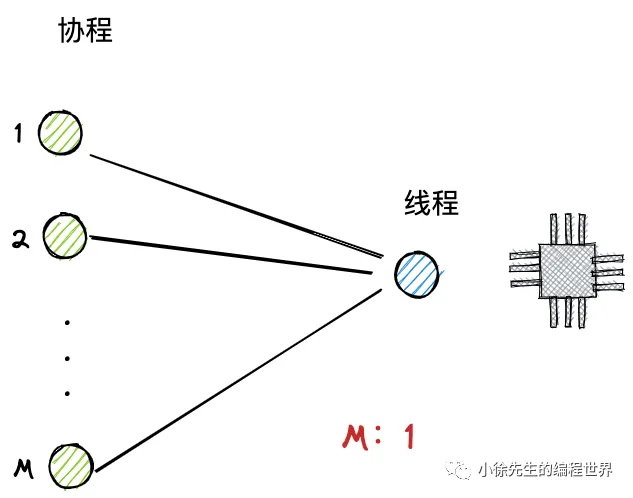

协程，又称为用户级线程，核心点如下：

（1）与线程存在映射关系，为 **M：1**；

（2）创建、销毁、调度**在用户态完成**，对内核透明，所以更轻；

（3）从属同一个内核级线程，**无法并行**；**一个协程阻塞会导致从属同一线程的所有协程无法执行。**


## goroutine

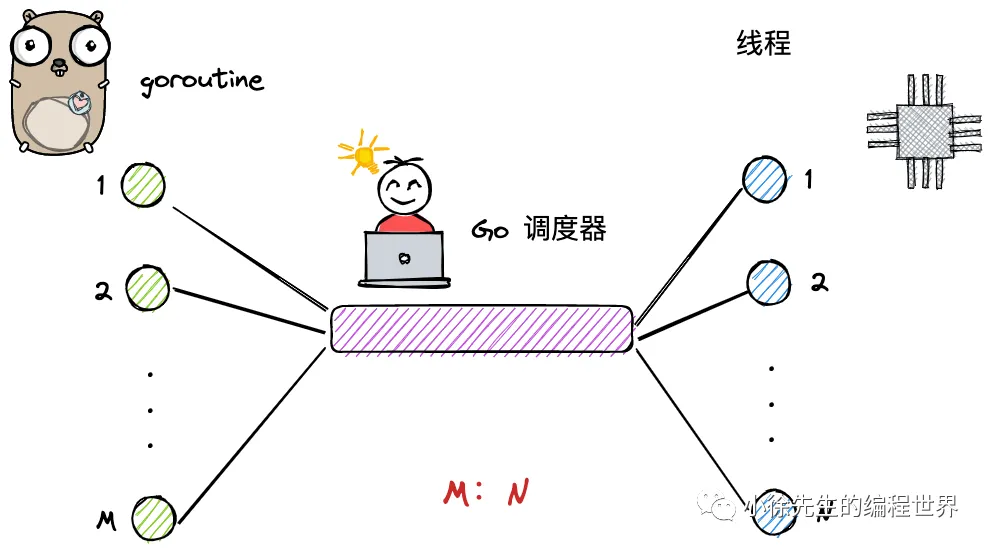

Goroutine，经 Golang 优化后的特殊“协程”，核心点如下：

（1）与线程存在映射关系，为 **M：N**；

（2）创建、销毁、调度**在用户态完成**，对内核透明，足够轻便；

（3）可利用多个线程，**实现并行**；

（4）通过调度器的斡旋，实现和线程间的动态绑定和灵活调度；

（5）**栈空间大小可动态扩缩**，因地制宜。


# GMP模型

gmp = **goroutine(g)** + **machine(m)** + **processor(p)** （+ 一套有机组合的机制）


## G

（1）g 即goroutine，是 golang 中对**协程**的抽象；

（2）g **有自己的运行栈、状态、以及执行的任务函数**（用户通过 go func 指定）；

（3）**g 需要绑定到 p 才能执行**，在 g 的视角中，**p 就是它的 cpu**。


## M

（1）m 即 machine，是 golang 中对**线程**的抽象；

（2）m **不直接执行 g**，而是**先和 p 绑定，由其实现代理**；

（3）借由 p 的存在，m 无需和 g 绑死，也无需记录 g 的状态信息，因此 g 在全生命周期中可以实现跨 m 执行.

（4）**一个M阻塞，P就会去创建或者切换另一个M**


## P

（1）p 即 processor，是 golang 中的**调度器**；

（2）**所有的P都在程序启动时创建，并保存在数组中，即「全局 P 列表」**；

（3）p 是 gmp 的中枢，借由 p 承上启下，实现 g 和 m 之间的动态有机结合；

（4）**对 g 而言，p 是其 cpu**，**g 只有被 p 调度，才得以执行**；

（5）**对 m 而言，p 是其执行代理**，为其提供必要信息的同时（可执行的 g、内存分配情况等），并隐藏了繁杂的调度细节；

（6）**p 的数量决定了 g 最大并行数量**，可由用户通过 **GOMAXPROCS** 进行设定（超过 CPU 核数时无意义）。


## GMP

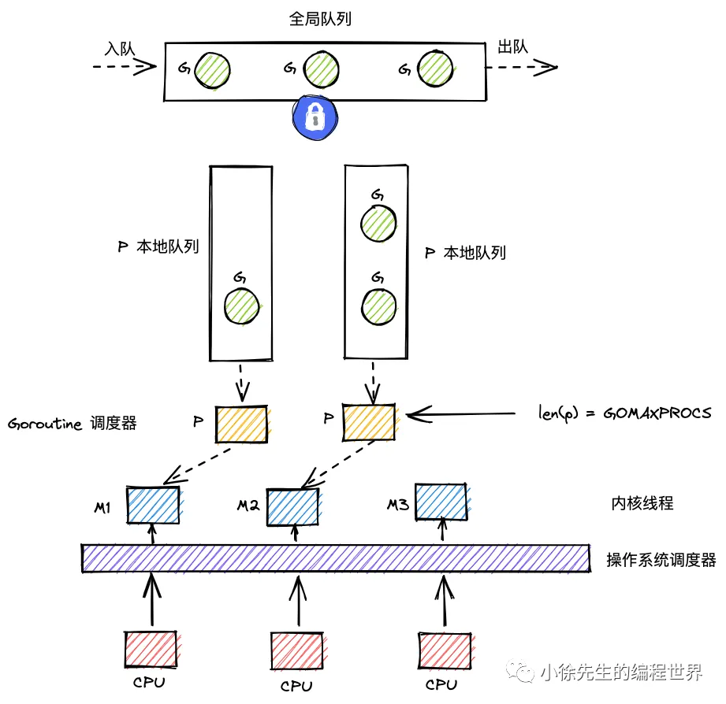

GMP 宏观模型如上图所示，下面对其要点和细节进行逐一介绍：

（1）M 是**线程**的抽象；G 是 **goroutine**；P 是承上启下的**调度器**；

（2）**M调度G前，需要和P绑定；**

（3）全局有多个M和多个P，但**同时并行的G的最大数量等于P的数量**；

（4）G的存放队列有三类：**P的本地队列、全局G队列、wait队列**（图中未展示，为io阻塞就绪态goroutine队列）；

（5）M调度G时，**优先取P本地队列，其次取全局G队列，最后取wait队列**；这样的好处是，取本地队列时，可以接近于无锁化，减少全局锁竞争；

（6）为防止不同P的闲忙差异过大，设立**work-stealing机制**，本地队列为空的P可以尝试从其他P本地队列偷取一半的G补充到自身队列。


## 调度器的设计策略

1. **复用线程**：避免频繁的创建、销毁线程，而是对线程的复用。

    1. **work stealing 机制**

    本地队列为空的P可以尝试从其他P本地队列偷取一半的G补充到自身队列，而不是销毁线程。

    2. **hand off 机制**

    当本地队列因为G进行系统调用阻塞时，线程释放绑定的P，把P转移给其他空闲的线程执行。

2. **利用并行**：`GOMAXPROCS`设置P的数量，最多有`GOMAXPROCS`个线程分布在多个CPU上同时运行。`GOMAXPROCS`也限制了并发的程度，比如`GOMAXPROCS` = 核数/2，则最多利用了一半的CPU核进行并行。

3. **抢占**：在coroutine中要等待一个协程主动让出CPU才执行下一个协程，在Go中，**一个goroutine最多占用CPU 10ms，防止其他goroutine被饿死**，这就是goroutine不同于coroutine的一个地方。

4. **全局G队列**：在新的调度器中依然有全局G队列，**当P的本地队列为空时，优先从全局G队列获取，如果全局G队列为空时则通过work stealing机制从其他P的本地队列偷取G**。


# 核心数据结构

## G

gmp 数据结构定义为 runtime/runtime2.go 文件中，由于各个类的成员属性较多，那么只摘取核心字段进行介绍。

```Go
type g struct {
    // ...
    m         *m
    // ...
    sched     gobuf
    // ...
}


type gobuf struct {
    sp   uintptr
    pc   uintptr
    ret  uintptr
    bp   uintptr // for framepointer-enabled architectures
}
```

1. g.m：在 p 的代理，**负责执行当前 g 的 m**；

2. g.sched：保存 goroutine 被调度出去时的执行现场，也就是 **goroutine 的调度上下文**。

    1. sched.sp：保存 CPU 的 rsp 寄存器的值，**指向函数调用栈栈顶**；

    2. sched.pc：保存 CPU 的 rip 寄存器的值，**指向程序下一条执行指令的地址**；

    3. sched.ret：保存**系统调用的返回值**；

    4. sched.bp：保存 CPU 的 rbp 寄存器的值，**存储函数栈帧的起始位置**.


其中 g 的生命周期由以下几种状态组成：

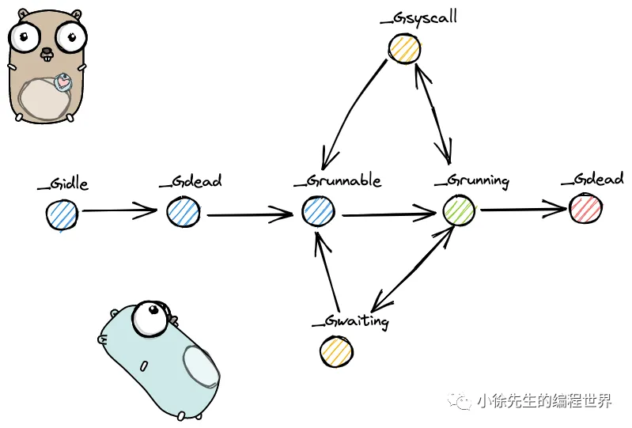

```Go
const(
  _Gidle = itoa // 0
  _Grunnable // 1
  _Grunning // 2
  _Gsyscall // 3
  _Gwaiting // 4
  _Gdead // 6
  _Gcopystack // 8
  _Gpreempted // 9
)
```

（1）_Gidle 值为 0，为协程**开始创建时**的状态，此时尚未初始化完成；

（2）_Grunnable 值 为 1，协程在待执行队列中，**等待被执行**；

（3）_Grunning 值为 2，协程**正在执行**，**同一时刻一个 p 中只有一个 g 处于此状态**；

（4）_Gsyscall 值为 3，协程**正在执行系统调用**；

（5）_Gwaiting 值为 4，协程处于挂起态，需要**等待被唤醒**。**gc、channel 通信或者锁操作时经常会进入这种状态**；

（6）_Gdead 值为 6，协程刚**初始化完成**或者**已经被销毁**，会处于此状态；

（7）_Gcopystack 值为 8，协程**正在栈扩容**流程中；

（8）_Greempted 值为 9，协程**被抢占**后的状态.


## M

```Go
type m struct {
    g0      *g     // goroutine with scheduling stack
    // ...
    tls           [tlsSlots]uintptr // thread-local storage (for x86 extern register)
    // ...
}
```

1. g0：一类特殊的调度协程，**不用于执行用户函数**，**负责执行 g 之间的切换调度**. 与 m 的关系为 1:1；

2. tls：thread-local storage，**线程本地存储**，**存储内容只对当前线程可见**。

    1. 线程本地存储的是 m.tls 的地址，**m.tls[0] 存储的是当前运行的 g**，因此线程可以通过 g 找到当前的 m、p、g0 等信息.


## P

```Go
type p struct {
    // ...
    runqhead uint32
    runqtail uint32
    runq     [256]guintptr

    runnext guintptr
    // ...
}
```

（1）**runq**：**本地 goroutine 队列**，**最大长度为 256**，本地队列属于P

（2）runqhead：**队列头部**；

（3）runqtail：**队列尾部**；

（4）runnext：**下一个可执行的 goroutine**.


## schedt

```Go
type schedt struct {
    // ...
    lock mutex
    // ...
    runq     gQueue
    runqsize int32
    // ...
}
```

sched 是**全局 goroutine 队列**的封装：

（1）lock：一把**操作全局队列时使用的锁**；

（2）runq：全局 goroutine 队列，全局队列属于 runtime 调度器，**所有 P 共享**；

（3）runqsize：全局 goroutine 队列的容量.


# 调度流程

## 两种G的转换（g0<->g）

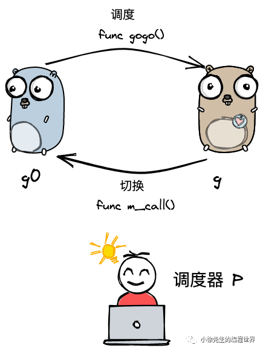

goroutine 的类型可分为两类：

1. 负责**调度普通 g 的 g0**，执行固定的调度流程，**与 m 的关系为一对一**；

2. 负责**执行用户函数的普通 g.**

m 通过 p 调度执行的 goroutine 永远在普通 g 和 g0 之间进行切换，**当 g0 找到可执行的 g 时，会调用 gogo 方法**，**调度 g 执行用户定义的任务**；**当 g 需要主动让渡或被动调度时，会触发 mcall 方法，将执行权重新交还给 g0.**

gogo 和 mcall 可以理解为对偶关系，其定义位于 runtime/stubs.go 文件中：

```Go
func gogo(buf *gobuf)
// ...
func mcall(fn func(*g))
```


## 调度类型

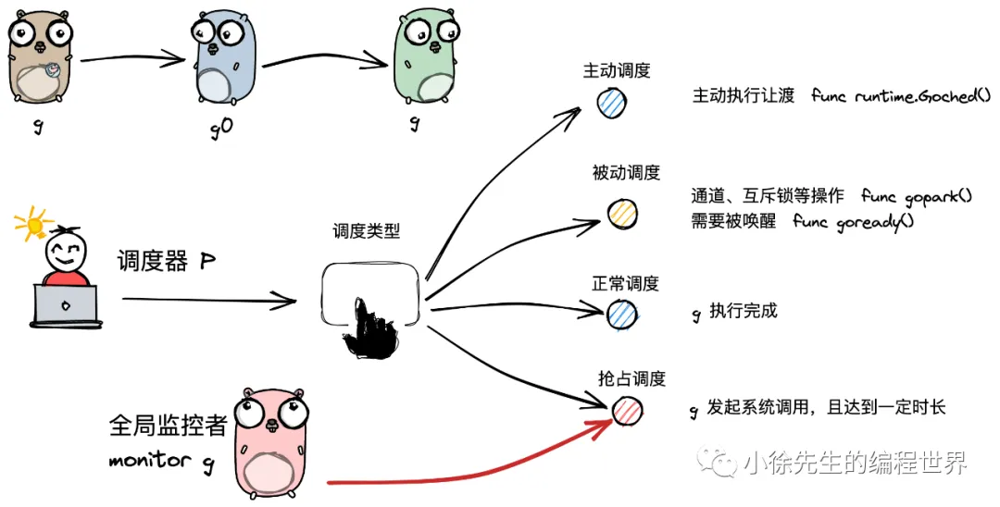

这里谈及的调度类型是广义上的“调度”，指的是调度器 p 实现从执行一个 g 切换到另一个 g 的过程。

可分为以下几种类型：

1. **主动调度**

一种用户主动执行让渡的方式，主要方式是，**用户在执行代码中调用了 runtime.Gosched 方法，此时当前 g 会当让出执行权，主动进入队列等待下次被调度执行**.

代码位于 runtime/proc.go：

```Go
func Gosched() {
    checkTimeouts()
    mcall(gosched_m)
}
```


2. **被动调度**

因**当前不满足某种执行条件，g 可能会陷入阻塞态无法被调度**，直到关注的条件达成后，g才从阻塞中被唤醒，重新进入可执行队列等待被调度.

常见的被动调度触发方式为**因 channel 操作**或**互斥锁操作**陷入阻塞等操作，**底层会走进 gopark 方法**.

代码位于 runtime/proc.go：

```Go
func gopark(unlockf func(*g, unsafe.Pointer) bool, lock unsafe.Pointer, reason waitReason, traceEv byte, traceskip int) {
    // ...
    mcall(park_m)
}
```

**goready 方法通常与 gopark 方法成对出现**，能够**将 g 从阻塞态中恢复，重新进入等待执行的状态**.

代码位于 runtime/proc.go：

```Go
func goready(gp *g, traceskip int) {
    systemstack(func() {
        ready(gp, traceskip, true)
    })
}
```


3. **正常调度**

g 中的执行任务已完成，g0 会将当前 g 置为**死亡状态（就是前文提到的g生命周期里的_Gdead状态）**，然后发起新一轮调度。


4. **抢占调度**

倘若 g 执行系统调用超过指定时长，且全局 P 资源紧缺，调度器会将 P 与 g 解绑，把 P 交还给其他 g 使用。等 g 完成系统调用后，会重新进入可执行队列中等待被调度.


值得一提的是，**前 3 种调度方式都由 m 下的 g0 完成，唯独抢占调度不同**。

因为发起系统调用时需要打破用户态的边界进入内核态，此时 M 陷入阻塞系统调用后没法继续运行 Go 调度器，无法主动完成抢占调度的行为.

因此，在 Golang 进程会有一个**全局监控协程 monitor g** 的存在，**这个 g 会越过 p 直接与一个 m 进行绑定，不断轮询对所有 p 的执行状况进行监控。**倘若发现满足抢占调度的条件，则会从第三方的角度出手干预，在必要时把 P 从 M 手中回收，让其他 M 使用。此外，monitor g 也负责发现长时间运行的 G 并触发抢占。


## 宏观调度流程

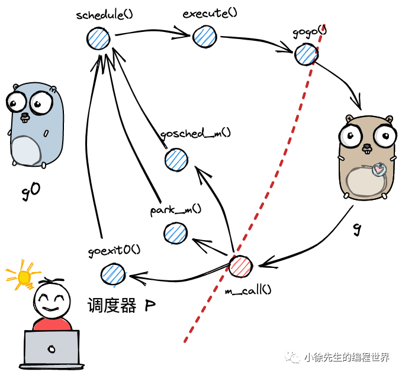

下面我们尝试对 gmp 的宏观调度流程进行整体串联：

（1）以 g0 -> g -> g0 的一轮循环为例进行串联；

（2）g0 执行 **schedule()** 函数，**寻找到用于执行的 g**；

（3）g0 执行 **execute()** 方法，**更新当前 g、p 的状态信息**，并调用 **gogo()** 方法，**将执行权交给 g**；

（4）g 因**主动让渡( gosche_m() )**、**被动调度( park_m() )**、**正常结束( goexit0() )**等原因，调用 **m_call** 函数，**执行权重新回到 g0 手中**；

（5）g0 执行 **schedule()** 函数，**开启新一轮循环**.


### Schedule()

调度流程的主干方法是位于 runtime/proc.go 中的 schedule 函数，此时的执行权位于 g0 手中：

```Go
func schedule() {
    // ...
    gp, inheritTime, tryWakeP := findRunnable() // blocks until work is available


    // ...
    execute(gp, inheritTime)
}
```

（1）**寻找到下一个执行的 goroutine**；

（2）**执行该 goroutine**.


#### FindRunnable()

findRunnable()用于**寻找到下一个执行的goroutine**。流程如下：

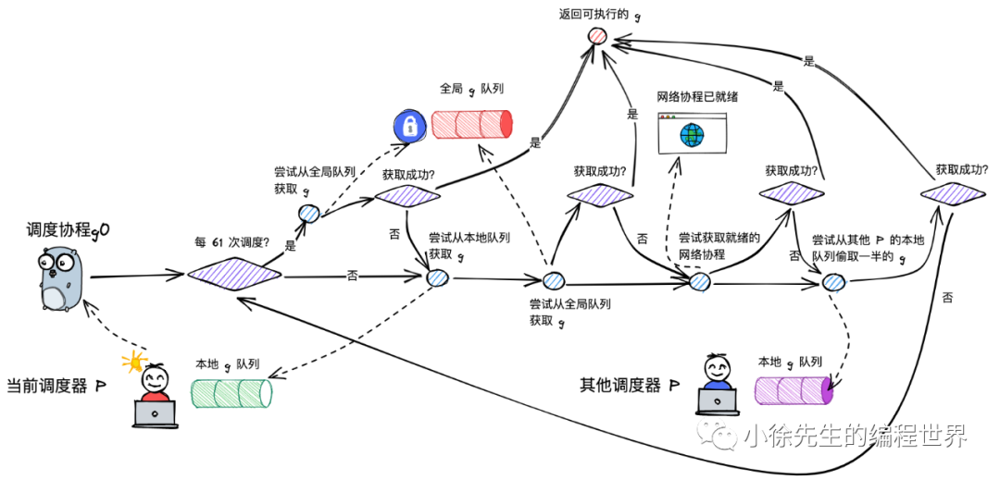

调度流程中，一个非常核心的步骤，就是为 m 寻找到下一个执行的 g，这部分内容位于 runtime/proc.go 的 findRunnable 方法中：

```Go
func findRunnable() (gp *g, inheritTime, tryWakeP bool) {
    _g_ := getg()


top:
    _p_ := _g_.m.p.ptr()
    // ...
    if _p_.schedtick%61 == 0 && sched.runqsize > 0 {
        lock(&sched.lock)
        gp = globrunqget(_p_, 1)
        unlock(&sched.lock)
        if gp != nil {
            return gp, false, false
        }
    }

    // ...
    if gp, inheritTime := runqget(_p_); gp != nil {
        return gp, inheritTime, false
    }

    // ...
    if sched.runqsize != 0 {
        lock(&sched.lock)
        gp := globrunqget(_p_, 0)
        unlock(&sched.lock)
        if gp != nil {
            return gp, false, false
        }
    }


    if netpollinited() && atomic.Load(&netpollWaiters) > 0 && atomic.Load64(&sched.lastpoll) != 0 {
        if list := netpoll(0); !list.empty() { // non-blocking
            gp := list.pop()
            injectglist(&list)
            casgstatus(gp, _Gwaiting, _Grunnable)
            return gp, false, false
        }
    }


    // ...
    procs := uint32(gomaxprocs)
    if _g_.m.spinning || 2*atomic.Load(&sched.nmspinning) < procs-atomic.Load(&sched.npidle) {
        if !_g_.m.spinning {
            _g_.m.spinning = true
            atomic.Xadd(&sched.nmspinning, 1)
        }


        gp, inheritTime, tnow, w, newWork := stealWork(now)
        now = tnow
        if gp != nil {
            // Successfully stole.
            return gp, inheritTime, false
        }
        if newWork {
            // There may be new timer or GC work; restart to
            // discover.
            goto top
        }
        if w != 0 && (pollUntil == 0 || w < pollUntil) {
            // Earlier timer to wait for.
            pollUntil = w
        }
    }


    //
```


1. **p 每执行 61 次调度，会从全局g队列中获取一个 goroutine 进行执行，并将一个全局g队列中的 goroutine 填充到当前 p 的本地队列中。**

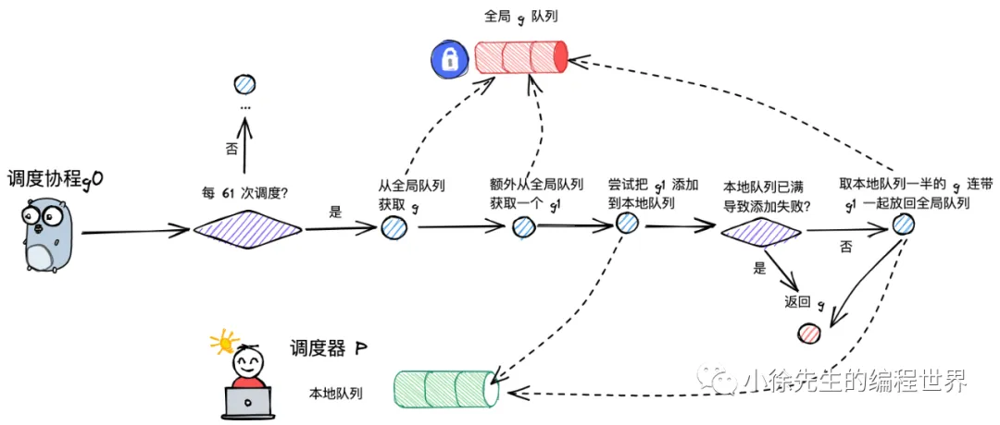

图中流程如下：

```Go
g0 每 61 次调度轮询全局队列
  ↓
从全局队列取出 g（要执行的）
  ↓
顺便再取一个 g1（想放进本地队列的）
  ↓
本地队列满了，g1 塞不进去
  ↓
执行runqputslow()：
  把本地队列前一半的 g 全部取出
  + g1 一并打包 → 扔回全局队列
  本地队列现在只剩后一半（腾出了空间）
  ↓
返回 g（直接拿去执行）
```

代码如下：

```Go
if _p_.schedtick%61 == 0 && sched.runqsize > 0 {
        lock(&sched.lock)
        gp = globrunqget(_p_, 1)
        unlock(&sched.lock)
        if gp != nil {
            return gp, false, false
        }
 }
```

除了获取一个 g 用于执行外，还会额外将一个 g1 从全局队列转移到 p 的本地队列，让全局队列中的 g 也得到更充分的执行机会.

```Go
func globrunqget(_p_ *p, max int32) *g {
    if sched.runqsize == 0 {
        return nil
    }


    n := sched.runqsize/gomaxprocs + 1
    if n > sched.runqsize {
        n = sched.runqsize
    }
    if max > 0 && n > max {
        n = max
    }
    if n > int32(len(_p_.runq))/2 {
        n = int32(len(_p_.runq)) / 2
    }


    sched.runqsize -= n


    gp := sched.runq.pop()
    n--
    for ; n > 0; n-- {
        gp1 := sched.runq.pop()
        runqput(_p_, gp1, false)
    }
    return gp
```

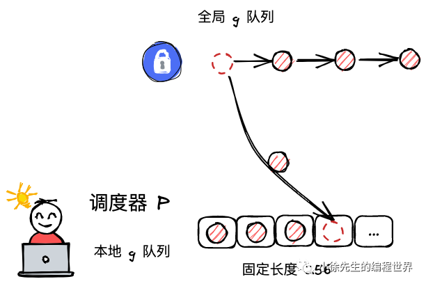

将一个 g 由全局队列转移到 p 本地队列的执行逻辑位于 runqput 方法中：

```Go
func runqput(_p_ *p, gp *g, next bool) {
    // ...


retry:
    h := atomic.LoadAcq(&_p_.runqhead) // load-acquire, synchronize with consumers
    t := _p_.runqtail
    if t-h < uint32(len(_p_.runq)) {
        _p_.runq[t%uint32(len(_p_.runq))].set(gp)
        atomic.StoreRel(&_p_.runqtail, t+1) // store-release, makes the item available for consumption
        return
    }
    if runqputslow(_p_, gp, h, t) {
        return
    }
    // the queue is not full, now the put above must succeed
    goto retry
```

I 取得 p 本地队列队首的索引，同时对本地队列加锁：

```Go
h := atomic.LoadAcq(&_p_.runqhead)
```

II 倘若 p 的局部队列未满，则成功转移 g，将 p 的队尾索引 runqtail 值加 1 并解锁队列.

```Go
if t-h < uint32(len(_p_.runq)) {
        _p_.runq[t%uint32(len(_p_.runq))].set(gp)
        atomic.StoreRel(&_p_.runqtail, t+1) // store-release, makes the item available for consumption
        return
   }
```

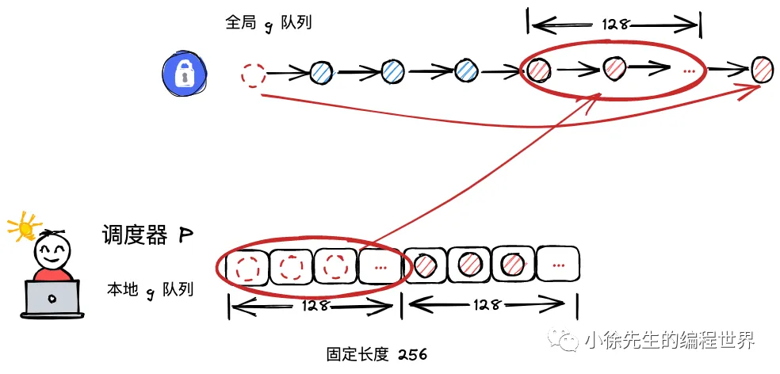

III 倘若发现本地队列 runq 已经满了，则会返回来将本地队列中一半的 g 放回全局队列中，帮助当前 p 缓解执行压力，这部分内容位于 runqputslow 方法中.

```Go
func runqputslow(_p_ *p, gp *g, h, t uint32) bool {
    var batch [len(_p_.runq)/2 + 1]*g
    // First, grab a batch from local queue.
    n := t - h
    n = n / 2

    // ...
    for i := uint32(0); i < n; i++ {
        batch[i] = _p_.runq[(h+i)%uint32(len(_p_.runq))].ptr()
    }
    if !atomic.CasRel(&_p_.runqhead, h, h+n) { // cas-release, commits consume
        return false
    }

    batch[n] = gp


    // Link the goroutines.
    for i := uint32(0); i < n; i++ {
        batch[i].schedlink.set(batch[i+1])
    }
    var q gQueue
    q.head.set(batch[0])
    q.tail.set(batch[n])


    // Now put the batch on global queue.
    lock(&sched.lock)
    globrunqputbatch(&q, int32(n+1))
    unlock(&sched.lock)
    return true
```


2. 尝试从 p 本地队列中获取一个可执行的 goroutine，核心逻辑位于 runqget 方法中：

```Go
if gp, inheritTime := runqget(_p_); gp != nil {
        return gp, inheritTime, false
    }
```

```Go
func runqget(_p_ *p) (gp *g, inheritTime bool) {
    if next != 0 && _p_.runnext.cas(next, 0) {
        return next.ptr(), true
    }


    for {
        h := atomic.LoadAcq(&_p_.runqhead) // load-acquire, synchronize with other consumers
        t := _p_.runqtail
        if t == h {
            return nil, false
        }
        gp := _p_.runq[h%uint32(len(_p_.runq))].ptr()
        if atomic.CasRel(&_p_.runqhead, h, h+1) { // cas-release, commits consume
            return gp, false
        }
    }
```

I 倘若当前 P 的 runnext 非空，通过 CAS 将其置零并取出执行；此时 `inheritTime` 返回 true，表示该 g 继承当前时间片，不重新计时。

```Go
if next != 0 && _p_.runnext.cas(next, 0) {
        return next.ptr(), true
    }
```

II CAS 从 p 的本地队列中获取 g.

通过 CAS 原子操作从 P 的本地队列中获取 g。虽然本地队列属于当前 P 独有，但 work-stealing 机制允许其他 P 来窃取，因此读取 head 指针时需使用 `atomic.LoadAcq` 保证可见性，后续通过 CAS 原子地推进 head，以此应对并发竞争，实现真正的无锁访问。

```Go
for {
        h := atomic.LoadAcq(&_p_.runqhead) // load-acquire, synchronize with other consumers
       // ...
   }
```

III 倘若本地队列为空，直接终止并返回；

```Go
h := atomic.LoadAcq(&_p_.runqhead) // load-acquire, synchronize with other consumers
        t := _p_.runqtail
        if t == h {
            return nil, false
       }
```

IV 倘若本地队列存在 g，取出队首的 g，通过 CAS 将 head 前移一位提交消费，成功后返回该 g。

```Go
gp := _p_.runq[h%uint32(len(_p_.runq))].ptr()
        if atomic.CasRel(&_p_.runqhead, h, h+1) { // cas-release, commits consume
            return gp, false
       }
```


3. 倘若本地队列没有可执行的 g，会从全局队列中获取：

```Go
if sched.runqsize != 0 {
        lock(&sched.lock)
        gp := globrunqget(_p_, 0)
        unlock(&sched.lock)
        if gp != nil {
            return gp, false, false
        }
    }
```

mutex加锁，尝试并从全局队列中取队首的元素。


4. 倘若本地队列和全局队列都没有 g，则会获取准备就绪的网络协程：

```Go
if netpollinited() && atomic.Load(&netpollWaiters) > 0 && atomic.Load64(&sched.lastpoll) != 0 {
        if list := netpoll(0); !list.empty() { // non-blocking
            gp := list.pop()
            injectglist(&list)
            casgstatus(gp, _Gwaiting, _Grunnable)
            return gp, false, false
        }
  }
```

需要注意的是，刚获取网络协程时，g 的状态是处于 waiting 的，因此需要先更新为 runnable 状态.


5. work-stealing: 从其他 p 中偷取 g。

```Go
func stealWork(now int64) (gp *g, inheritTime bool, rnow, pollUntil int64, newWork bool) {
    pp := getg().m.p.ptr()


    ranTimer := false


    const stealTries = 4
    for i := 0; i < stealTries; i++ {
        stealTimersOrRunNextG := i == stealTries-1


        for enum := stealOrder.start(fastrand()); !enum.done(); enum.next() {
            // ...
        }
    }


    return nil, false, now, pollUntil, ranTime
```

**偷取操作最多进行 4 轮尝试。每一轮都会按一个随机顺序去检查其他 P，看它们的本地运行队列里有没有 G 可以偷**，过程中只要找到可窃取的 p 则会立即返回；如果没找到，会继续尝试其他来源：

```Go
stealWork 返回 nil
        ↓
检查 netpoll（网络事件有没有就绪的 g）
        ↓
检查 timer（有没有到期的定时器）
        ↓
再次检查全局队列
        ↓
真的什么都没有 → M 解绑 P，P 进入空闲列表
              → M 陷入休眠（park），等待被唤醒
```

为保证窃取行为的公平性，遍历的起点是随机的。窃取动作的核心逻辑位于 runqgrab 方法当中：

```Go
func runqgrab(_p_ *p, batch *[256]guintptr, batchHead uint32, stealRunNextG bool) uint32 {
    for {
        h := atomic.LoadAcq(&_p_.runqhead) // load-acquire, synchronize with other consumers
        t := atomic.LoadAcq(&_p_.runqtail) // load-acquire, synchronize with the producer
        n := t - h
        n = n - n/2
        if n == 0 {
            if stealRunNextG {
                // Try to steal from _p_.runnext.
                if next := _p_.runnext; next != 0 {
                    if _p_.status == _Prunning {

                        if GOOS != "windows" && GOOS != "openbsd" && GOOS != "netbsd" {
                            usleep(3)
                        } else {
                            osyield()
                        }
                    }
                    if !_p_.runnext.cas(next, 0) {
                        continue
                    }
                    batch[batchHead%uint32(len(batch))] = next
                    return 1
                }
            }
            return 0
        }
        if n > uint32(len(_p_.runq)/2) { // read inconsistent h and t
            continue
        }
        for i := uint32(0); i < n; i++ {
            g := _p_.runq[(h+i)%uint32(len(_p_.runq))]
            batch[(batchHead+i)%uint32(len(batch))] = g
        }
        if atomic.CasRel(&_p_.runqhead, h, h+n) { // cas-release, commits consume
            return n
        }
    }
}
```

I 每次对一个 p 尝试窃取前，会通过原子操作读取目标 P 的 head 和 tail 指针，获取当前队列的状态快照，为后续计算可窃取数量做准备。

```Go
h := atomic.LoadAcq(&_p_.runqhead) // load-acquire, synchronize with other consumers
        t := atomic.LoadAcq(&_p_.runqtail) // load-acquire, synchronize with the producer
```

II 尝试偷取其现有的一半 g，并且返回实际偷取的数量.

```Go
n := t - h
        n = n - n/2

        // ...

        for i := uint32(0); i < n; i++ {
            g := _p_.runq[(h+i)%uint32(len(_p_.runq))]
            batch[(batchHead+i)%uint32(len(batch))] = g
        }
        if atomic.CasRel(&_p_.runqhead, h, h+n) { // cas-release, commits consume
            return n
        }
```


#### execute()

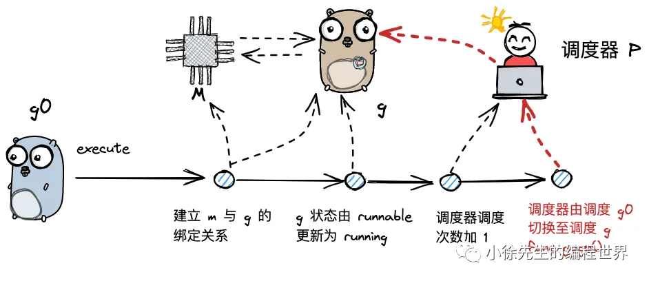

当 g0 为 m 寻找到可执行的 g 之后，接下来就开始执行 g. 这部分内容位于 runtime/proc.go 的 execute 方法中：

```Go
func execute(gp *g, inheritTime bool) {
    _g_ := getg()


    _g_.m.curg = gp
    gp.m = _g_.m
    casgstatus(gp, _Grunnable, _Grunning)
    gp.waitsince = 0
    gp.preempt = false
    gp.stackguard0 = gp.stack.lo + _StackGuard
    if !inheritTime {
        _g_.m.p.ptr().schedtick++
    }


    gogo(&gp.sched)
```

（1）更新 g 的状态信息，建立 g 与 m 之间的绑定关系；

（2）更新 p 的总调度次数；

（3）调用 gogo 方法，执行 goroutine 中的任务.


### gosched_m

g 执行**主动让渡**时，会**调用 mcall 方法将执行权归还给 g0**，并由 **g0 调用 gosched_m 方法**，位于 runtime/proc.go 文件中：

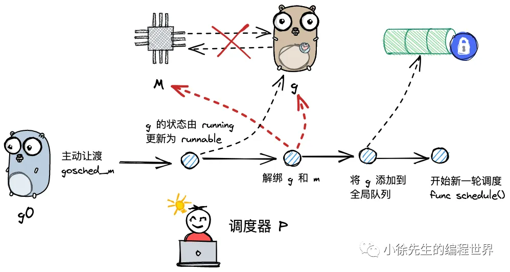

```Go
func Gosched() {
    // ...
    mcall(gosched_m)
}
```

```Go
func gosched_m(gp *g) {
    goschedImpl(gp)
}


func goschedImpl(gp *g) {
    status := readgstatus(gp)
    if status&^_Gscan != _Grunning {
        dumpgstatus(gp)
        throw("bad g status")
    }
    casgstatus(gp, _Grunning, _Grunnable)
    dropg()
    lock(&sched.lock)
    globrunqput(gp)
    unlock(&sched.lock)


    schedule()
```

（1）将当前 g 的状态由执行中切换为待执行 _Grunnable：

```Go
casgstatus(gp, _Grunning, _Grunnable)
```

（2）调用 dropg() 方法，将当前的 m 和 g 解绑；

```Go
func dropg() {
    _g_ := getg()


    setMNoWB(&_g_.m.curg.m, nil)
    setGNoWB(&_g_.m.curg, nil)
}
```

（3）将 g 添加到全局队列当中：

```Go
lock(&sched.lock)
    globrunqput(gp)
    unlock(&sched.lock
```

（4）开启新一轮的调度：

```Go
schedule()
```


### park_m和ready

g 需要**被动调度**时，会**调用 mcall 方法切换至 g0**，并**调用 park_m 方法将 g 置为阻塞态**，执行流程位于 runtime/proc.go 的 gopark 方法当中：

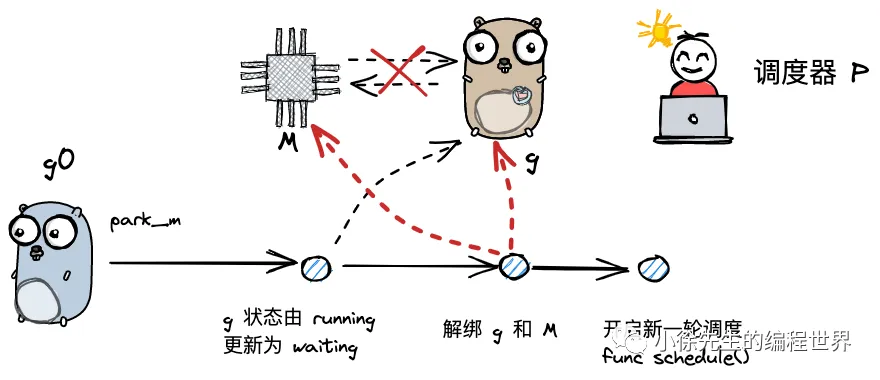

```Go
func gopark(unlockf func(*g, unsafe.Pointer) bool, lock unsafe.Pointer, reason waitReason, traceEv byte, traceskip int) {
    // ...
    mcall(park_m)
}
```

```Go
func park_m(gp *g) {
    _g_ := getg()


    casgstatus(gp, _Grunning, _Gwaiting)
    dropg()


    // ...
    schedule()
```

（1）将当前 g 的状态由 running 改为 waiting；

（2）将 g 与 m 解绑；

（3）执行新一轮的调度 schedule.


当因被动调度陷入阻塞态的 g 需要被唤醒时，会由其他协程执行 **goready** 方法将 g 重新置为可执行的状态，方法位于 runtime/proc.go .

被动调度如果需要唤醒，则被其他 g 负责将 g 的状态由 waiting 改为 runnable，然后**会将其添加到唤醒者的 p 的本地队列中**：

```Go
func goready(gp *g, traceskip int) {
    systemstack(func() {
        ready(gp, traceskip, true)
    })
}
```

```Go
func ready(gp *g, traceskip int, next bool) {
    // ...
    _g_ := getg()
    // ...
    casgstatus(gp, _Gwaiting, _Grunnable)
    runqput(_g_.m.p.ptr(), gp, next)
    // ...
}
```

（1）先将 g 的状态从阻塞态改为可执行的状态；

（2）调用 runqput 将当前 g 添加到唤醒者 p 的本地队列中，如果队列满了，会连带 g 一起将一半的元素转移到全局队列.


### goexit0

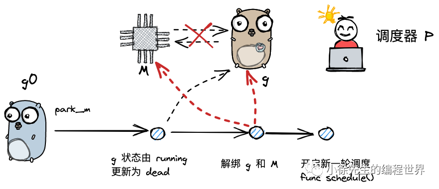

当 g 执行完成时，会先执行 mcall 方法切换至 g0，然后调用 goexit0 方法，内容为 runtime/proc.go：

```Go
// Finishes execution of the current goroutine.
func goexit1() {
    // ...
    mcall(goexit0)
}
```

```Go
func goexit0(gp *g) {
    _g_ := getg()
    _p_ := _g_.m.p.ptr()


    casgstatus(gp, _Grunning, _Gdead)
    // ...
    gp.m = nil
    // ...


    dropg()


    // ...
    schedule()
```

（1）将 g 状态置为 _Gdead；

（2）解绑 g 和 m；

（3）开启新一轮的调度.


### retake

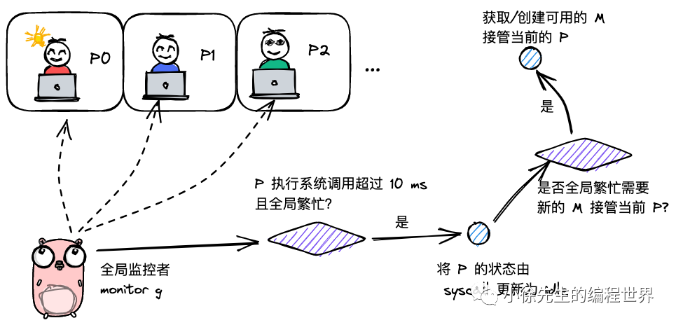

`retake` 这条路径不是靠“当前这个 M 的 g0 主动发起”，而是由 monitor g 从外部检测并发起抢占。

```Go
func retake(now int64) uint32 {
    n := 0

    lock(&allpLock)
    for i := 0; i < len(allp); i++ {
        _p_ := allp[i]
        if _p_ == nil {
            // This can happen if procresize has grown
            // allp but not yet created new Ps.
            continue
        }
        pd := &_p_.sysmontick
        // ...
        if s == _Psyscall {
            // ...
            if runqempty(_p_) && atomic.Load(&sched.nmspinning)+atomic.Load(&sched.npidle) > 0 && pd.syscallwhen+10*1000*1000 > now {
                continue
            }
            unlock(&allpLock)
            if atomic.Cas(&_p_.status, s, _Pidle) {
                n++
                _p_.syscalltick++
                handoffp(_p_)
            }
            incidlelocked(1)
            lock(&allpLock)
        }
    }
    unlock(&allpLock)
    return uint32(n)
}
```

（1）加锁后，遍历全局的 p 队列，寻找需要被抢占的目标：

```Go
lock(&allpLock)
    for i := 0; i < len(allp); i++ {
        _p_ := allp[i]
        // ...
    }
    unlock(&allpLock)
```

（2）倘若某个 p **同时满足**下述条件，则会进行抢占调度：

I 执行系统调用超过 10 ms；

II p 本地队列有等待执行的 g；

III 或者当前没有空闲的 p 和 m.

```Go
if s == _Psyscall {
            // ...
            if runqempty(_p_) && atomic.Load(&sched.nmspinning)+atomic.Load(&sched.npidle) > 0 && pd.syscallwhen+10*1000*1000 > now {
                continue
            }
            // ... 抢占调度
            lock(&allpLock)
        }
```

（3）抢占调度的步骤是，先将当前 p 的状态更新为 idle，然后步入 handoffp 方法中，判断是否需要为 p 寻找接管的 m（因为其原本绑定的 m 正在执行系统调用）：

```Go
if atomic.Cas(&_p_.status, s, _Pidle) {
                n++
                _p_.syscalltick++
                handoffp(_p_)
            }
```

（4）当以下四个条件**满足其一**时，则需要为 p 获取新的 m：

I 当前 p 本地队列还有待执行的 g；

II 全局繁忙（没有空闲的 p 和 m，全局 g 队列为空）

III 需要处理网络 socket 读写请求

```Go
func handoffp(_p_ *p) {
    if !runqempty(_p_) || sched.runqsize != 0 {
        startm(_p_, false)
        return
    }


    if atomic.Load(&sched.nmspinning)+atomic.Load(&sched.npidle) == 0 && atomic.Cas(&sched.nmspinning, 0, 1) {
        startm(_p_, true)
        return
    }

    lock(&sched.lock)
    // ...
    if sched.runqsize != 0 {
        unlock(&sched.lock)
        startm(_p_, false)
        return
    }
    // If this is the last running P and nobody is polling network,
    // need to wakeup another M to poll network.
    if sched.npidle == uint32(gomaxprocs-1) && atomic.Load64(&sched.lastpoll) != 0 {
        unlock(&sched.lock)
        startm(_p_, false)
        return
    }


    // ...
```

（5）获取 m 时，会先尝试获取已有的空闲的 m，若不存在，则会创建一个新的 m.

```Go
func startm(_p_ *p, spinning bool) {

    mp := acquirem()
    lock(&sched.lock)
    // ...

    nmp := mget()
    if nmp == nil {
        id := mReserveID()
        unlock(&sched.lock)


        var fn func()
        // ...
        newm(fn, _p_, id)
        // ...
        return
    }
    unlock(&sched.lock)
    // ...
}
```


# 调度器的生命周期

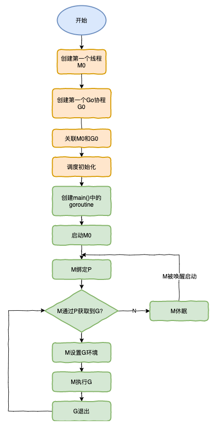

**M0**
M0是启动程序后的编号为0的主线程，这个M对应的实例会在全局变量runtime.m0中，不需要在heap上分配，**M0负责执行初始化操作和启动第一个G，** 在之后M0就和其他的M一样了。


**G0**
**G0是每次启动一个M都会第一个创建的gourtine**，**G0仅用于负责调度的G**，G0不指向任何可执行的函数, 每个M都会有一个自己的G0。在调度或系统调用时会使用G0的栈空间, 全局变量的G0是M0的G0。


# Go 调度器场景过程全解析

## 场景1：G1 创建 G2

P拥有G1，M1获取P后开始运行G1，G1使用go func()创建了G2，为了局部性G2优先加入到P的本地队列。

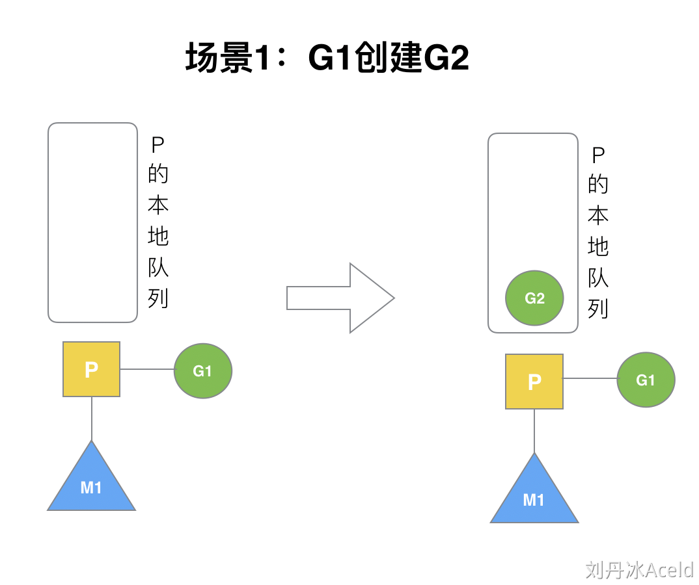


## 场景2：G1 执行完毕

G1运行完成后(函数：goexit)，M上运行的goroutine切换为G0，G0负责调度时协程的切换（函数：schedule）。从P的本地队列取G2，从G0切换到G2，并开始运行G2(函数：execute)。实现了线程M1的复用。

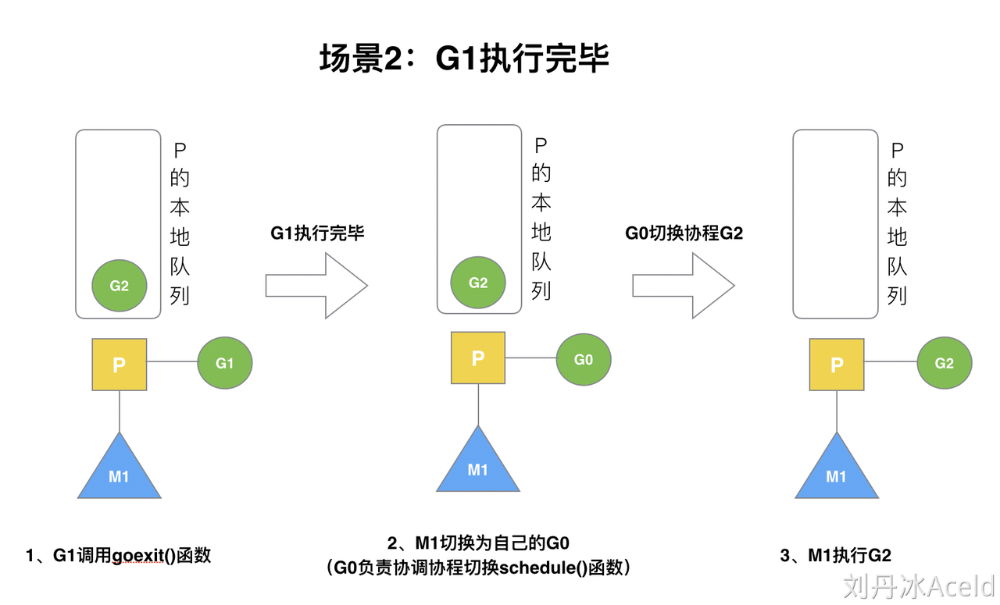


## 场景3：G2 开辟过多的 G

假设每个P的本地队列只能存4个G。G2要创建了6个G，前4个G（G3, G4, G5, G6）已经加入p1的本地队列，p1本地队列满了。

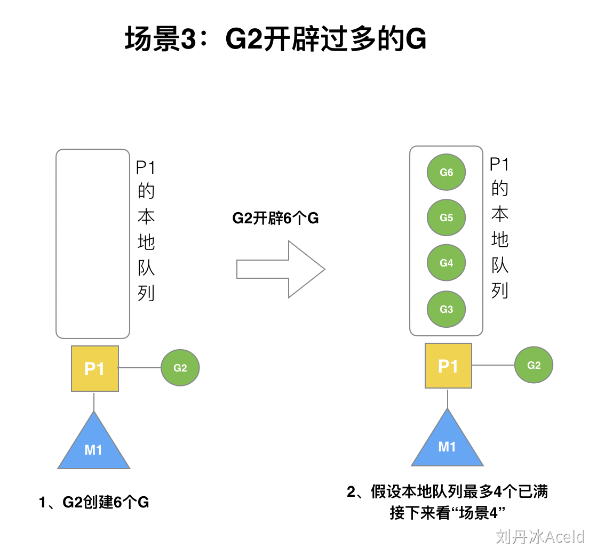


## 场景4：G2 本地满再创建 G7

G2在创建G7的时候，发现P1的本地队列已满，需要执行**负载均衡**(把P1中本地队列中前一半的G(G3, G4)，还有新创建G**转移**到全局队列)

> 实现中并不一定是新的G，如果G是G2之后就执行的，会被保存在本地队列，利用某个老的G替换新G加入全局队列
>
>

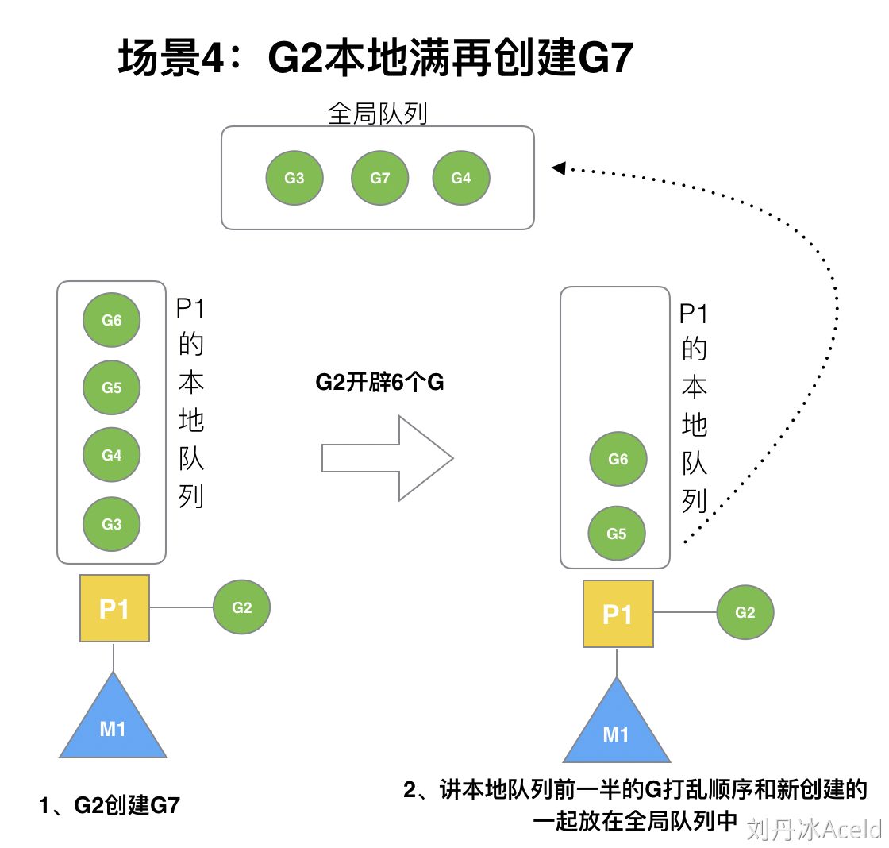

这些G被转移到全局队列时，**会被打乱顺序**。所以G3,G4,G7被转移到全局队列。


## 场景5：G2 本地未满创建 G8

G2创建G8时，P1的本地队列未满，所以G8会被加入到P1的本地队列。

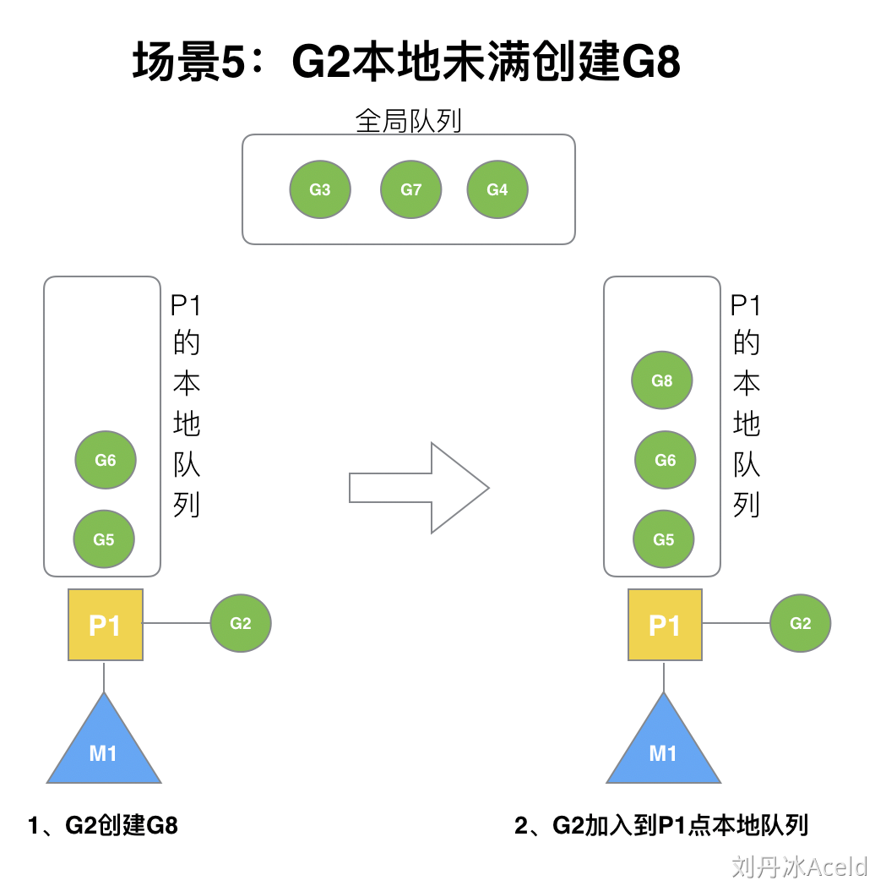

G8加入到P1点本地队列的原因还是因为P1此时在与M1绑定，而G2此时是M1在执行。所以G2创建的新的G会优先放置到自己的M绑定的P上。


## 场景6：唤醒正在休眠的M

规定：**在创建G时，运行的G会尝试唤醒其他空闲的P和M组合去执行**。

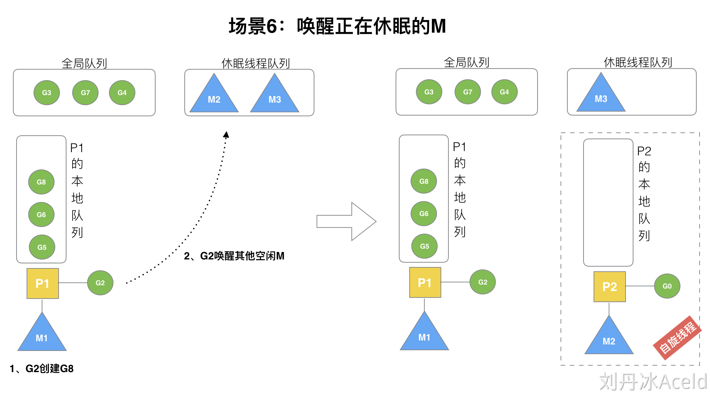

假定G2唤醒了M2，M2绑定了P2，并运行G0，但P2本地队列没有G，M2此时为**自旋线程（没有G但为运行状态的线程，不断寻找G）**。


## 场景7：被唤醒的M2从全局队列取批量G

M2尝试从全局队列(简称“GQ”)取一批G放到P2的本地队列（函数：findrunnable()）。M2从全局队列取的G数量符合下面的公式：

```Go
n =  min(len(GQ) / GOMAXPROCS +  1,  cap(LQ) / 2 )
```

至少从全局队列取1个g，但每次不要从全局队列移动太多的g到p本地队列，给其他p留点。这是**从全局队列到P本地队列的负载均衡**。

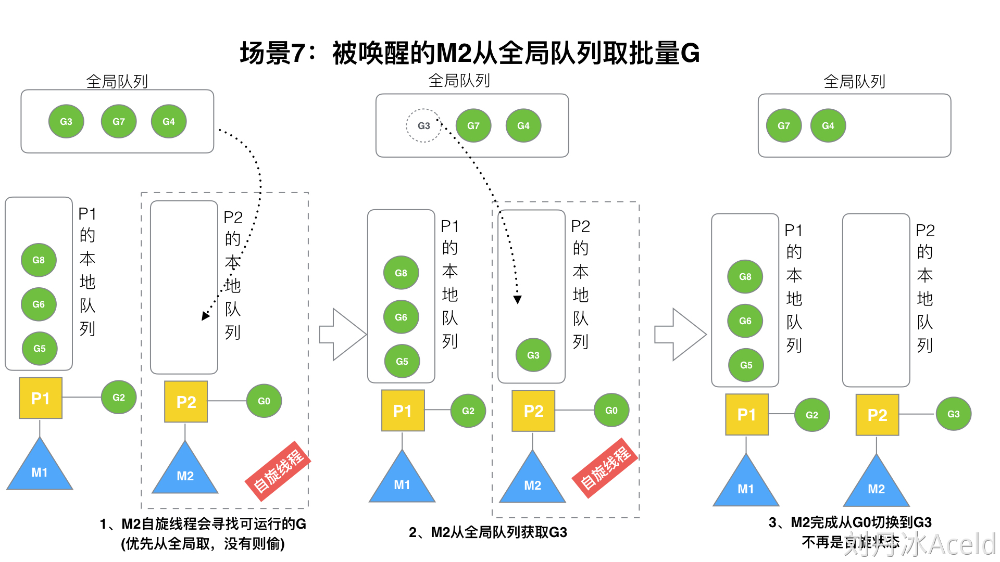

假定我们场景中一共有4个P（GOMAXPROCS设置为4，那么我们允许最多就能用4个P来供M使用）。所以M2只从能从全局队列取1个G（即G3）移动P2本地队列，然后完成从G0到G3的切换，运行G3。


## 场景8：M2从M1中偷取G

假设G2一直在M1上运行，经过2轮后，M2已经把G7、G4从全局队列获取到了P2的本地队列并完成运行，全局队列和P2的本地队列都空了,如场景8图的左半部分。

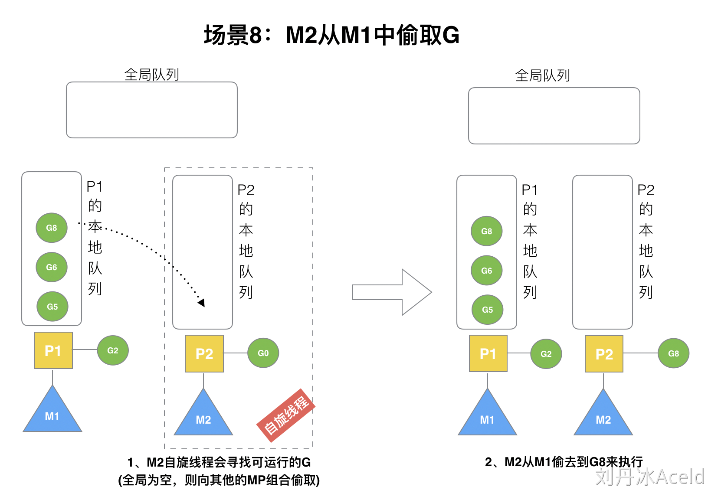

**全局队列已经没有G，那M就要执行work stealing(偷取)：从其他有G的P哪里偷取一半G过来，放到自己的P本地队列**。P2从P1的本地队列**尾部**取一半的G，本例中一半则只有1个G8，放到P2的本地队列并执行。


## 场景9：自旋线程的最大限制

P1本地队列中的G5、G6已经被其他M偷走并运行完成，当前M1和M2分别在运行G2和G8，M3和M4没有goroutine可以运行，M3和M4处于**自旋状态**，它们不断寻找goroutine。

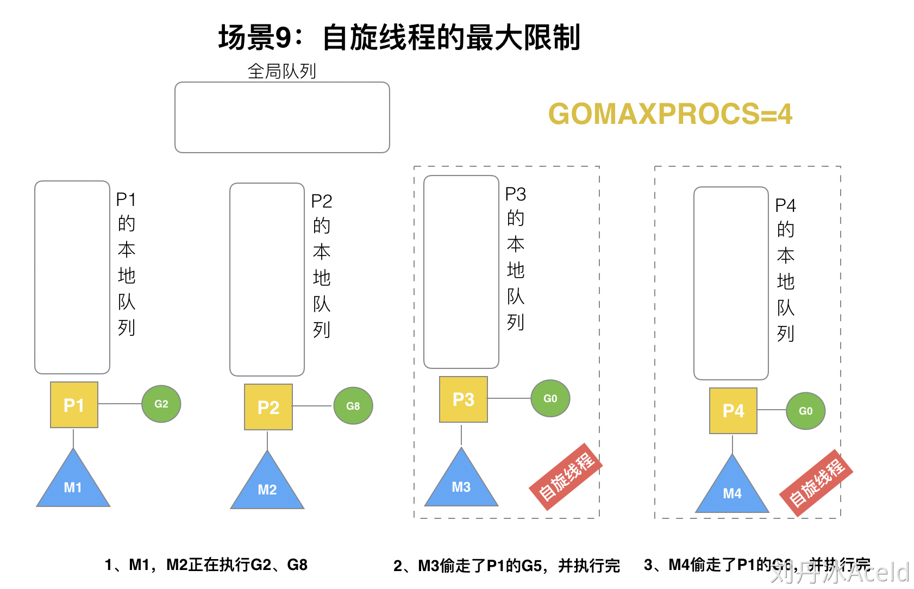

为什么要让m3和m4自旋，自旋本质是在运行，线程在运行却没有执行G，就变成了浪费CPU.  为什么不销毁现场，来节约CPU资源。因为创建和销毁CPU也会浪费时间，我们**希望当有新goroutine创建时，立刻能有M运行它**，如果销毁再新建就增加了时延，降低了效率。当然也考虑了过多的自旋线程是浪费CPU，所以系统中最多有GOMAXPROCS个自旋的线程(当前例子中的GOMAXPROCS=4，所以一共4个P)，多余的没事做线程会让他们休眠。


## 场景10：G 发生系统调用/阻塞

假定当前除了M3和M4为自旋线程，还有M5和M6为空闲的线程(没有得到P的绑定，注意我们这里最多就只能够存在4个P，所以P的数量应该永远是M>=P, 大部分都是M在抢占需要运行的P)，G8创建了G9，G8进行了**阻塞的系统调用**，M2和P2立即解绑，P2会执行以下判断：如果P2本地队列有G、全局队列有G或有空闲的M，P2都会立马唤醒1个M和它自己绑定，否则P2则会加入到空闲P列表，等待M来获取可用的p。本场景中，P2本地队列有G9，可以和其他空闲的线程M5绑定。

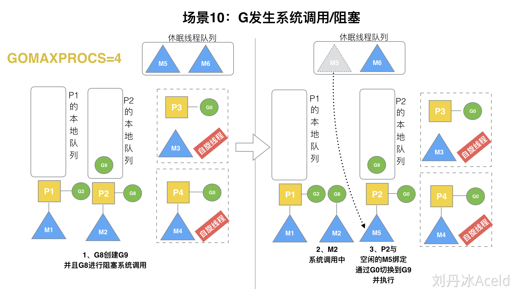


## 场景11：G 发生系统调用/非阻塞

G8创建了G9，假如G8进行了**非阻塞系统调用**。

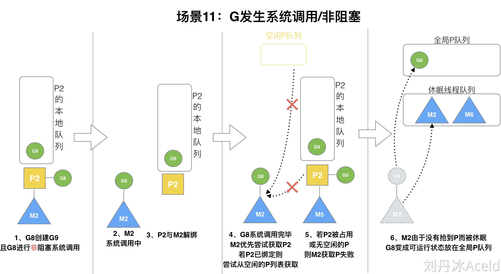

M2和P2会解绑，但**M2会记住P2**，然后G8和M2进入**系统调用**状态。当G8和M2退出系统调用时，会尝试获取P2，如果无法获取，则获取空闲的P，如果依然没有，G8会被记为可运行状态，并加入到全局队列，M2因为没有P的绑定而变成休眠状态(长时间休眠等待GC回收销毁)。
