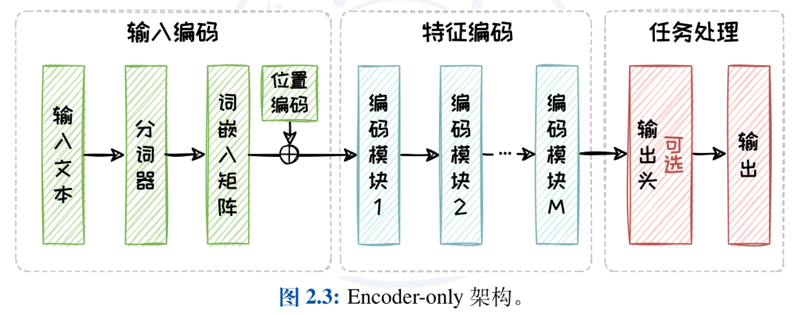
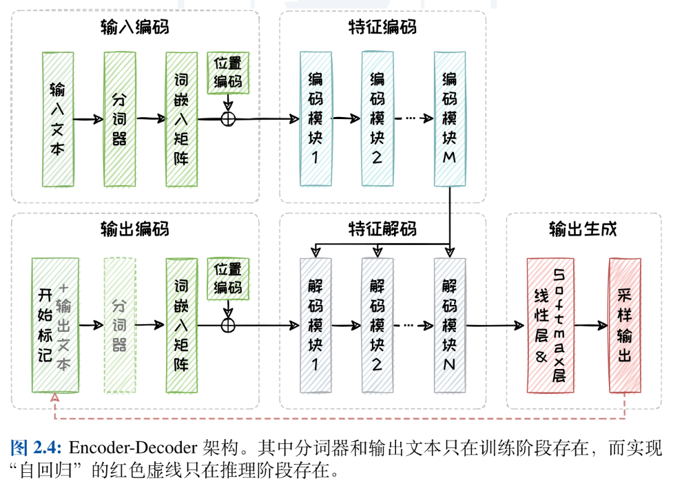
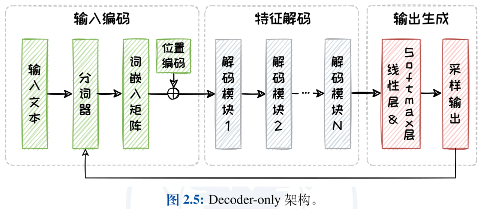
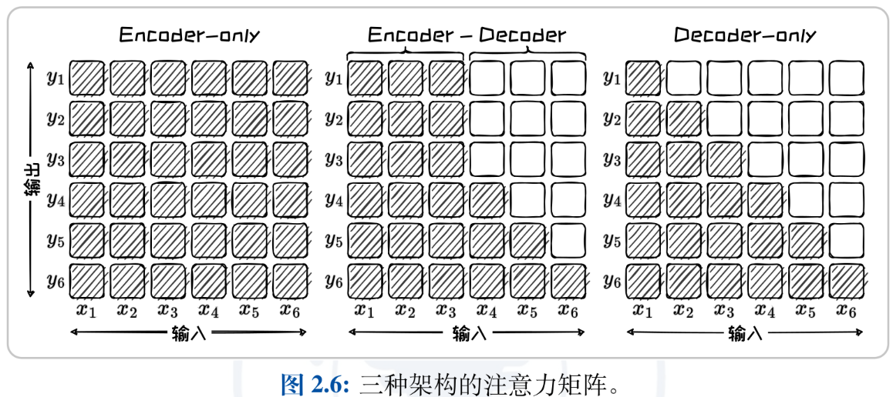



 Notes written after reading the textbook "Foundation of Large Models" from Zhejiang University 

## Preface

The development of large model technology can be described as "rapidly evolving," with seemingly groundbreaking advancements happening every day. 🤔

In reality, how effective are these "groundbreaking advancements"? What is their actual value in engineering practice? Ultimately, these questions must be traced back to those "ordinary" classic principles.

It's certainly a good thing to keep up with the latest developments in large model technology: it helps us understand research directions and broaden our thinking. However, we should not only focus on the ever-evolving top-tier technologies but also pay attention to the underlying, unchanging fundamentals behind them.

This is the significance of taking the time to read textbooks in an era of rapid technological advancement.

This article primarily focuses on the book [“Foundation of Large Models”](https://github.com/ZJU-LLMs/Foundations-of-LLMs) written by Zhejiang University, which is still being continuously updated.

## Basics of Language Models

This is the most commonly taught knowledge in universities today: n-gram based statistical language modeling, RNN-based language models, and Transformer-based language models. Below is a flowchart of the Transformer architecture.

The model architecture doesn't have much to say, but there are a few interesting questions that were a bit unclear to me before reading the book but became immediately clear afterward.

---

Q: It's said that Transformer is a parallel computing architecture, so why can tokens only be generated one after another in a serial manner?

A: The parallel computing of the Transformer is reflected in the processing of known sequences, where all known token vectors are fed into the model in parallel for processing. However, the token generation process remains serial and autoregressive.

---

Q: Does swapping the order of residual connections and layer normalization affect the model?

A: Networks that place layer normalization after residual connections are called Post-LN, while those that place layer normalization before residual connections are called Pre-LN. Post-LN has a stronger ability to handle representation collapse but is slightly weaker at addressing gradient vanishing, whereas Pre-LN is the opposite.

Q: What does representation collapse mean?

A: During training, the learned representations of the model become less discriminative, meaning different input samples are mapped to similar or even identical feature vectors, causing the model to lose its ability to distinguish between different samples.

---

Q: Why can the Encoder and Decoder parts of the Transformer be used independently to build a language model?

A: From the following discussion on [Mainstream Architectures](), it can be observed that only the Encoder-Decoder and Decoder-only architectures are capable of independently constructing the kind of "language models" we typically think of that can generate text fluently. In contrast, the Encoder-only architecture is rather limited and is generally used for producing text embeddings.

---

Q: What loss function is used during the training of Transformer models?  

A: Different types of training tasks employ different loss functions. In autoregressive prediction tasks, the loss function is consistent with traditional RNN models, which is the cross-entropy between the model's predictions and the ground truth.  

---

Q: What are top-k, top-p, and temperature? What are their purposes?  

A: Top-k, top-p, and temperature are all parameters used during the decoding process when a language model generates text. However, their meanings are not equivalent—top-k and top-p are sampling methods, while temperature controls the randomness of sampling.  

Model decoding can be divided into two approaches: probability maximization, which decodes the text segment with the highest probability, and stochastic sampling, which allows the model to generate more creative text.  

In stochastic sampling, different parameters correspond to different sampling methods, namely top-k sampling and top-p sampling. Top-k sampling limits the number of candidate tokens (selecting the top-k highest-probability candidates), while top-p limits the cumulative probability of candidates (selecting candidates whose probabilities sum to at least p). Overall, top-p tends to perform better because it avoids selecting very low-probability tokens, preventing nonsensical outputs, while also enhancing the diversity of generated text, especially when candidate probabilities are relatively balanced.  

Temperature adjusts the scale of the input to the softmax function, leveraging its nonlinearity to control sampling randomness. During top-k or top-p sampling, a subset of candidate tokens is selected from the vocabulary, and their probabilities are normalized using the softmax function. The temperature mechanism divides the original probabilities of these candidates by the temperature parameter T. When \( T > 1 \), the differences between candidate probabilities shrink, increasing the model's randomness, and vice versa.  

## Large Language Model Architecture  

### Scaling Laws  

Scaling Laws reveal how model capabilities evolve with the scale of the model and training data, providing valuable guidance for the design and optimization of large language models.  

Widely recognized scaling laws include the Kaplan-McCandlish Scaling Law proposed by OpenAI and the Chinchilla Scaling Law proposed by DeepMind. The latter builds upon the former with further exploration.  

$$
L(N,D)=E+\frac{A}{N^\alpha}+\frac{B}{D^\beta}
$$

$$
E=1.69,A=406.4,B=410.7,\alpha=0.34,\beta=0.28
$$

Here, \( L \) represents the cross-entropy loss, \( N \) is the model parameter size, and \( D \) is the training data volume.  

Additionally, given a fixed computational budget \( C \), the optimal model and data scales are:  

$$
N_{opt}\propto C^{0.46}, D_{opt}\propto C^{0.54}
$$

### Mainstream Architectures  

Mainstream architectures are divided into Encoder-only, Encoder-Decoder, and Decoder-only architectures.

The Encoder-only architecture, intuitively, consists of only an encoder, where the feature encoding part includes self-attention layers and fully connected layers. A very natural question is: How can we train with only encoding? In practice, during pre-training, a fully connected layer is used to transform the encoding into a masked prediction task. When handling actual tasks, specialized task-processing layers need to be customized separately.

The Encoder-Decoder architecture is the standard Transformer structure. During the training phase, it is trained using input and ground truth output: the input text is first encoded into a sequence of vectors, which are then transformed into internal contextual features in the feature encoder. In the decoder part, Teacher-Forcing technology is used, where the known parts of the ground truth output serve as input, combined with the input context obtained from the encoding module, to predict the next token. The loss is then calculated, and model parameters are updated through backpropagation.

The Decoder-only architecture emerged to effectively reduce the model's scale and overall complexity. Similar to before, during the training phase, this architecture first encodes the input into a group of vectors, then uses Teacher-Forcing technology for autoregressive training (by concatenating the input text with the known parts of the ground truth output and training step-by-step).

### Functional Comparison of the Three Mainstream Architectures

The three architectures differ significantly in their attention matrices, which determines their suitability for different tasks. As shown in the figure below, the attention matrix in the Encoder-only architecture exhibits a full attention pattern, known as **bidirectional attention**. This allows modeling complex semantic relationships and contextual dependencies. In the Encoder-Decoder architecture, the input part employs bidirectional attention, while the output part uses unidirectional attention, where each subsequent token only attends to preceding tokens. The attention in the Decoder-only architecture comes from the masked self-attention module, where predicting the current token can only depend on historically generated tokens, representing complete unidirectional attention.

In summary, the Encoder-only architecture is suitable for **natural language understanding tasks**, such as sentiment analysis, text classification, and other discriminative tasks, but it may not perform as well as the other two architectures in natural language generation tasks. The Encoder-Decoder architecture is suitable for **conditional generation tasks**, such as machine translation, text summarization, and question-answering systems—scenarios that require simultaneous processing of input and output. However, the newly added decoder also introduces computational complexity. The Decoder-only architecture is suitable for **unconditional text generation tasks**, capable of generating high-quality, coherent text, such as in automatic story generation or news writing tasks that do not require specific input text. However, under limited scale, the Decoder-only architecture may have limitations in understanding complex text and may perform worse than the Encoder-Decoder architecture.

> [!NOTE] Title
> The wording here regarding the limitations of the Decoder-only architecture is actually quite nuanced: it must be under **limited scale** that Decoder-only performs worse than Encoder-Decoder in text understanding. However, due to its superior task generalization, Decoder-only has become the most mainstream architecture today.

## Parameter-Efficient Fine-Tuning

## Model Editing
