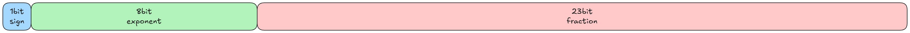
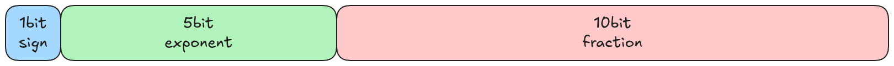
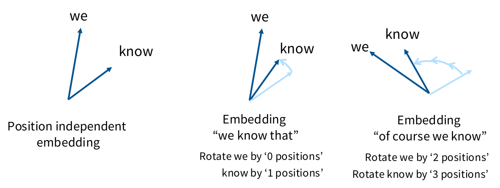



 Once you understand how a network architecture is implemented, a natural question arises: how do I actually train a model like this? This section compiles all sorts of engineering know-how that answers that very question. 

## Preface

Large model architectures come in all shapes and sizes, but if you really want to understand one, you have to get your hands dirty. There are plenty of high-quality online courses on YouTube to learn from— [CS336: Language Modeling from Scratch](https://cs336.stanford.edu/) being a prime example—so this article essentially serves as my notes on CS 336. Here is my [code implementation](https://github.com/morethan987/cs336-assignment1-basics) and [Answers for Problems](https://github.com/morethan987/cs336-assignment1-basics/blob/main/Q%26A.md).

"Practice is the sole criterion of truth." 🫡

The content can be broadly divided into five parts:

1. Fundamentals: tokenizers, resource inventory, model architectures, training strategies
2. Systems engineering: kernels, parallelism, inference
3. Scaling laws
4. Data engineering: pretraining data engineering—messy, but absolutely critical
5. Model alignment: RL post-training fine-tuning

## Fundamentals

### Tokenizers

Karpathy has an excellent [video](https://youtu.be/zduSFxRajkE?si=X3hpizNlFcFiIXQt) on tokenizers that dives deep into everything you need to know about them.

Functionally speaking, a tokenizer is a peripheral component independent of the Transformer body. Its main job is to encode a long string of text into integers—the data type that Transformer models actually process: a sequence of integers.

A rather interesting question to ponder: from a low-level perspective, if the only goal is to map characters to integers, digitized text doesn't really need explicit encoding, because the vast majority of digital text is already UTF-8 encoded—these characters are natively represented as integers at the hardware level.

```python
>>> test_string = "hello, 世界！"
>>> utf8_encoded = test_string.encode("utf-8")
>>> print(utf8_encoded)
b'hello, \xe4\xb8\x96\xe7\x95\x8c\xef\xbc\x81'
>>> list(utf8_encoded)
[104, 101, 108, 108, 111, 44, 32, 228, 184, 150, 231, 149, 140, 239, 188, 129]
```

As you can see from the example above, a very short piece of text gets encoded into 16 integers—clearly far too granular. A Transformer's attention window is limited in size and extremely expensive, so the tokenizer's purpose is to chunk and aggregate this fragmented low-level encoding, thereby shortening the length of the integer sequence and improving the model's computational efficiency.

> [!NOTE] Food for thought
> A question worth exploring: assuming we had abundant compute, would training directly on raw UTF-8 sequences yield better results? Put another way, we could view the tokenizer as a simple spatial mapping that projects data from the noisy space of UTF-8 encoding into a more semantically meaningful space. We already know this mapping is effective—after all, every major LLM is trained this way—but how much does it actually improve things, and can we quantify that theoretically?

In terms of concrete algorithms, most models use the BPE algorithm that OpenAI originally adopted, with tiktoken being the representative library. Google's sentencepiece is also widely used across many large models, though configuring it is considerably more complex compared to tiktoken.

#### Detailed Questions

1. Why use bytes encoding instead of utf-8 encoding directly?

Ans: Actuall text data distribution on utf-8 encoding vocabulary is sparse while bytes encoding only has 256 vocabularies which means every vocabulary is amply sampled. However, bytes encoding is not perfect due to extremelly long seqeunce it produces, which is quite a burdon for model training.

2. Why pre-tokenize before BPE?

Ans: Original BPE needs to walk through whole corpus every merge leading to an overwhelming computational cost. Besides, there are some exact boundaries we don't expect the merging happen at, such as cross-word merging(e.g. "there" and "is" should be always two tokens) and trivial punctuations(e.g. dog! vs dog.).

3. How do you handle large datasets under memory constraints?

A: When training on massive datasets with limited RAM, the key is leveraging lazy-loading file reading mechanisms like `mmap` to effectively cap peak memory usage. When necessary, you should implement a full-pipeline streaming lazy-loading strategy—covering everything from file reading and encoding all the way to writing back to disk. Additionally, data structures and algorithms play a huge role in the tokenization stage; in my personal experience, priority queues and hash tables are the ones I rely on most.

### Resource Inventory

Broadly, available resources can be categorized as: per-unit-time compute capacity (FLOP/s), time, data volume, memory size, and the compute cost of tensor operations. The purpose of a resource inventory is to estimate training time—or the maximum model size you can train—given known resource constraints.

#### Memory Footprint

Almost all data is stored using tensors—arrays of floating-point numbers arranged according to certain rules. Depending on the floating-point format used, the memory footprint of model training or inference varies. In general, floating-point formats include the following:

1. float 32: 32-bit float, occupying 4 bytes of memory



2. float 16: 16-bit float, occupying 2 bytes of memory. Its dynamic range is smaller than float 32, which can cause numerical underflow when gradients produced during backpropagation become very small. (This is precisely why bfloat 16 was introduced.)



3. bfloat 16: brain floating point, also occupying 2 bytes. It sacrifices precision to expand the dynamic range, minimizing weird numerical overflow issues. (In deep learning, precision matters far less.)


In practice, mixed-precision training is the norm: float 32 for optimizer states, bfloat 16 for parameters, activations, and gradients. Of course, there are more aggressive precision formats like float 8 and float 4, but they're generally not used for actual model training. And when float 4 is used, it doesn't directly represent a single parameter value; instead, neighboring parameters are packed together and share a scaling factor. This trick relies on the local similarity of parameters—adjacent parameters tend to have similar orders of magnitude, so you can factor out the shared scale and use a batch of low-precision numbers plus the scaling factor to represent a batch of high-precision numbers.

> [!NOTE] Difference from quantization
> Quantization aligns a model trained at high precision to a lower-precision space. It's considerably easier to pull off than training directly at low precision.

Here is a rough memory footprint estimation for an MLP. Assuming the input, activations, and output all have a fixed dimension \(D\), the layer count is \(L\), and the batch size is \(B\), the total parameter count can be estimated as \(D^2\cdot L\) —meaning \(L\) layers of \(D\times D\) square matrices. Parameter memory occupies \(2D^2\cdot L\) bytes assuming each parameter is stored in bf 16 format. Gradient memory usage is identical to parameters (since only parameters require gradients, and every parameter needs one gradient value). Optimizer states require \(4D^2\cdot L\) bytes because optimizer states generally use fp 32 to maintain precision (for instance, the \(g^2\) parameter in the AdaGrad optimizer acts as the **denominator** to regulate the learning rate, requiring higher precision). Finally, activation memory matches that of the parameters at \(2D^2\cdot L\) bytes.

> [!NOTE] Note
> Optimizer states vary depending on the optimizer; for example, the Adam optimizer allocates 8 bytes of memory per parameter to store the first and second momentum values.

Some methods to reduce memory footprint include gradient accumulation—where a `micro_batch_size` parameter is used to compute and accumulate gradients across \(\frac{\text{batch\_size}}{\text{micro\_batch\_size}}\) steps before updating parameters—and selective activation storage, where you might only keep pre-activation data instead of both pre- and post-activation data, recomputing post-activation values on the fly when needed. More aggressive strategies even omit caching across matrix multiplications, though this will undoubtedly slow down training speed.

#### Tensor Computation

Let's look at the computational cost of tensor multiplication, using the following diagram as an example.


The total computational cost, in a nutshell: the resulting tensor has the shape \(B\times K\), giving us \(B\cdot K\) elements in total. Each element is the sum of \(D\) pairs of element-wise multiplications, meaning every element in the final result represents \(2D\) multiplication or addition operations. So the total computational cost is: \(2D\cdot B\cdot K\).

> [!NOTE] A clarification
> This is the simplest case, with no hardware-level optimizations factored in—for instance, all additions being fused into a single operation.

There's another important engineering metric to introduce here: MFU (Model FLOPs Utilization), which measures the actual compute utilization when the model is running. Simply put, in real-world engineering implementations, the GPU's total compute power is never 100% utilized—MFU captures that actual utilization rate.

During backpropagation, because gradients must be computed for both operands involved in the forward pass (the activations and the weights), the backward pass requires roughly twice as much compute as the forward pass.

### Model Architecture

As a model introduced back in 2017, the standard Transformer is, in a sense, showing its age—which is why Transformer models implemented in actual production are modernized variants. A high-level comparison of these modifications is shown below.


#### Normalization

First, Post-Normalization was replaced by Pre-Normalization, which is far more beneficial for numerical stability. The key lies in removing normalization from the residual stream—Layer Normalization can be placed either before or after the linear module, or even applied as "Double-Norm".

Next comes the choice of normalization function. Early LLMs generally used the standard LayerNorm formulation, such as in GPT-1/2/3:


$$
y=\gamma\frac{x-E(x)}{\sqrt{ Var(x)+\epsilon }} + \beta
$$

More recent models, however, opt for RMSNorm, which completely eliminates the mean and bias terms:


$$
y=\gamma\frac{x}{\sqrt{ \left \| x \right \|_{2}^2 }}
$$

So why use RMSNorm? Because while there is virtually no difference in final training performance (with RMSNorm sometimes even performing slightly better), RMSNorm is noticeably faster. But why optimize this module in the first place? Mathematically, normalization accounts for a meager \(0.17\%\) of total FLOPs, making optimization seem unnecessary at first glance; in reality, however, normalization accounts for up to \(25.5\%\) of actual execution time due to heavy data movement overhead.

Finally, bias terms in linear layers are discarded. The original FFN layer expression was:


$$
\text{FFN}(x) = max(0, xW_{1}+b_{1})W_{2}+b_{2}
$$

However, modern implementations generally use:


$$
\text{FNN}(x) = \sigma(xW_{1})W_{2}
$$

The main reason for this change is to save memory and improve training stability. See the [Training Stability]() section for details regarding training stability. #### Activation Functions

A wide variety of activation functions have emerged, but selecting the right one still requires careful consideration. Modern LLM models generally choose activation functions with gating mechanisms. The so-called gating mechanism is essentially an element-wise multiplication (Hadamard product, \(\otimes\)). Below is a concrete comparative example. The classic FF layer expression is as follows:


$$
\text{FF} = max(0, xW_{1})W_{2}
$$

In contrast, ReGLU adds a gating mechanism to the ReLU section using an additional set of parameters:


$$
\text{FF}_{\text{ReGLU}}(x, W_{1}, V, W_{2}) = (max(0, xW_{1})\otimes xV)W_{2}
$$

Each element of the parameter matrix \(V\) acts on the corresponding ReLU output, amplifying or attenuating specific activation values. Similarly, the expressions for GeGLU and SwiGLU activation functions are:


$$
\text{FF}_{\text{GeGLU}}(x, W_{1}, V, W_{2}) = (\text{GeLU}(xW_{1})\otimes xV)W_{2}
$$


$$
\text{FF}_{\text{SwiGLU}}(x, W_{1}, V, W_{2}) = (\text{Swish}(xW_{1})\otimes xV)W_{2}
$$

where \(\text{Swish}(x) = x\cdot\text{sigmoid}(x)\) is a foundational activation function similar to GeLU and ReLU.

Experiments ultimately show that gated activation functions are indeed effective. Although the gain is modest—such as a less than \(1\%\) improvement from ReLU's \(83.80\%\) to ReGLU's \(84.67\%\), this gain comes with virtually no extra cost (both VRAM and compute overhead are minimal). So why not enjoy a free lunch?

> [!NOTE] Note
> Because gated activation functions introduce an extra projection parameter matrix, the hidden dimensions of these projection matrices are typically set to \(\frac{2}{3}\) of non-gated activation functions to maintain parameter parity.

#### Layer Parallelism

Transformer blocks in standard LLMs are typically stacked sequentially, expressed as:


$$
y = x+\text{MLP}(\text{Norm}(x+\text{Attention}(\text{Norm}(x))))
$$

However, the GPT-J model proposed a parallel computation layout for Transformer modules:


$$
y = x + \text{MLP}(\text{Norm}(x)) + \text{Attention}(\text{Norm}(x))
$$

Although the GPT-J paper states that this parallel approach yields a \(15\%\) speedup in large-scale training with controllable quality loss at the 8 B scale and zero loss at the 62 B scale—making its impact on model quality largely neutral—the vast majority of models still stick to sequential Transformer blocks. After all, logically speaking, this parallel layout effectively cuts the depth of the model in half, which represents a rather risky architectural trade-off.

#### Positional Encoding

Currently, the most mainstream positional encoding technique is **Rotary Position Embedding** (RoPE), which is a relative positional encoding scheme independent of absolute token positions. Why do we need relative positional encoding? Because the attention mechanism in Transformers logically ought to depend only on the relative positions between tokens, rather than capturing absolute position information for logical inference.

Thus, the motivation behind RoPE is simple: since we want an embedding representation independent of absolute positions, and the inner product is invariant under rotation, we can use rotation angles to represent relative positions, as illustrated below:



#### Hyperparameter Selection

Hyperparameter selection generally revolves around these core questions:

1. How many times the model dimension \(d_{\text{model}}\) should the FF layer dimension \(d_{\text{ff}}\) be set to?
2. How should the number of attention heads be chosen? Should \(d_{\text{model}} = d_{\text{head\_num}} \cdot d_{\text{head}}\) strictly hold?
3. How should the aspect ratio between model width and depth be determined?
4. How should the vocabulary size be chosen?
5. Is regularization necessary to prevent overfitting when the data volume far exceeds the parameter count?

First, the relationship \(d_{\text{ff}} = 4d_{\text{model}}\) holds true for the vast majority of current models, with very few exceptions. For example, in GLU-variant FF layers, due to the third projection matrix introduced, \(d_{\text{ff}}\) is set to \(\frac{2}{3}\) of the standard size, giving \(d_{\text{ff}} = \frac{8}{3}d_{\text{model}}\) in this family—which in a sense isn't even a true exception. The real outlier is Google's T 5 model, which uses an exaggerated \(d_{\text{ff}} = 64d_{\text{model}}\), though the paper explains this choice was driven by TPU utilization considerations.

As for the number of attention heads, \(d_{\text{model}} = d_{\text{head\_num}} \cdot d_{\text{head}}\) holds true almost all the time, with the main exceptions again being certain Google models.

Regarding the aspect ratio (width vs. depth), extensive empirical data indicates that \(d_{\text{model}}/n_{\text{layer}} \approx 128\) is a sweet spot. Models are not strictly better the deeper they get; extremely deep models are notoriously hard to parallelize and suffer from high latency.


Vocabulary size depends on whether the model is monolingual or multilingual: monolingual models typically use 30–50 k, while multilingual vocabularies reach 100–250 k. As a side note, Transformers with multimodal generation capabilities feature even larger vocabularies.


On overfitting and regularization: logically, overfitting shouldn't be a concern when data scale vastly exceeds parameter count, as overfitting rarely occurs under these conditions. SGD-style optimizers perform only a single pass over the corpus, making it hard for the model to memorize text snippets. Indeed, Dropout has largely been phased out. However, weight decay has been retained: although weight decay yields worse results in most cases compared to no decay, combining it with a small dynamic learning rate ultimately outperforms non-decayed setups (as seen in the bottom-right of the second figure below, where the blue dashed line achieves the optimal training loss).


#### Training Stability

What is training stability? It might sound a bit abstract, but the figure below illustrates it well: although the blue curve achieves lower loss, it frequently exhibits severe spikes—meaning you might end up with a terrible model when training completes. The blue curve is a classic sign of training instability.


Where does this instability stem from? First is the Softmax function at the output layer, where the division operation can be dangerous:


$$
\log(P(x)) = \log\left(\frac{e^{U_r(x)}}{Z(x)}\right) = U_r(x) - \log(Z(x))
$$


$$
Z(x)=\sum_{r'=1}^{|V|} e^{U_{r'}(x)}
$$

where \(U_{r}\) represents the scoring function and \(|V|\) denotes the vocabulary size. To stabilize this term, \(\log(Z(x))\) can be transformed into the following form—squaring it and tuning it with \(\alpha\) so that the division term approaches 0 as closely as possible. This method is called Z-loss stability.


$$
\begin{aligned} L &=\sum_i \left[ \log(P(x_i)) -\alpha(\log(Z(x_i))-0)^2 \right] \\ &=\sum_i \left[ \log(P(x_i)) -\alpha\log^2(Z(x_i)) \right] \end{aligned}
$$

Second is the instability within the attention module's Softmax. However, the solution here isn't to modify Softmax directly, but to apply Normalization to the QK inputs—the widely known "QK Norm" method. In standard Transformer attention, Q and K undergo an inner product immediately after computation; "QK Norm", on the other hand, normalizes Q and K before computing their inner product, ensuring the values fed into Softmax remain on a far more consistent scale.

#### Attention Overhead During Inference

Most of our previous discussion focused on model training. However, when deploying models, we must consider inference-time overhead—most notably, the attention computational cost. Let us define an attention module where \(d\) is the model hidden dimension, \(b\) is the batch size, \(n\) is the input sequence length, \(h\) is the number of attention heads, and \(k=\frac{d}{h}\) is the head dimension.

Let us first analyze the arithmetic operations of the attention module during training. The input \(X\) has shape \(b\times n\times d\), and each head projection matrix has shape \(d\times k\), so the QKV projection FLOPs equal \(3\times(b\cdot n\cdot d\cdot k)\times h = 3bnd^2\). Next, computing the inner product of Q and K (both of shape \(b\times n\times k\)) takes \(bhkn^2 = bdn^2\) operations. While there are subsequent computations, they are non-dominant for large \(d\) and \(n\), so we can simply represent the computational complexity of the attention module as \(O(bnd^2+bdn^2)\).

Memory cache usage during training is straightforward to compute: first, matrices like input and QKV of shape \(b\times n \times d\) require \(O(bnd)\) memory access; then Softmax requires \(O(bhn^2)\) cache access, and weight parameters require \(d^2\) cache access, leading to a total memory access complexity of \(O(bnd+bhn^2+d^2)\).

Thus, the arithmetic intensity of the training attention module is \(O\left( \left( \frac{1}{d+n}+\frac{hn}{d^2+dn}+\frac{d}{bnd+bn^2} \right)^{-1} \right)\), which clearly becomes increasingly compute-dense as sequence length \(n\) grows.

Inference, however, is fundamentally different because tokens must be generated sequentially. In inference, we introduce KV Cache to avoid redundant computations, keeping computational complexity at \(O(bnd^2+bdn^2)\), but driving memory access complexity up to \(O(bn^2d+d^2)\).

The arithmetic intensity converges toward 1 as sequence length \(n\) grows—an extremely low intensity considering a fully loaded A 100 has an arithmetic intensity of around 156. In other words, LLM inference is a classic memory-bound task.

To reduce memory bandwidth intensity, we can employ Grouped-Query Attention (GQA), which groups query heads together so that heads in the same group share a single set of KV Cache. Denoting the number of groups as \(g\), GQA reduces memory access complexity to \(O\left( \frac{1}{g}bn^2d+d^2 \right)\).

Another technique for reducing attention computational complexity is grouped sliding-window attention. Simply put, full attention across the entire sequence is computed only once every four attention layers, while intermediate layers only compute attention over tokens within a fixed sliding window.

#### Attention Mechanism

There are two main optimization approaches for attention mechanisms: keeping the \(O(n^2)\) complexity while optimizing constants, or fundamentally redesigning the mechanism to achieve linear \(O(n)\) complexity. The former works remarkably well when context lengths aren't exceptionally long (say, under 2 M tokens)—take ChatGPT's local sliding-window attention as an example. Alternatively, you can push constant-factor optimization to the extreme through hardcore systems engineering; FlashAttention is a prime example here, reaching roughly 4 x the speed of standard PyTorch implementations.

However, if we want to process even longer input sequences, we have to tackle the \(O(n^2)\) complexity directly and reduce it to \(O(n)\). The core idea stems right from the standard quadratic attention formula:


$$
\text{Attn(Q,K,V)} = \text{softmax}(QK^T)V
$$

If the softmax function could be omitted, attention would naturally become linear. Below is the batched expression, which is convenient for training:


$$
\text{Attn(Q,K,V)} = (QK^T)V = Q(K^TV)
$$

We can also express it in a recurrent form for inference, which looks strikingly similar to an RNN:


$$
\begin{matrix} S_{t} = S_{t-1} + k_{t}v_{t}^T \\ y_{t} = q_{t}^TS_{t} \end{matrix}
$$

Linear attention layers are indeed deployed in real-world models. For instance, MiniMax-M 1 adopts a hybrid setup with 7 linear attention layers paired with 1 quadratic attention layer, balancing the recall issues of pure linear attention against the heavy compute costs of pure quadratic attention. To give you a clearer picture of the recall loss brought by linear attention, here is a figure from ByteDance's survey paper on hybrid linear attention:


As seen in the right chart, pure linear attention suffers a steep decline in recall. Curiously, the left chart shows that some pure linear attention models actually outperform standard quadratic attention in language capabilities (note that the model evaluation score here is a composite metric of perplexity and benchmarks). This suggests that pure recall tasks aren't fully aligned with real-world language tasks, where exact recall isn't always strictly required. Another practical takeaway from the right chart is that a 3:1 hybrid ratio achieves recall performance on par with standard attention—which explains why this 3:1 hybrid scheme is so widely used in practice.

Building on the recurrent formulation of linear attention, we can add a memory decay factor \(\gamma_{t} = f(x_{t})\) to clear out stale memory states, along with a gated output term \(v_{t}^TD\) (allowing certain information to bypass state compression and output directly). This gives us the Mamba-2 formulation. The Mamba family is undoubtedly one of the most famous linear attention designs out there; in Nemotron-3, it is combined with standard attention in a 3:1 ratio, delivering superior performance compared to pure linear setups.


$$
\begin{matrix} S_{t} = \gamma_{t} S_{t-1} + k_{t}v_{t}^T \\ y_{t} = q_{t}^TS_{t} + v_{t}^TD \end{matrix}
$$

Applying a directional Delta correction to the Mamba-2 expression, along with an input gate \(\beta_{t} = f(x_{t})\) for new memory entries, yields the Gated DeltaNet formulation:


$$
\begin{matrix} S_{t} = \gamma_{t} (I-\beta_{t}k_{t}k_{t}^T) S_{t-1} + \beta_{t}k_{t}v_{t}^T \\ y_{t} = q_{t}^TS_{t} \end{matrix}
$$

Here, \((I-\beta_{t}k_{t}k_{t}^T)\) erases parts of the state related to the current \(k_{t}\), making room for the new memory item \(\beta_{t}k_{t}v_{t}^T\). The largest-scale application of this approach to date is the Qwen-3.5 model—though again, it uses a 3:1 hybrid format rather than pure linear attention to get the best of both worlds. A clear trend emerges: linear attention mechanisms are gradually converging toward LSTM-like architectures.

Besides hidden-state approaches, another route is sparse activation, best exemplified by DSA (DeepSeek Attention). DSA uses a lightweight index to compute and retrieve the Top-k most relevant tokens, keeping the costs of \(O(n^2)\) attention manageable. This mechanism is adopted in both DeepSeek-v 3.2 and GLM-5, yielding impressive real-world results.

> [!NOTE]- A Side Note
> While benchmark scores look great on paper, in practical use you'll notice severe context-constraint forgetting. Personally, I don't feel fully confident delegating highly complex tasks to DeepSeek models—if you audit their outputs closely, you'll find they often fail to follow constraints mentioned earlier in the prompt. In short, it can feel a bit clunky 🤔, especially when compared side-by-side with Anthropic's models.

#### MoE

Mixture of Experts (MoE) is currently one of the most mainstream architectural paradigms. It allows scaled-up models to run with manageable compute costs, reaping the performance gains of parameter expansion while keeping inference costs in check—a true win-win. Of course, MoE wasn't an instant hit; its architecture and training balance are notoriously tricky to tune. In a sense, MoE represents less of a pure algorithmic leap and more of a major win for LLM systems engineering.

MoE can be applied to either Feed-Forward (FF) layers or Attention layers, but virtually all implementations focus on FF layers. By default, "MoE" refers to FF-layer MoE, a convention we'll follow here.

MoE consists of a few key components: routing functions, expert count, and training objectives. Routing functions and expert counts are straightforward, but training objectives serve a dual purpose: training the language model itself and maintaining routing balance so every expert receives adequate training.

Common routing functions include Top-k and Hash routing, alongside RL-based routing policies that frame load balancing as a linear assignment problem. Among these, Top-k is by far the most popular. Its mathematical formulation is as follows:


$$
h_t^l = \sum_{i=1}^{N} \left( g_{i,t}\operatorname{FFN}_i(u_t^l) \right) + u_t^l
$$


$$
g_{i,t} = \begin{cases} s_{i,t}, & s_{i,t}\in \operatorname{TopK} \left( \{s_{j,t}\mid 1\le j\le N\}, K \right),\\ 0, & \text{otherwise}, \end{cases}
$$


$$
s_{i,t} = \operatorname{Softmax}_i \left( (u_t^l)^T e_i^l \right)
$$

While this wall of math might look daunting, plain English puts it simply: the input \(u_{t}^l\) takes the inner product with each expert's key vector \(e_{i}^l\), followed by softmax normalization to obtain a matching probability distribution. Next, the gating function \(g_{i,t}\) selects the Top-k experts and zeroes out the rest (a batching trick that avoids conditional branching when calculating \(h_{t}^l\)). From there, standard feedforward computation takes over, aggregating expert outputs via simple summation before adding the residual connection.

Taking things a step further, experts can be split into finer sub-experts alongside dedicated shared parameters. This allows non-shared experts to specialize further, achieving better ensemble effects. This design is widely known as the DeepSeekMoE architecture.


Logically, both shared and non-shared experts should contribute to model performance. However, ablation studies from OLMoE reveal that performance gains actually stem from finer partitioning of non-shared experts, rather than the shared experts themselves.


The exact expert division ratios across architectures are detailed in the table below, which also highlights that DeepSeek-v 1 was indeed the pioneer in granular expert re-segmentation.

Model | Routed | Active | Shared | Fine-grained ratio
:----- | :-----: | :-----: | :-----: | :-----:
GShard | 2048 | 2 | 0 | -
Switch Transformer | 64 | 1 | 0 | -
ST-MOE | 64 | 2 | 0 | -
Mixtral | 8 | 2 | 0 | -
DBRX | 16 | 4 | 0 | -
Grok | 8 | 2 | 0 | -
DeepSeek v 1 | 64 | 6 | 2 | 1/4
Qwen 1.5 | 60 | 4 | 4 | 1/8
DeepSeek v 3 | 256 | 8 | 1 | 1/14
OLMoE | 64 | 8 | 0 | 1/8
MiniMax | 32 | 2 | 0 | ~1/4
Llama 4 (maverick) | 128 | 1 | 1 | 1/2

Finally, let's look at MoE training. The primary obstacle in MoE training is that the routing function is non-differentiable and inherently prone to instability. Early attempts tried modeling routing as an RL task with little success; adding noise to Top-k sampling improved stability, but at a slight cost to performance. Currently, the most effective solution is a regularization-like approach that introduces a heuristic load-balancing auxiliary loss:


$$
\text{loss} = \alpha \cdot N \cdot \sum_{i=1}^{N} f_i \cdot P_i
$$


$$
f_i = \frac{1}{T} \sum_{x \in \mathcal{B}} \mathbb{1}\{\operatorname{argmax} p(x) = i\}
$$


$$
P_i = \frac{1}{T} \sum_{x \in \mathcal{B}} p_i(x)
$$

Here, \(f_{i}\) denotes the actual proportion of tokens assigned to expert \(e_{i}\), while \(P_{i}\) represents the routing function's target probability for \(e_{i}\). This formulation uses the non-differentiable \(f_{i}\) to guide the differentiable \(P_{i}\), applying gradient penalties to unbalanced allocations:


$$
\frac{\partial \text{loss}}{\partial p_i(x)} = \frac{\alpha N}{T^2} \sum_{x \in \mathcal{B}} \mathbb{1}_{\operatorname{argmax} p(x) = i}
$$

Empirical results confirm that this heuristic approach works remarkably well, effectively balancing load across experts. Standard DeepSeekMoE further supplements this with device-level load-balancing regularization.


The later DeepSeekMoE-v 2 built upon this by introducing a Top-M device routing mechanism and inter-device communication penalty terms to curb communication overhead. To be honest, this adds quite a lot of regularization terms—it's effective, but arguably ungraceful. DeepSeekMoE-v 3 attempted to remove these loss terms by introducing dynamic bias terms, though it didn't eliminate them entirely.

Of course, training stability and fine-tuning in MoE differ markedly from standard dense FF modules—and frankly, are much trickier. Training instability largely stems from the softmax function in routing (nine out of ten instability issues trace back to softmax 🤣), which can be mitigated using the Z-loss method covered in the [Training Stability]() section. On the fine-tuning front, MoE models are far more prone to overfitting on small datasets than dense counterparts. DeepSeek's remedy? Fine-tune with massive datasets.

Overall, MoE carries a heavy systems engineering flavor—which brings us back to my point at the start: MoE's true impact shines brightest in systems engineering. At its core, MoE uses pragmatic engineering tricks to push the boundaries of scaling laws, giving us a straightforward path to continue squeezing performance out of sheer model scale.
