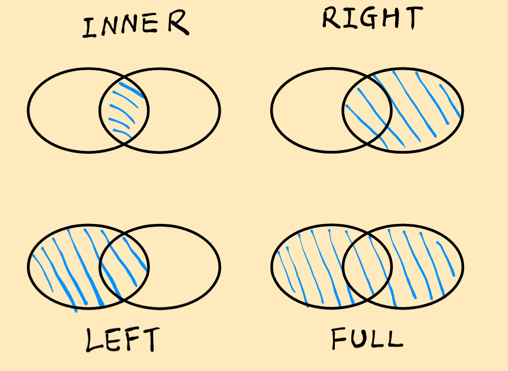

 MySQL 安装部署流程 + 简明语法 CookBook + 学习笔记 

### 信息源

- [SQL教程 - 廖雪峰的官方网站](https://liaoxuefeng.com/books/sql/introduction/index.html)

非常非常亲民的 MySQL 教程网站，内置了一个网页版的数据库，方便新手同志们直观了解 MySQL数据库的操作，对于 SQL 的整个背景也有简洁但必要的表述。

### 安装 MySQL

安装 MySQL 最简单的方法就是通过 Docker Desktop 来操作；只需要两步就能够完成

命令行中运行：

```sh
docker pull mysql
```

#### 命令行启动MySQL

初始化 SQL 并运行：

```sh
docker run -d --name mysql -p 3306:3306 -e MYSQL_ROOT_PASSWORD=password -v /Users/liaoxuefeng/mysql-data:/var/lib/mysql mysql
```

参数解释：

参数 | 含义
----- | -----
`-d` | 表示后台运行
`--name` | 表示容器的名字，不输入 Docker 会自动选择一个名字
`-p 3306:3306` | 表示把容器的端口 3306 映射到本机，这样可以在本机通过 3306 端口连接 MySQL
`-e MYSQL_ROOT_PASSWORD=password` | 表示传入一个环境变量，作为root的口令，这里设置的口令是 `password`，不输入此项则会自动生成一个口令，需要查看日志才能知道口令，**建议设置**
`-v /path:/var/lib/mysql` | 表示将本地目录映射到容器目录 `/var/lib/mysql` 作为 MySQL 数据库存放的位置，需要将 `/path` 改为你的电脑上的实际目录
`mysql` | 告诉 Docker 你要运行的镜像的名称

> [!NOTE] 温馨提示
> 使用 Docker 运行 MySQL 时，任何时候都可以删除 MySQL 容器并重新运行；如果删除了本地映射的目录，重新运行就相当于一个全新的 MySQL ；

#### docker-compose启动MySQL

创建 `docker-compose.yml` 文件如下：

```yml
services:
  mysql:
    image: mysql
    ports:
      - "3306:3306"
    environment:
      MYSQL_ROOT_PASSWORD: password
    volumes:
      - ../data:/var/lib/mysql
    restart: unless-stopped
```

运行 `docker-compose build up -d` 来启动服务

### MySQL 基础语法

#### 查询

**注释语法**：

```sql
-- 这是一条注释
```

**基本查询语法**：

```sql
SELECT * FROM <表名>;
```

**条件查询**：

```sql
SELECT * FROM <表名> WHERE <条件表达式>;
```

其中条件表达式内部还可以使用各种逻辑运算关键词，如：`AND`，`NOT`，`OR`

**投影查询**：

```sql
SELECT <列1>, <列2>, <列3> FROM <表名>;
SELECT <列1> 别名1, <列2> 别名2, <列3> 别名3 FROM <表名>;
```

**排序**：

```sql
-- 按score从低到高:
SELECT id, name, gender, score FROM students ORDER BY score;

-- 按score从高到低:
SELECT id, name, gender, score FROM students ORDER BY score DESC;

-- 按score, gender排序:
SELECT id, name, gender, score FROM students ORDER BY score DESC, gender;

-- 带WHERE条件的ORDER BY:
SELECT id, name, gender, score
FROM students
WHERE class_id = 1
ORDER BY score DESC;
```

**分页查询**：

```sql
-- 查询第1页:
SELECT id, name, gender, score
FROM students
ORDER BY score DESC
LIMIT 3 OFFSET 0; -- 从第0条记录开始查，往后查最多3条，也可以不足3条
```

**聚合查询**，利用 MySQL 中的聚合函数来查询：

```sql
-- 使用聚合查询, 查询记录的总条数:
SELECT COUNT(*) FROM students;

-- 使用聚合查询并设置结果集的列名为num:
SELECT COUNT(*) num FROM students;

-- 使用聚合查询并设置WHERE条件:
SELECT COUNT(*) boys FROM students WHERE gender = 'M';

```

> [!Waring] 注意
> 虽然 `COUNT(*)` 的结果是一个标量，但是返回仍然是一个二维表格，只是表格只有一行一列

另外还有一些常用的聚合函数：`MAX()`，`MIN()`，`AVG()`，`SUM()` 等，与 `COUNT()` 类似

**分组聚合查询**：

```sql
-- 按class_id分组进行聚合查询, 类似于for循环:
-- 注意这里没有选中class_id因此最后的结果表格没有id
SELECT COUNT(*) num FROM students GROUP BY class_id;

-- 按class_id分组, 并显示class_id:
SELECT class_id, COUNT(*) num FROM students GROUP BY class_id;

-- 多个分组标准, 例如按class_id, gender分组:
SELECT class_id, gender, COUNT(*) num FROM students GROUP BY class_id, gender;
```

**多表查询**(笛卡尔查询)：

```sql
-- FROM students, classes:
SELECT * FROM students, classes;

-- 设置别名，同名列通过.操作服进行区分:
SELECT
    students.id sid,
    students.name,
    students.gender,
    students.score,
    classes.id cid,
    classes.name cname
FROM students, classes;

-- 设置报个别名, 更清爽一点点:
SELECT
    s.id sid,
    s.name,
    s.gender,
    s.score,
    c.id cid,
    c.name cname
FROM students s, classes c;
```

多表查询的返回依然是一个二维数据表，但是这个数据表是通过**笛卡尔积**的形式组织的，因此也叫笛卡尔查询

**连接查询**，类似于多表查询，但是两个表之间的组织关系不是通过笛卡尔积进行，而是选取一个为主表，将附表的内容进行连接：

- **内连接**，只有一种，修饰语为 `INNER`：

```sql
-- 选出所有学生，同时返回班级名称:
SELECT s.id, s.name, s.class_id, c.name class_name, s.gender, s.score
FROM students s
INNER JOIN classes c
ON s.class_id = c.id;

```

- **外连接**，有三种，修饰语为 `RIGHT`，`LEFT`，`FULL`：

```sql
-- 使用RIGHT OUTER JOIN:
SELECT s.id, s.name, s.class_id, c.name class_name, s.gender, s.score
FROM students s
RIGHT OUTER JOIN classes c
ON s.class_id = c.id;

```

理解方法：通过集合的方式来理解

```sql
-- 这里面tableA是主表, 也叫左表; tableB同理
SELECT ... FROM tableA ??? JOIN tableB ON tableA.column1 = tableB.column2;
```



#### 修改

- **插入语法**：

```sql
-- 添加一条新记录:
INSERT INTO students (class_id, name, gender, score) VALUES (2, '大牛', 'M', 80);

-- 一次性添加多条新记录:
INSERT INTO students (class_id, name, gender, score) VALUES
  (1, '大宝', 'M', 87),
  (2, '二宝', 'M', 81),
  (3, '三宝', 'M', 83);

-- 插入子查询
INSERT INTO TotalPrice (OID, TotalPrice)
SELECT OID, SUM(Quantity * Price * Discount)
FROM Products INNER JOIN OrderItems
ON Products.PID = OrderItems.PID GROUP BY OID;
```

- **更新**：

```sql
-- 更新id=1的记录:
UPDATE students SET name='大牛', score=66 WHERE id=1;

-- 更新score<80的记录:
UPDATE students SET score=score+10 WHERE score<80;

-- 更新id=999的记录, 没有匹配的记录所以什么都不会做:
UPDATE students SET score=100 WHERE id=999;

-- 不带WHERE语句的更新会作用在整张表上
UPDATE students SET score=60;
```

- **删除**：

```sql
-- 删除id=1的记录:
DELETE FROM students WHERE id=1;

-- 不带WHERE的删除操作会作用于整张表
DELETE FROM students;
```

#### 创建

- **建库**：

```sql
CREATE DATABASE your_db_name -- 数据库名称
CHARACTER SET utf8mb4 -- 数据库字符集
COLLATE utf8mb4_unicode_ci; -- 指定排序规则
```

- **建表**：

```sql
CREATE TABLE 表名 (
    列名1 数据类型 约束,
    列名2 数据类型 约束,
    列名3 数据类型 约束,
    ...
    PRIMARY KEY (主键列名)
);

-- 具体的一个用户表
CREATE TABLE users (
    id INT AUTO_INCREMENT,
    username VARCHAR(50) NOT NULL UNIQUE,
    email VARCHAR(100) NOT NULL UNIQUE,
    password VARCHAR(255) NOT NULL,
    created_at TIMESTAMP DEFAULT CURRENT_TIMESTAMP,
    PRIMARY KEY (id)
);
```

- **触发器**：

```sql
CREATE TRIGGER trigger_name
BEFORE INSERT ON orders
FOR EACH ROW
BEGIN
    SET NEW.order_time = NOW();
END;
```
