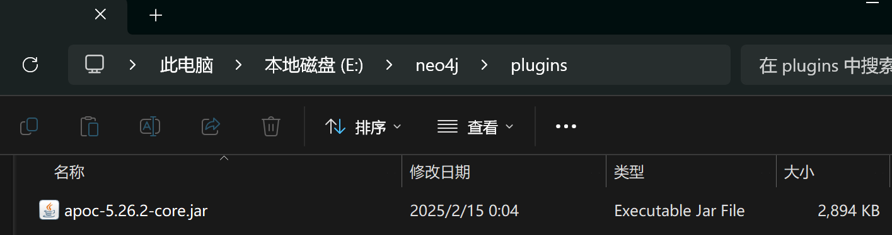

 Neo4j图数据库的基础信息以及操作方法 

## 简介

[Neo4j](https://github.com/neo4j/neo4j) 是一个高性能的图数据库，将数据以及数据之间的关系通过图的形式来存储。图的具体形式是**标签属性图**，使用的查询语言是 `Cypher`。

## 标签属性图

**标签属性图**是一种特定类型的图：

- 一个结点有一个或者多个标签来进行类型的定义
- 关系和节点地位相同，被视为同等重要
- 每个节点和关系都拥有可供访问的属性

## Cypher

> Cypher 是一种**声明式**查询语言，允许你使用类似**ASCII艺术风格**的语法（包括括号、破折号和箭头）来识别数据中的**模式**。


### 模式

**模式**是图数据库中的特定的结点和关系的组合，例如一个人（Person）在一个电影（Movie）中出演（ACT_IN）就是一个模式，代码形式表示为：

```cypher
(p:Person)-[r:ACT_IN]->(m:Movie)
```

其中用小括号选中的部分是结点，用方括号选中的部分是关系。结点部分中 p，m 是指代相应结点的变量，Person 和 Movie 是对应结点的标签，中间用冒号连接。关系部分中 r 是指代关系的变量，ACT_IN 是特定的关系类型。直接翻译成自然语言，意思就是：用 p 指代包含 Person 标签的结点，用 m 指代包含 Movie 标签的结点，他们之间的关系用 r 表示，类型是 ACT_IN

### 数据读取

数据读取操作依赖**模式匹配**，使用关键字 `MATCH`，这相当于给数据库发送指令，让它过滤出只符合特定关系的**结点关系对**，也就是三元组 `(p,r,m)` 构成的集合

```cypher
MATCH (p:Person)-[r:ACT_IN]->(m:Movie)
```

类似于 SQL，你还可以使用关键字 `WHERE` 进行进一步的筛选：

```cypher
MATCH (p:Person)-[r:ACT_IN]->(m:Movie)
WHERE p.name = 'Tom Hanks'
RETURN p,r,m
```

`name` 就是结点 `p` 的一个属性，使用 `.` 操作服来访问节点的额属性；`RETURN` 关键字标记返回值。

下面是一个更加复杂的模式匹配命令代码，`AS` 关键字用来设置别名：

```cypher
MATCH (p:Person)-[:ACTED_IN]->(m:Movie)<-[r:ACTED_IN]-(p2:Person)
WHERE p.name = 'Tom Hanks'
RETURN p2.name AS actor, m.title AS movie, r.role AS role
```

这个命令筛选出和 Tom Hanks 参演过同一场电影的所有演员，并给出他们的名字、参与的电影、在电影中饰演的角色

按照某个属性来进行排序以及分页也是支持的：

```cypher
MATCH (m:Movie)
WHERE m.released IS NOT NULL
RETURN m.title AS title, m.url AS url, m.released AS released
ORDER BY released DESC LIMIT 5
```

这会筛选出最新的 5 个电影。

> [!NOTE] 注意
> Cypher 关键字对大小写不敏感；属性名、变量名等其他的都是大小写敏感的

### 数据写入

数据写入使用 `MERGE` 关键字，其含义就是将一个结点或者关系**合并**进数据图中。

- 合并结点：

```cypher
MERGE (m:Movie {title: "Arthur the King"})
SET m.year = 2024
RETURN m
```

这个命令代码会创建一个新的 Movie 结点，其 `title` 属性被设置为 `"Arthur the King"`，`year` 属性被设置为 `2024`；

你可能会疑惑为什么不这样写：

```cypher
MERGE (m:Movie)
SET m.year = 2024, m.titile = "Arthur the King"
RETURN m
```

其实大括号内的内容被用于检查你想创建的**模式**是否已经存在，避免重复创建模式。

- 合并关系：

```cypher
MERGE (m:Movie {title: "Arthur the King"})
MERGE (u:User {name: "Adam"})
MERGE (u)-[r:RATED {rating: 5}]->(m)
RETURN u, r, m
```

## 安装

目前时间 2025-02-15，经过广大开发者的测试，发现 Neo4j Desktop 对于国内的用户有封锁，导致软件界面无法正常显示。虽然可以通过关闭网络等手段破除封锁，但是这样就失去了桌面版独特的优势：方便部署；

因此这里主要推荐并介绍使用 Docker 部署的流程；

操作系统：Windows 11

### Docker Desktop

无话可说，安装后启动放后台即可

### 拉取镜像

一般来说直接无脑拉取最新镜像就行：`docker pull neo4j`

但是如果你的项目硬性需要 [APOC](https://neo4j.com/labs/apoc/4.1/installation/) 的话，就需要考虑最新的 APOC 版本，因为镜像有可能领先 APOC 的版本；社区版发布在 [Releases · neo4j/apoc](https://github.com/neo4j/apoc/releases)

目前考虑 APOC 兼容的话请使用：`docker pull neo4j:5.26.2`

### 构建容器

```sh
docker run -d -p 7474:7474 -p 7687:7687 -v E:/neo4j/data:/data -v E:/neo4j/logs:/logs -v E:/neo4j/conf:/var/lib/neo4j/conf -v E:/neo4j/import:/var/lib/neo4j/import -v E:/neo4j/plugins:/var/lib/neo4j/plugins -e NEO4J_dbms_security_procedures_unrestricted="apoc.*" -e NEO4J_dbms_security_procedures_allowlist="apoc.*" -e NEO4JLABS_PLUGINS='["apoc"]' -e NEO4J_AUTH=neo4j/mo123456789 --name neo4j neo4j:5.26.2
```

参数说明：

- `-p` 参数用于暴露端口，这里开放了两个端口
- `-v` 参数用于宿主机的目录挂载（说人话就是指定这个 Docker 应用的存储目录）
- `-e` 参数用来配置环境变量：带有 `apoc` 的都是 APOC 相关的配置；`NEO4J_AUTH` 表示用户名为 neo4j，密码为 mo123456789；

> [!warning] 注意
> 如果你使用 Neo4j 用于语言模型的增强生成(RAG)，一定要带上述 APOC 相关配置；如果不是的话，那么那些命令可以直接去掉

运行完上面的命令之后可以去宿主机挂载目录中查看 APOC 插件是否安装：



### 手动安装 APOC

去 [Releases · neo4j/apoc](https://github.com/neo4j/apoc/releases) 中最新的 Assets 中下载 `apoc-5.26.2-core`；然后粘贴到上面👆所说的宿主机目录中；然后重启 Docker 容器就行

### 浏览器UI

这里默认将 7474 端口给浏览器UI使用，7687 端口给别的后台程序使用；

在容器运行在后台的情况下，访问：`http://localhost:7474/browser/preview`

选择接入链接：`neo4j://localhost:7687`

然后就可以成功进入浏览器UI界面了😄

## 参考资料

- [Docker：Docker部署Neo4j图数据库 - 怒吼的萝卜 - 博客园](https://www.cnblogs.com/nhdlb/p/18703804)
