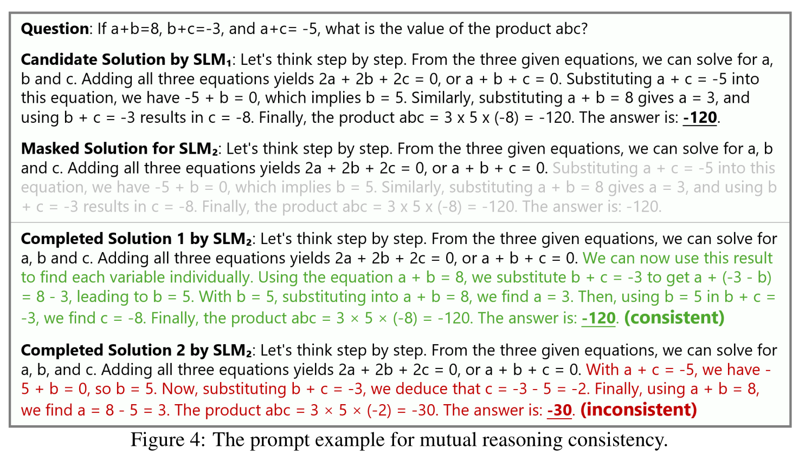



 关键词：互推理；小模型；推理能力提升 

## 研究背景

### 现有工作

以下内容由 AI 生成，快速解释 RAP 是什么。

研究基础是一种名为 RAP（Reasoning via Planning）的框架，旨在通过将语言模型（LLM）同时作为世界模型和推理代理，并结合蒙特卡洛树搜索（MCTS）算法进行策略性探索，从而提升模型在复杂任务中的推理能力。

1. **问题背景**：
    - 当前的大型语言模型（LLM）在推理任务中存在局限性，主要原因是缺乏对环境的心理表征（世界模型），无法有效预测动作的结果和长期影响。
    - 此外，LLM 缺乏奖励机制来评估推理路径，也无法平衡探索和利用，导致推理效率低下。
2. **RAP 框架**：
    - **语言模型作为世界模型**：通过自然语言定义状态和动作，将推理过程建模为马尔可夫决策过程（MDP），并利用 LLM 预测每个动作的结果。
    - **奖励设计**：使用动作的对数概率、置信度以及 LLM 自身的评估结果作为奖励，引导推理走向理想状态。
    - **蒙特卡洛树搜索（MCTS）**：通过 MCTS 迭代构建搜索树，平衡探索和利用，最终选择高奖励的推理路径。

### 不足之处

1. LLM 难以有效探索解空间，常常会产生低质量的推理路径
2. LLM 难以准确评估推理路径质量的高低
3. 上述问题在小模型中更加突出

## 方法概述

### 拟人推理

推理路径仍然依赖 MCTS 来生成，但是提供了更丰富的模拟人类思考推理流程的动作：分解和搜索某一个推理步、提出子问题、问题转化等等

### 路径评估

使用相互一致性原则判定路径质量，即引入另外一个能力相当的小模型来作为“同伴”，以此判定推理路径的质量，具体流程如下：

1. 框架会给予“同伴”小模型一些局部推理路径作为提示，然后让这个小模型补全推理路径
2. 如果 MCTS 生成的路径与“同伴”小模型补全的路径一致，那么就认为这个推理路径质量高，可以作为候选路径

> [!NOTE] Title
> 使用能力相当的小模型，避免对大模型进行蒸馏；使用“同伴模型”对路径进行评估而非直接指导路径生成；判断"路径一致"主要依赖最终结果

## 具体方法论

符号说明表格：

符号 | 含义
:-----: | :-----:
\(x\) | 目标问题
\(M\) | 目标小模型
\(T\) | 小模型使用 MCTS 生成的搜索树
\(s\) | 推理中间步
\(t\) | 候选路径，\(T\) 中的一条完整推理路径
\(ans\) | \(M\) 解决 \(x\) 的最终推理路径
\(Score\) | 推理路径评价函数
\(a\) | 从动作空间中采样得到的一个动作
\(s_{d}\) | 终止推理步，包含问题的答案
\(\hat{M}\) | "同伴"小模型
\(T_{validate}\) | 经过路径评估函数剪枝后的 \(T\)
\(Estimate\) | 路径评估函数

### 问题规范化

把“小模型解决推理问题”这个抽象的自然语言描述的过程形式化：

$$
t=x\oplus s_1 \oplus s_2 \oplus ...\oplus s_d
$$

$$
T=\left \{ t^1, t^2, ..., t^n \right \}
$$

$$
T_{validate}=Estimate(T)
$$

$$
ans = max(Score(T_{validate}))
$$

### 拟人推理

#### 动作空间

1. **一步思考**：给予现有推理路径，让模型产生下一步的推理
2. **快速思考**：直接让模型补全所有的推理步，直到产生最终结果
3. **子问题+回答**：让模型提出一个子问题并回答这个子问题
4. **子问题重回答**：上一步中产生的答案可能不准确，因此提供一个额外的动作选项，重新回答子问题
5. **问题重述**：让模型重新整理问题中的条件

> [!WARNING] Title
> 注意，动作4 只能发生在动作3 之后，动作5 只能发生在问题本身(根节点)之后

#### 奖励函数

借鉴了 AlphaGo，将中间步的评价(奖励)设置为其对于正确的结果的贡献，具体实现如下：

1. 初始化 \(Q(s_{i},a_{i})=0\)；随机产生下一步，直到遇到终止结点 \(s_{d}\)
2. 使用**一致性投票**计算 \(Q(s_{d},a_{d})\)，也是终止结点的**置信度分数**
3. 反向传播：\(Q(s_{i},a_{i})=Q(s_{i},a_{i})+Q(s_{d},a_{d})\)

#### MCTS

大体上使用了经典的 MCTS：选择、扩展、模拟(Rollout)和反向传播；只是为了获取更加精确的奖励值，执行了多次模拟评估

探索-开发平衡依然使用经典 UCT 公式：

$$
UCT(s,a) = \frac{Q(s,a)}{N(s,a)}+c\sqrt{ \frac{\ln N_{parent}(s)}{N(s,a)} }
$$

其中 \(N(s,a)\) 表示某个节点被访问过的次数，\(Q(s,a)\) 就是可以被累计更新的奖励值，\(c\) 表示平衡率

### 路径评估

1. 对于一条推理路径 \(t=x\oplus s_1 \oplus s_2 \oplus ...\oplus s_d\)，随机抽取一个推理步 \(s_{i}\)
2. 将 \(s_{i}\) 之前的推理路径 \(t_{1}=x\oplus s_1 \oplus s_2 \oplus ...\oplus s_i\) 作为提示词注入"同伴"小模型 \(\hat{M}\)
3. \(\hat{M}\) 补全路径，产生新路径 \(t'=x\oplus s_1 \oplus s_2 \oplus ...\oplus s_i \oplus s_{i+1}' \oplus \dots \oplus s_{d}'\)
4. 如果"路径一致"也就是得出的问题答案一致，那么 \(t'\) 就被视作候选路径

> [!NOTE] Title
> 选出候选路径的过程就是 \(T\) 被剪枝的过程，最终产生 \(T_{validate}\)

### 最终选择

对于候选路径树中的每一个候选路径 \(t=x\oplus s_1 \oplus s_2 \oplus ...\oplus s_d\)

$$
Score(t)=\prod_{i=1}^{d} Q(s_{i},a)
$$

最后选择分数最大的那一条推理路径：

$$
ans = max(Score(T_{validate}))
$$

## 其他细节

1. MCTS 执行 32 次 Rollout
2. 处理 MATH 数据集的时候 MCTS 最大深度为 8，其余情况最大深度为 5
3. "同伴"小模型的推理与目标小模型的推理可以并行执行，提高计算效率
4. 路径评估的时候，路径截断点应该处于总路径的 \(20\% \sim 80\%\) 之间

## 深入理解

rStar 生成的是解决问题的高质量路径。例如下面这个论文的原图：

整个流程就是：\(SLM_{1}\) 通过 MCTS 生成一条问题的解决路径，然后将这条路径遮盖，用 \(SLM_{2}\) 在原有思路的条件下尝试解决这个问题，如果能够成功得出正确答案，那么这条路径就被认为是高质量路径。

下面来逐步分析一下这其中的一些关键点：

1. 题目信息：在数学问题中，题目中的信息应该能够完整地解决这个数学问题，并且在题目中都已经完整给出
2. 最终得出的结果能够被精确地验证

这些特点其实就是"数学简单问答"这个特定领域中的**先验**，没有这些先验 rStar 的流程就无法进行。众所周知，数学问答和代码是公认的较为封闭的领域，因此 AI 在这些领域上进行强化学习能够获得比较出色的效果。

这里需要特别说明一下 rStar 和经典的强化学习的关联。经典强化学习中，Agent 选取一个动作，环境给予一次反馈，然后 Agent 立即或累积一小批之后实时更新自己的参数。rStar 所做的其实就是将数据的生成和训练过程解耦和：先让 Agent 自己产生大量数据，然后进一步筛选出其中的高质量数据，然后统一进行训练。

> [!NOTE] 思考
> 能不能将 rStar 的数据筛选过程和传统强化学习的实时更新策略结合呢？🤔实际上还真有人这么做，详见 [TTRL](https://arxiv.org/abs/2504.16084)

综上所述，如果要将 rStar 的成功经验应用到临床医学问诊领域中，那么就需要把临床医学问诊变成一个封闭领域。如何变成一个封闭领域？这就需要考虑现有数据能做的。

现有数据是什么？有患者的基本信息，有患者的入院诊断等等。这些数据都是从实际检查中得到的，这里可以将其分解为一个一个的动作，比如"进行入院诊断"之后就能够得到入院诊断的结果，然后就可以利用这个结果和真实数据的对比，反向监督微调模型更好地进行入院诊断。然后每一个重要步骤都进行类似的操作。

换言之，在临床医学问诊领域中一个重要的先验就是**人类专家在多年实践中获得的一套完整的诊疗流程**。这个诊疗流程中，每一步都会产生可用于模型训练的数据，模型最终学会的也就是**更好地完成上述流程**。虽然这样得到的模型并不能完全应付突发情况(这些情况不在训练数据中)，但事实上突发情况也的确不应该让模型来处理，模型应该处理的是繁复的一般性的问题，而突发情况应该交由经验丰富的人类专家处理。

进一步总结一下我们能做的工作：将人类专家的诊疗流程提炼总结为一个完备的工作流，每一个工作步骤中都需要模型自主收集相关信息并得到这个步骤的结论，这个过程中可以使用 MCTS 来进行搜索采样，从而能够更好地进行自主信息搜集和结论推理。
