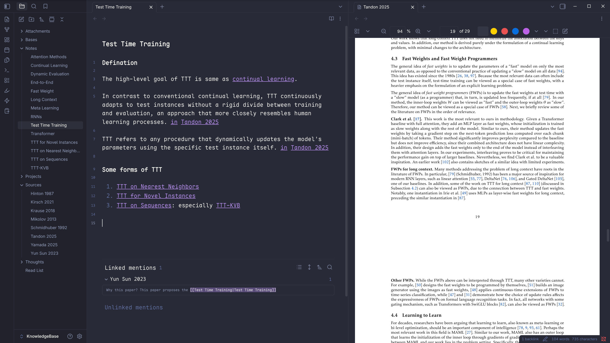

 记录这一路的折腾与试错，一段我之所以是我的来时路。 

## 前言

下学期就要到保研的日子了。回望大学三年，我自己可真是喜欢折腾啊。有些折腾与试错我自己都快要记不清了，趁着寒假的空闲，将这些模糊的记忆都记录下来，也算是为我自己的个人陈述找点素材吧。

> [!NOTE]- 烦恼
> 虽然折腾挺多，但成功的却异常稀少，简历着实难写啊😭

## 大学之前

### ChatGPT初印象

在高考之前，当时班级上晚饭之后都会用教室的白板大屏放晚间新闻，我也是从那个上面第一次听到了这个词语：ChatGPT

当时看到的一张数据图令我印象深刻：一张电力、移动电话、互联网和 ChatGPT 用户数量随时间变化的一张对比图。尽管我当时就觉得这种对比不甚严谨，毕竟 ChatGPT 的用户增长与其前置基础设施的普及有很大关系，但是 ChatGPT 的"直角"式增长还是令人大受震撼。

至此我的心中便埋下了一粒种子，我很好奇 ChatGPT 是如何做到的，毕竟之前我对 AI 的印象几乎没有。在 ChatGPT 之前我只知道 AI 能够做人脸识别和下围棋，我可不觉得它能够如此自然地与我交流。

### 家教

在高考完的暑假，百无聊赖，之前从来都玩不腻的游戏几天之内就无聊透顶了。然后我在同学的推荐下还去当了一个月的家教，教的是初中升高中的化学知识，说是为了接下来的高中生活提前铺路。

那个孩子我觉得是很典型的中国式孩子，对知识没有什么兴趣也不知道为什么要学习，只是被父母和学校告知要努力学习考一个好的分数。父母也是普普通通，待人和善，对孩子抱有一些期待但也有几分佛系，不知是被孩子从小的表现磨去了棱角还是一直如此。最后这段家教经历也没什么波澜地结束了，我也收获了人生的第一桶金。

我现在都对那个孩子的表现印象深刻，他让我不得不问一个问题，为什么现在的孩子不喜欢学习？或许更加通用一些，为什么要学习呢？

这个问题不只是孩子，连很多家长也无法给出令人满意的答案：或是为了考一所好的大学，为了一份好的工作，为了更好的生活......这些答案没错，但这些回答本质上在用一个抽象的东西解释另一个抽象的东西，解释了但好像没有解释：好的大学是什么？好的工作又是什么？什么叫更好的生活呢？大部分孩子只知道手机上的抖音和哔站上有很多好看的视频，网络游戏很好玩，生活就是和父母一日三餐看看电视。

总之，知识从来没有给他们的生活带来任何便利，也没有用自己的知识解决过任何问题，知识最有用的地方就是考试获得高分之后稍微的轻松。也仅仅是稍微，因为马上就有下一场考试。**学习知识本是用于解决问题，但现在学习知识本身却成为了问题，当手段成为了目的本身，因果颠倒的动机注定无法长久**。

但经历了这么多，我总算是对如何培养学习动机有一点感悟了，**那就是去解决问题，不管是什么问题**，只要孩子认为那是一个需要解决的问题，那么自然而然在解决越来越复杂的问题的时候就会学习越来越多的知识：如果他认可考试分数是一个问题，那么就去学习如何分析考试试卷，如何获得学习方法，如何高效刷题；如果对考试分数不感兴趣，那就先去解决别的问题，等考试分数的意义能够被他理解之后，解决其他问题所累积的经验和自信自然会成为其最大的底气。

当然，当时的我是不可能如此通透的，在高考完之后我经历了人生中最大的挫折：物理竞赛失利、高考成绩不理想(很大程度上是因为复阳了，发着烧去考试)，特别是这些选择都是我自己做的。当时我不顾家人的劝阻参与了物理竞赛，这条道路虽鲜有人知但凶险程度并不亚于高考，毕竟知道这条道路的人大都是精英家庭背景，通过大量学习超前的知识从而在同龄人中获得难以企及的竞赛分数。

> [!NOTE]+ 感想
> 或许这也是为什么内卷越来越低龄化了，毕竟只要尝过了"打提前抢"的甜头，没有人会拒绝这么一笔划算的买卖，那种对同龄人绝对碾压的优越感和被碾压的恐惧感是驱动内卷的不竭动力。

然后我就尝试从书中寻找一些生活的定力，于是我在 2023 年剩下的半年时间内在微信读书阅读了 253 小时 57 分钟，从科幻小说到政治经济学《资本论》，从编程语言到操作系统，从如何经营店铺到个人医疗健康，一些心理学和名人传记，甚至还有《普林斯顿微积分读本》和《费曼物理学讲义》，可见我还真是挺喜欢物理学的。但物理竞赛的失败让我大学没有选择物理系，我清晰地意识到了物理学是一门过于基础的学科，这种学科需要天才来驱动，需要质量而非数量，从个体发展的角度来看还是计算机最为稳妥。

> [!NOTE]- 说明
> 我对物理学的兴趣点其实在于其足够复杂又足够简洁，复杂在各种物理学现象，简洁在其恰到好处的物理直觉与数学原理。在不断地刷题的过程中，我观测了大量精巧的物理数学模型，明白了在两个不同领域之间建立映射关系会带来不同的思考角度，而这往往是破局的关键

## 大学一年级

### 折腾个人博客

高考之后我也正式步入大学生活，也正式开始了我的折腾与试错，技能树也被逐步点亮。

首先需要实现的就是访问外网，然后就可以进一步解锁 GitHub、Google 账号等，可谓是打开了一片新天地。具体操作就不细讲了，但最终确实是很简单地就成功了。然后就是经典单人 CPU 异步并发：完成课内准备考试，折腾 C/C++ 环境熟悉地表最强代码开发工具 VSCode，初步构思打造个人博客，备考英语四级，延续暑假作风继续在微信读书上高强度刷书。

现在看来当时的博客技术栈只能用"青涩"来形容了，我最原始的博客版本是在网上找的一个静态简历模板，纯网页三件套(HTML + CSS + JavaScript)。写博客需要手工编辑修改 HTML 文档之后上传到 GitHub Pages 进行免费托管并自动获得一个类似：morethan987.github.io 的免费域名。

当然，这个域名国内网络环境是没法访问的，但我发现国内访问还需要配置国内域名并还要支付域名持有费用之后我就果断放弃了。只有外网能看也无所谓了，反正估计也不会有很多人看的。

> [!NOTE]+ 话里话外
> 如果你能看到这篇文章的话，那你应该在我的新博客里面😁改动之大不言而喻

尽管我的旧博客有诸多不便，但我还是花费了挺多经理去打磨其样式细节：更换图标、开发新的页面、设计导航栏增加拟态白色风格、调试明暗主题切换等等；虽然只是在他人代码结构之上进行的扩充和修改，但这也算是我自己动手解决的第一个项目吧：拥有一个可以发布文章的博客网站。

当然，也正如前面提到的，博客的样式设计非常粗糙，纯粹的网页三件套难以进行精致页面的设计，并且写新的博客也需要直接编辑 HTML 文件，文字输出体验异常糟糕，这种情况下可以预计我的耐心用不了多久就会被消磨掉，然后这个网站就会成为互联网上又一个废弃的页面。

虽然这个项目最终效果并不理想，但我也从中真正理解了代码质量和架构设计有多重要：高质量的代码和优良的设计架构能够让你从繁琐的维护泥潭之中解脱出来，让你去做真正有意义的事情而非空耗精力。另外我也意识到了想让人坚持做一件事情是困难的，与其磨炼自己的意志力不如花一些时间去降低维护的成本，维护时间越长这种思路节省的时间也越多——这就是复利，人应该去做一些具有长期效益的事情。

> [!NOTE]+ 吐槽
> 这也是我一直以来不甚喜欢考试的原因，短短几个小时的时间之后，你会发现先前你花了一个学期甚至数年学习的知识瞬间就没有了价值。我不想去争论什么"思维能力"之类的抽象的东西，也不否认一些考试能够深远地地改变你的平台和资源。但单论那些知识，那些熬夜蚀刻进脑中的一个细节也生怕放过的知识，考试结束铃响之后貌似确乎是与我们人生的后续无缘了。但无可奈何，有些东西的意义本就只是筛选和否定罢了。成年人的世界只做筛选不做培养，深以为然，但我还是选择去折腾与尝试，做了一些"低效"但我认为有意义的事情，这让我更像一个人而非批量生产的零件。

### 机器学习自学

寒假终于是有足够的空闲时间可以进行自学了，我之前一直对大语言模型挺感兴趣，但我当时甚至连一点机器学习基础都没有，不过好在线性代数基础还在并且时间充裕。于是我就开始了一场即兴探索之旅：看姜博士的鸢尾花书系列，经典花书《深度学习》，实操纯 Numpy 编写简单神经网络《Python 神经网络编程》，甚至还包括脑科学的书籍《千脑智能》，包括与 ChatGPT 直接对话学习 Transformer 的架构，在网上还找到了一个可视化 Transformer 的网站[Transformer Explainer](https://poloclub.github.io/transformer-explainer/)

经过一个寒假的自学，我也差不多建立了对 Transformer 的模糊的直觉，一种模糊到现在都已经完全忘记的认知。但我还是清晰地记得那种违和感，感觉这个简单的模型架构与生物大脑貌似完全不同啊，并且存在一个明显的弊端：没法持续学习。

也是在《千脑智能》这本书的影响下，我开始思考如何借鉴脑科学的知识来构建人工智能系统，而我产生这种想法的根本理由也很简单：人类是目前唯一已知的通用智能，除此之外还能参考什么呢？于是从这个出发点开发，我阅读了一些英文的论文文献，了解了皮质柱、全局工作理论、海马体与长期记忆、脉冲神经网络(号称下一代神经网络)。

然而阅读了这么多文献，我逐渐发现脑科学的复杂程度远超想象，能够直接应用到人工神经网络设计之中的方法少之又少，从脑科学发现的现象到人工神经网络的设计之间存在难以跨越的鸿沟。尽管如此，我还是对这种"借鉴生物"的方法抱有一些幻想，在接下来的日子之中我也偶尔从生物学与物理学的角度去构建一些人工神经网络需要满足的约束，希望在满足足够多的约束的情况下，人工神经网络能够展现出更类人的表现。例如我曾经尝试将神经元的权重值作为损失函数中的一项，因为生物神经元要维持高强度连接是需要能量的，异常高的权重参数应该被理解为一种损失。当时我还没有意识到，但当我与 AI 交流想法之后，我才知道我的想法就是经典的 L1 正则化。

> [!NOTE]- 思考
> 虽然也不是什么值得夸耀的，但我貌似确实是从自己的思路发现了正则化这个方法，也是一种新的理解思路吧

### 数学建模

这段时间仍然非常紧，排课很多并且还要准备英语六级和数学建模大赛，因此学术上的推进就被压缩为了空闲时间阅读公众号推文了。

首先是数学建模大赛，这个比赛真的是为我量身定制一般：题目中的数学模型和物理竞赛中的模型简直如出一辙，甚至更加简单明了。虽然但是，在第一次模拟赛的时候还是挺手忙脚乱的：建模不仅要考虑模型是否精确，还要考虑是否能够代码化并且能够被正确优化。队友之间的配合也需要磨合，进行建模的工具链、工作流程和技术水平还需要进一步打磨。

尽管过程曲折，但是在完成第一篇模拟赛论文之后我们就基本解决了上面大部分问题。考虑到我们队伍的成员能力，我们决定专精 A 题，也就是建模优化问题，套路固定侧重建模与代码实现能力，我们队伍中另外一个同学也有物理竞赛背景，因此我们两个人几乎就能够完成一篇完整的论文，我负责建模与代码，他负责建模与论文，再加上一个队友进行复杂示意图的绘制基本上能够轻松拿出一篇像样的论文。

工具链我们也在此时几乎确定：使用 LaTeX 编写进行论文排版，利用 Overleaf 进行在线论文协同，利用 MATLAB 进行计算与 debug。工作流程也几乎确定：优先广泛搜集资料，有些建模题目本身就有广泛的论文可供参考，如果能够找到一篇合适的论文那将极大提高建模效率，其他更具体的工作流与方法论见：[数模国赛总结]()。至于本身的建模和优化能力则主要通过阅读大量参考书籍来实现：《高等应用数学问题的 MATLAB 求解》《最优化方法及其 MATLAB 实现》《MATLAB 在数学建模中的应用》《数学模型》，可以看出我们的重心完全放在了优化算法及其代码实现上。

> [!NOTE]- 安利
> 强烈推荐薛定宇老师的《高等应用数学问题的 MATLAB 求解》，内容非常非常详细，特别是对于同一个目的不同实现方式的交叉对比，对于算法选型非常有帮助

另外我们在模拟赛中也发现了一个巧妙的办法：论文模板化和优化代码模板化。思路的出发点也很简单：为什么所有工作必须要在比赛进行的时候完成呢？将一些固定的框架与套路在比赛之前就通过模板的形式固定下来能够极大提高效率。通过数次的模拟赛经验以及对往年优秀论文的观摩，我们已经大概能够想象出优秀论文的整体结构了，因此我着手编写了一个论证思路严谨的 LaTeX 模板并配以详细的注释说明。然后对于各种比赛中可能出现的优化问题都准备了一套应对方案：可微与否，计算成本是否高昂，精度和速度是否有要求等等。

从一开始的迷茫彷徨，查询到数模获奖率极低时的畏惧，到将整个工作流程的细致拆解与优化，再到最终获得国家级二等奖。从中我也初步体会到了所谓的"极客精神"，极致的专注、极致的效率、极致的优化。这是一种非常令人沉迷的感觉，你会发现你所学习的知识几乎全部都转化为了实打实的效果，每一个知识都有了"为何要学"的理由。

### 动手深度学习

至于人工智能的学习，在平时阅读微信公众号推送的火爆论文的同时，也在跟着《动手深度学习》等进一步掌握其他 Transformer 出现之前的经典模型架构同时进一步巩固深度学习的基础知识和代码实现能力。

其中最让我印象深刻的就是卷积神经网络中的平移不变性和局部性这两个原理，这两个原理清晰地表明了从全连接网络到卷积网络的思路：利用自然图像中的已知结构优化神经网络的参数效率。

> [!NOTE]+ 思考🤔
> 这个现象直接说明了网络架构的改进能够让参数效率更高，那卷积网络是在图像数据上效率最高的网络架构吗？这是否意味着模型架构与参数效率是一个需要平衡的跷跷板？我们可以投入大量数据、大量参数、大量算力让全连接网络达到更好的效果，但我们也可以将一部分算力和参数分配给架构优化用以提升参数效率。然而貌似目前的神经网络架构搜索(NAS)还局限在粗粒度模块的排列组合，或许还需要一种更加细粒度的方法进行搜索并使用一些强化学习的思路才能够让机器自主设计出超越人类的网络架构

而对于微信公众号上的推文，阅读就比较粗糙了，一开始的时候那些推文我还偶尔会仔细阅读一下，但后来就只看看论文的大致思路了：一来则是印象很轻看完之后没有记住什么，二来很多论文的与我当时的思路相去甚远，在我看来目前的大模型效果已经非常不错了，要是能够高效地从实时交互中学习的话，简直就完美不用再奢求更多了。并且我当时还在纠结如何从人脑的工作机制中提取出持续学习的关键启发，但这条思路着实有些艰难。

## 大学二年级

### 博客技术栈升级

从本科生院经过分流进入了计算机学院的计算机科学与技术专业，成为一个老牌正统 CS 人了。换了新宿舍，认识了新朋友，开始学习更专业的计算机知识，与队友参加了为期三天的数模国赛，与这些相伴的还有平时的日常课程还有准备二刷的英语六级。

我原来博客的槽点如前所述，实在是有点太多了，故平时都有意无意地在寻求一些新的技术栈，适配我平时写作习惯的同时也能够轻松管理维护，在此基础上如果性能也能再进一步的话那就再好不过了。运气非常好的是我发现了 Hugo 这个工具，几乎完美符合我上面所说的标准：使用 Markdown 进行内容写作然后自动编译为 HTML 网页，我选择的 [Blowfish](https://blowfish.page/zh-cn/) 主题有非常详细的文档，易于配置的同时也支持高度的自定义，功能齐全样式美观，最后编译速度非常快。再配合 GitHub Actions 就可以实现网页内容的自动推送更新，实现了由 Git 触发的自动网页博客发布。具体的细节见 [Hugo博客搭建]()

但唯一美中不足的是，我平时使用的 Obsidian 的语法与 Hugo 的语法有一定的区别，并且还需要考虑图片复制和文件夹的规范构建。我想在 Obsidian 中就能够完全掌控整个博客的推送流程，但是我在插件市场中逛了一圈都没有发现完全满足我需求的插件，于是我准备自己开发一个 Obsidian 插件：[插件开发]()

这个插件最开始使用的是纯正则表达的方式进行替换，但这样的写出来的代码耦合度非常高，不同的转化流程之间彼此交叉影响，增加了代码复杂度的同时也难以进行新的解析方法的添加。然后我就参照编译器中使用的方法，为 Markdown 构建抽象语法树(AST)解析器，同时配套增加规则定义抽象类，执行规则的执行器和将树形结构扁平化为字符串的打印器。不同组件之间功能分离，测试分离，能够更好地进行开发测试并进行功能扩展。

另外在引入 AST 结构之后，整体的转换能力也得到了大幅增强，能够非常简单地从 Markdown 得到其他各种类型的文件，因此我也顺便添加了向微信公众号的推送功能：参考一个已有的开源项目，将 Markdown 转化为一个内联了 CSS 的 HTML 以富文本粘贴的方式写入剪贴板中，在这个过程中会将图片嵌入为 base64 字符串从而避免了对外部图床的依赖。

然后在这个基础上添加一些附加的甜点功能：Git 查询和推送功能，依赖 Git diff 实现的差异化翻译功能以及批量导出功能。最终实现的效果个人感觉比较好，至少自用是完全足够了😄

值得一提的是，在编写插件之前我还认真考虑过能不能做一个 GitHub 开源项目，用于将 Obsidian 中的笔记发布为一个网页，为此我还特地进行了一个全面的调查：[笔记转博客调研]()

最后发现 Quartz 的功能做得实在是太齐全了，简直是做了一个 Web 版的 Obsidian，并且样式在一众同类产品中也是比较好看的。但也正是因为其界面与 Obsidian 太相似了，因此我觉得这样的界面更适合做一个知识库网站。大致的逻辑就是，知识库网站中存放一些粗糙的笔记，然后经过总结归纳之后发布到博客之中。因此我也在我原本的 Hugo 博客中嵌入了一个小链接能够跳转到这个知识库页面，类似下面这个样子。

当然了，最后这个知识库也很久没有使用了，毕竟我发现我好像不太需要"从粗糙笔记蒸馏为精致博客"这个步骤，我更喜欢直接写博客长文。另外，毕竟 Quartz 我确实不太熟悉，在模糊的印象中我已经记不清它的 CLI 接口是什么样的了。故这某种程度上来说又是一次试错吧。

### Ubuntu启动

在这个学期的末尾，我突然就想整一个 Linux 操作系统来玩玩，当时的考虑是原生 Linux 环境在某些情况下可能比 WSL 和虚拟机更方便稳定一些。另外也听别人说了很多 Linux 的坏话和好话，于是我决定来亲身体验一下，也有了这篇文章 [Ubuntu折腾札记]()，里面记录了我折腾 Ubuntu 系统的几乎全部细节。在这个过程中我也不知不觉掌握了 Linux 系统的文件目录划分，shell 的 rc 文件的功能，上古编辑器 Vim 的用法等等。这些通过亲身实践得出来的经验都遵守一个原则：尽可能简洁的使用方式，稍微复杂一些的初始化配置方法，尽量广泛的通用性，尽可能小的内存占用。

虽然过程琐碎折腾，但这么一来你才会感觉到电脑是如此轻盈而准确地按照你的规划运行。我认为使用一个工具最合适的状态就是"略懂原理"，可以在学习成本不那么高的前提下调整一些更加底层的东西，让自己的使用体验更佳从而长久地提升生产效率。

当然这个时候我还是没有将 Linux 作为我的主力操作系统的打算，但使用 Ubuntu 的时间正在逐渐增加，我对 Linux 的熟悉度也在增加。并且我发现了一个 Windows 始终难以解决的一个问题：Windows 总是卡卡的，这种卡顿感在只使用 Windows 的情况下可能不太明显，但是没有对比就没有伤害😅 这种差异是如此明显以至于使用 Ubuntu 的时候总是有一种莫名的爽快的感觉，这种感觉真的很令人上头。忽然理解了车迷口中的"驾驶感"是什么意思了😄

### 大创

> 大创，即大学生创新创业计划项目，兼具科研与创业训练的能力。简而言之就是从导师手中获取项目并用之参赛，然后在一年的时间内通过数次答辩最终获得项目认定。

在这个学期，我也加入了一个老师的实验室，尝试参加大创项目。简单来说这个项目是进行疾病的时空预测，不过这个项目我并非队长，我个人感觉这个项目的根基是有些不稳的：数据量太少(只有几千条)，训练的目标不明确，技术路线不清晰，感觉真的是挺难做下去的。其中最最难以处理的其实是数据量的问题，众所周知深度学习模型是数据怪兽，没有大量的数据进行预训练很难出效果。因此在立项答辩的时候这个点也是遭受批判最多的一个点：没有数据量怎么进行模型训练？这个问题真的很难回答，无论如何辩解几千条数据怎么看都少得可怜😓因此这个大创项目连立项都没能够通过。

> [!NOTE]+ 来自现在的想法
> 这个项目可以建模为一个"分布序列到分布序列"的预测，与标准 Transformer 非常类似，能够使用 Teacher-Forcing 的思路进行训练，但数据量仍然是一个绕不过去的死穴。数据量的问题其实一直都存在，甚至近年来更加离谱，整个互联网的数据对当今的 LLM 来说只是标配，这从某种程度上来说确实是一个需要思考的问题：如何提高数据效率？或者更有对比性的，为什么人类不用那么多数据进行训练？

从这次失败的大创经历我也感受到了一些困惑：那些看上去如此完美的算法在实际使用的时候还是会出现问题。但从另一个角度来想，或许也只有在实际使用的过程中才能够发现真正的问题。因此在寒假的时候我准备大量使用 LLM 进行代码编写与学习，积累一些实际使用 LLM 的经验，了解现在 LLM 驱动的生态到底是什么样子。

### 日程管理与AI4Coding

寒假的时候，我开始尝试优化一个长期以来困扰着我的问题，我每天想做的事情实在是太多了：前沿AI论文阅读、日常课程学习、代码开发、身体锻炼等等。这些事情用脑子安排起来实在是费神费力，并且常常会被一些突然出现的事项打断，被打断之后的日程重排也很费力。于是我设想要是有一个AI助手能够帮我完成日程的管理，这样我每天就能够更轻松地完成更多的事情了。基于这个初步的想法我开始构思如何实现我期望的效果，包括构建桌面应用所需的技术栈、项目需要实现的核心功能、实现核心功能的思路等。

由于经验不足的缘故并且当时急于体验 AI4Coding的效果，当时的我竟然连核心功能如何实现的思路都没有就开始了桌面软件的开发。在经过慎重的对比选择之后，我选择使用 Electron 进行桌面软件的开发。我当时甚至连前后端的概念都没有，只是知道能够通过API接口调用外部大模型就能够实现基础的对话聊天功能，我最初想法也是先构建一个桌面端对话聊天应用，然后再在聊天对话的基础之上赋予软件从中获取用户的日程并学习用户的习惯与偏好的功能。

> [!NOTE]+ 反思
> 现在看来当时还是犯了很多错误，最重要的就是核心需求没有分析清楚，具体要做到什么效果、如何检验测评效果也没有考虑清楚。并且野心还不小，什么样的功能都想往这个"日程助手"里面塞，直接就捅破了目前 LLM 的上限，最终的实践发现 AI 很难处理考虑用户偏好的复杂日程排期，并且调用成本异常昂贵。

寒假结束的时候最终是构建了一个基本的桌面 AI 聊天软件，其中绝大部分功夫都花在了写出符合 Electron 逻辑的代码并调优样式。这个过程中我大量地使用了 LLM 进行代码编写并得出了一些自己的体会：现在 AI 的代码能力确实是挺强，但是其知识储备过时这个问题仍然非常严重；Token 的效率其实是不够高的，AI 会反复地探索代码仓库并犯低级错误，甚至忘记自己写过什么；AI 对项目的目标总是会产生微妙的偏移，这种偏移往往会严重影响最终的结果，因此需要反复强调目标并且需要人工干预。

> [!NOTE]+ 说明
> 这些问题目前的解决方案是使用一些专为 VibeCoding 设计的工作框架，将 LLM 的不确定性限制在可接受的范围内，并通过这套框架赋予 LLM 一些工具调用的能力，让 AI4Coding 的效果更加稳定。并且不得不说，这种工程补丁的效果着实显著，甚至我认为这就是 LLM 能够深度介入现实的最好方案了。我之前还比较天真，觉得 LLM 不应该需要框架进行规范，但现在看来只要提供明确的测试方法和充足的调用预算，LLM 几乎能够准确实现所有代码，甚至还能够指出一些不切实际的设想并提供一个更加落地的方案

### 换课题组

寒假就这样急匆匆地过完了，又是一个新学期平时的课业也比上学期繁重不少。各种用于探索的时间也因此变得更少了，毕竟精力有限。

这个学期我进行的第一件重要的决策应该是从我上一个导师的实验室离开并加入新的导师的课题组。我的上一个老师是一个数据库领域的青年才俊，做事认真负责，学术背景和人脉资源都挺优秀的。手底下的本科生和研究生也非常多，开会的时候经常能把一个会议室坐得满满当当。

首先，我当初加入这个老师的实验室的目的其实是参与大创：我同学邀请我参加她的大创项目，但是这个项目只接受同实验室的人参与。因此我就加入了这个老师的实验室，说来惭愧，我本人对数据库和数据挖掘并不感冒。我当时的注意力全部都放在 LLM 模型上，特别是一些前沿的模型算法设计。另外一个原因是那个老师名气实在是太大了，实验室人才济济，属实是有些僧多粥少了。我平时的工作也是一些琐碎而简单的数据库维护工作，与 LLM 关系不大，属实是有些耗费心神。

于是在听说另外一个老师在做 LLM 相关的工作后，为了尽可能高效地产出学术成果，我也就跳槽到了目前这个导师的课题组。这个老师是一枚学术青椒，沟通交流起来没有那么困难，也理解为什么本科生那么着急想要出学术成果。

> [!NOTE]+ 无奈😮‍💨
> 一些老师可能会觉得现在的本科生过于浮躁了，急于求成，急于出成果，没有耐心踏踏实实做科研。但我觉得这并非学生个体能够决定的，毕竟现在这个环境内卷实在是严重。如果真的不追求效率，不追求成果产出的话，那在保研等后续关键节点是非常非常被动的：毕竟什么"科研素养"之类的说辞与一篇实实在在的 CCF-A 论文之间的差距不言自明。更何况，从某红色阅读软件上的信息来看，大部分保研人多多少少手上都有几篇论文，甚至一些高手有五篇以上。因此我个人认为本科生急于求成并非个体选择，而是一种环境压力的具体体现，也就是：没的选。

总之，我就切换了课题组之后对自己的目的也更加明确了：积攒学术成果。砍掉大部分无效的动作，直奔目标，实现端到端的任务执行，这才是当下生存的要术。更年轻的老师也更加理解这一点。

### 计算机设计大赛

当然在真正开始我的科研征程之前，我还需要将我寒假以来积累的代码经验付诸实践检验：我决定将我这个半生不熟的项目拿去参与计算机设计大赛。

现在想来，那真是一段兵荒马乱的时光。因为是从零开始构建，因此凌晨三点半的虎溪阳台我见得可真是太多了。

首先是软件的大致构思，如前所述，我希望能够使用 LLM 做出一个类似个人日程助理的软件。不得不说，这确实是一个异常宏大的愿景，这一点我在项目开始并没有意识到。

首先软件需要从用户的对话中，获取用户的日程信息、习惯与偏好，这一步涉及关键信息的抽取、复杂日程信息的存储建模、复杂日程信息的序列化与反序列化、用户偏好的存储与加载、日程指涉的关联与提取。说的更加直白一些就是，我们的软件需要在与用户的交互过程中记录用户的日程信息与行为偏好信息，但是如何存储日程信息？如何存储用户偏好？当用户提及某一个日程的时候如何从数据存储中关联到准确的日程数据？又该如何关联到正确的用户偏好信息？仅仅这一个功能涉及的问题就非常底层并且广泛了。

为了能够更清晰地建模用户需求，我甚至还在校内发起了一个小型的问卷调查，搜集到的各种各样的用户期望对这个日程管理助手的提问。

可以发现，有些提问实际上并不好回答。如果要完美支持这么多的功能，那背后需要构建的数据管道将会非常复杂。并且大模型的一个非常难以解决的问题就在这里：响应太慢了。尽管每秒数十个 token 对于简单聊天来说并不慢，但是当你层叠嵌套多层大模型调用的时候这就是一个非常严重的问题。因此从这个角度来说，应该尽量避免使用大模型。但换一个角度，为了能够解决上面这些看似简单提问，除了大模型还有什么更好的办法吗？貌似还真没有。因此第一个原则就是：将软件的 LLM 调用结构尽可能限制在两层，并且需要进行系统层面的异步并发执行，这样才能够在保证处理问题的通用性的同时减少响应时间。

于是我和我的室友开始着手设计后端的数据管线。经过漫长的技术栈迭代，前前后后进行了三次迭代。最终，我们决定采用 PocketFlow 这个简洁的异步框架来搭建这个 Agent，使用向量数据库和关系数据库共同存储用户的日程信息以便支持模糊的语义查询和精确的关系查询。架构上采用一个 Manager 与三个 SubAgent 的结构，所有的对话消息将记录在一个公共内存空间之中，每一个 Agent 都通过一个滤镜来查看公共对话空间中的消息，避免上下文窗口爆炸。

最终设计出来的数据管线，实在是非常复杂。PS：这幅图真的给我整出心理阴影了，我自己都不想再看第二次。如巨蟒缠绕般的窒息感😵

除了系统设计这种烧脑的任务，还有更加耗费时间经历的事情：代码开发与部署。主要分为三个部分：前端、后端与服务器部署。每一个都是难啃的骨头😭

前端为了能够快速构建一个可用的页面，我们使用了别人写的模板。怎么说呢，当时看来减少了构建 UI 的时间，但是处理数据传递的时间反而增加了。当时对于 React 和 Vercel 的生态近乎一无所知，并且那个前端的代码现在看来属实糟糕，导致前端的工作负担很重，最终也只是勉强实现了一个能用的网页对话界面。前端代码简直是当之无愧的屎山。

> [!NOTE]+ 心声
> 在你自己亲手写出一堆屎山代码并在其中艰难前行之前，你对屎山一无所知😭😭😭😭痛，太痛了，痛彻心扉......不要说什么能跑就行，在代码跑通之前我就要被屎山代码噎死了

后端主要就是实现那个复杂的数据管线，异步编程和 WebSocket 则进一步增加了实现的难度。并且其中涉及 LLM 操作的部分更是难以进行调试，较弱的模型在复杂提示词条件下会出现一些难评的表现。因此为了适配更多的模型，还需要在提示词中反复强调格式、操作和输出规范。尽管看上去很复杂，但基本上还是可以理解的，并且 PocketFlow 这个极简的 Agent 框架也帮我们解决了一些繁琐的问题。

然后是服务器部署，总的来说是使用 Docker 进行容器化构建，但实际操作起来仍然是异常繁琐和耗时的。详见[在云服务器上部署服务]()，其中主要记录了与云服务器相关的问题，可以发现其中的操作已经非常琐碎了。然而这还只是问题的一部分，构建 Docker 容器也是一个麻烦事：你需要将 Qdrant 向量数据库和 MySQL 关系数据库封装进去，然后构建这些模块之间的内部网络通信，然后使用 Nginx 统一对外暴露端口并配合 Certbot 进行自动 SSL 证书申请，还需要处理前端页面的跨域资源请求问题。

最后，把上面这些问题统统解决之后，也就得到了最终的个人日程助手。虽然很不想承认，但最终的效果确实一言难尽😭尽管做了异步并发但响应速度还是很慢，尽管能够基本完成我们之前所设想的效果，但是各种隐性 Bug 和不稳定情况层出不穷，尽管提示词已经经过了大量的调试但仍然臃肿并且需要强模型进行驱动(弱模型难以正确执行)......总之就是离我自己的设想差得很远。最终的比赛结果也非常骨感，只拿了一个省级三等奖，类似于一个参与奖了😭

在理解了 AI4Coding 的发展之后，我突然意识到貌似真正有效的 Agent 不需要那么多花里胡哨的数据管线和工具加持。或许真的只需要一个 Markdown 文件用来存储记忆，Agent 直接使用 Grep 工具搜索文件内容就已经足够了。更进一步，可以为 Agent 编写一个 CLI 工具来管理复杂的精确的日程事务，用户与一个通用 Agent 框架(如 Claude Code)进行交互，这也是目前看来最为有效的一个方案了(2026.8.1)。

这些思路上的转变其核心是"框架和 Agent 谁占据主导"？如果是框架本身占主导而 Agent 作为工作流中一个固定的螺丝钉发挥较为狭窄的作用的话，就是类似 LangChain 的模式(Workflow)，这种模式最大的优势就是在特定的场景下稳定可控，最大的劣势是不通用；而如果是 Agent 主导，框架作为 Agent 能力的扩展的话，就是类似 Claude Code 的模式，众所周知这种模式在当今取得了巨大的成功，已经成为了事实性的标准：当人们讨论 Agent 的时候默认就是这种范式。Agent 模式最大的优势是通用性，最大的劣势是在深度领域中不够稳定，但这个劣势可以随着基模能力的提升被弱化，相比之下 Workflow 对基模能力提升的响应相对而言就很小了。

如果还要更进一步的话，就需要从底层模型进行突破了，我们需要一个真正能够持续学习的模型，将信息压缩入网络权重之中，毕竟网络权重能够存储的信息量可比一个 Markdown 文件大多了并且也不用考虑如何"查找"有关信息的问题，毕竟一个 Forward 就能够解决。当然权重并非银弹，灾难性遗忘等等问题并不比一套复杂的工程更简单，但无可置疑的是如果持续学习有所突破的话，其影响是比一个优秀的工程实现更加深远的。

### 软件实训

14 天的时间内做出一个智能家居管理系统，前端后端和硬件三联动，硬件和后端使用 MQTT 协议，后端与前端使用 HTTP 辅助 WebSocket 提高网络利用率的同时支持全双工通信。

有了之前数学建模和计算机设计大赛的带队经验，再加上之前折腾了那么久的全栈开发经验，这次的项目几乎没有什么大的意外，工作进度稳步推进，最终是支持了几乎所有场景和硬件的联动，利用外部大模型 API 接口做了硬件的自然语言控制功能。总之效果还是很不错的😄

对比其他小组，我们小组内部几乎没有什么激烈的讨论，也没有谁拖沓摆烂。就，很平静，平静到像上了好几年班一样。唯一有点遗憾的是验收答辩之后没有组队聚餐，大家都各自有事儿就不了了之了。这导致这段经历中最令人印象深刻的就是在凌晨 12 点空无一人的马路中间大摇大摆地乱走。潮湿而闷热的空气带着一种不太真实的感觉沉淀在记忆之中。

### 校园网远程访问系统

为了能够远程访问校园内网的算力服务器，我决定自己搭建一套校园网远程访问系统。当时还没有学过计算机网络，几乎全程在 AI 的辅助之下，花了一天的时间完成了这个系统。

当时尝试了很多方法，比如 frp 进行内网穿透、使用 TailScale 进行 P2P 直连，但众所周知运营商大内网和校园网都是及其难以穿透的，也是因为这个原因 TailScale 的 P2P 直连也失败了(只能走海外服务器但延时极高)。最终是选择了使用 WireGuard 并借助公网云服务器反向连接校园内网的工控机(跳板机)，这样才能够在如此困难地情况下进行双向的通信。


graph LR
subgraph "外部环境"
User["💻 远程用户 (WG Client)"]
end

subgraph "云端中转 (中继节点)"
Cloud["☁️ 公网云服务器 (WG Server / Hub)"]
end

subgraph "校园内网 (封闭环境)"
Jump["📟 工控机/跳板机 (WG Client)"]
Target["🚀 算力服务器 (Computing Server)"]
end

User <== "加密隧道" ==> Cloud
Jump -- "1.主动发起连接" --> Cloud
Cloud <== "2.建立双向隧道" ==> Jump
Jump -. "3.局域网转发 (SSH/TCP)" .-> Target

style User fill:#e1f5fe,stroke:#01579b,color:#333
style Cloud fill:#fff3e0,stroke:#e65100,stroke-width:2px,color:#333
style Jump fill:#f3e5f5,stroke:#4a148c,color:#333
style Target fill:#e8f5e9,stroke:#1b5e20,stroke-width:2px,color:#333


简单说说反向连接是怎么回事。现在的防火墙和 NAT 系统阻止的一般都是从外部来的主动流量，如果是从内部发出请求再从外部传递的响应流量几乎没有阻力就可以进入任意深度的内网。毕竟如果内部请求的响应都拦截了，就和断网没有区别了。于是利用这个特性从深内网的客户端主动访问公网服务器并使用心跳持活，这样就可以轻松建立双向隧道了。因为是数据接收方主动发起连接，目的是接收数据，因此叫作反向连接。

唯一的缺点是公网云服务器要付费😅其他的简直无可挑剔：20ms 极致低延时，异常稳定(能够应对校园网间歇性退出登录、间歇性断电等等)，易于操作，功能强大(与 Clash 配合甚至能够进行 HTTP 代理)

> [!NOTE]+ 说明
> 理论上是能够进行双侧对称型 NAT 打洞的，甚至已经有了很多软件能够实现这个功能([EasyTier](https://github.com/EasyTier/EasyTier.git)和[OpenP2P](https://github.com/openp2p-cn/openp2p.git))；均使用"生日攻击"的方式穿透如此困难的 NAT，理论可行但实际上成功率较低并且流量行为极其类似 Dos 可能会被封禁 MAC 地址😢

## 大学三年级

### 加入Arch邪教

在折腾了接近一年的 Ubuntu 之后，各种各样更加新奇的 Linux 系统也慢慢进入了我的视野。例如 Mint 据说是最受新手欢迎的系统，Fedora 是 Linux 之父 Linus 的选择，Manjaro 派生自 Arch 提供了图形化安装界面和稳定的软件仓库。甚至还有 SteamOS 系统如其名，专为 Steam 游戏而生🐸

由于我的追求是极致的性能、高度的自定义和最新的软件体验，因此我最终选择了 Arch Linux，传闻中最简洁也最难上手的 Linux 发行版，还据说不太稳定偶尔会因为滚动更新而崩溃。并且因为入坑之后就难以自拔，于是也被冠以"Arch"邪教的称号。标签都叠了这么多了，我的好奇心也被勾了起来，我还真想试试这所谓的邪教。于是，大三上学期中旬，我果断抽了 3 天时间来折腾，我倒要看看这是什么妖魔鬼怪🤔

于是我就根据 [Arch Linux 简明指南](https://arch.icekylin.online)的帮助下开始了 Arch 之旅。这本指南非常详细，特别是网络、文件系统和系统引导之类的底层配置。

这一套丝滑小连招之后，恭喜🎉你终于获得了一个黑色的命令行界面，是的这么多的操作甚至还没有安装好图形界面。到这里我花了接近一天半的时间，这还是我接触过 Ubuntu 对 Linux 系统有一定的了解的情况下，如果完全零基础的话我都不敢想象。因此我在这里重申一下网上广为流传的一句警言：不建议零基础上手 Arch Linux😢

然后图形用户界面的安装我就没有按照这个教程来了。因为我在安装 Arch 之前就已经心有所属了：[niri](https://github.com/niri-wm/niri.git) 桌面混成器。这里放一张官方 GitHub 的大图😁概括来说，niri 是一个无限滚动平铺桌面。我之前也了解过 Hyperland 等其他平铺桌面管理器，但我个人不太喜欢那种强制压缩窗口的平铺思路，而 niri 则非常精准地命中了我对于平铺桌面的核心想象，优雅简洁高效美观。

> [!NOTE]- 心情😄
> 对 niri 真的是一见倾心，当你正在脑中构思建模一个平铺窗口管理这个问题的时候，突然就有一个完美贴合你的思路的解决方案

于是我就在手机上开了一个 Google AI Studio 和 Arch Wiki 作为辅助，然后就开始了折腾，朝着 niri 桌面环境进发。当然，在底层文件系统等配置完成的情况下，安装桌面环境就非常简单了：直接使用 pacman 安装就行了。比较繁琐的是其他桌面配套组件以及配置文件的调整：状态栏、桌面壁纸、登录管理界面、输入法等等。折腾的最终结果就是得到了一个干净高效的 Arch 桌面系统。

然后就是各种用户体验方面的选择与优化了，各种各样的小工具与系统调试，大部分重要的可复用的内容都合并到 [Ubuntu折腾札记]()之中了，并没有单开一篇博客进行记录。另外我还参考 YouTube 上的经验构建了一个 [dotfiles](https://github.com/morethan987/arch-dotfiles.git) 仓库，方便进行配置管理与迁移。

> [!NOTE]- 思考
> 一开始我还不理解 dotfiles 是什么东西，看到了很多次但都没有注意。直到我真的看到太多次了，我才好奇这是什么，然后我又解锁了一个好用的配置文件管理工具。这种不经意之间的偶遇也是 Linux 的一大乐趣吧

后续的日子我也将主力操作系统完全切换到了 Arch Linux 上，这样一个粗糙的操作系统就像一颗鹅卵石一样被打磨得越来越光滑，越来越符合我心目中的完美操作系统，简洁高效、易于管理、使用流畅。我也终于理解了 Arch 为什么会是邪教了：再精美的工业批量产品也比不上手工打磨、在使用过程中不断迭代的工艺品。人们会对出自自己之手，从自己的选择之中诞生的东西产生共鸣。

> [!NOTE]+ 思考
> 下一步的消费级硬件也应实现类似的功能，硬件从售出之后就在不断贬值，但实际上沉淀在时间之中的数据具有很高的价值，硬件应该捕获这种价值。这个过程非常类似于淘金，从信息流中淘金。

另外当你有了一个如此通用的工具，你可以非常方便地将知识固化为小工具，例如 [ssh 反向代理工具]() 能够让所有我能够 ssh 上的服务器全部都能够便捷地访问外网，看门狗工具能够帮我监视长进程的运行状态并发送微信通知，mping 工具能够监视我的邮箱并在收到审稿意见的时候发送微信通知。这些不起眼的小玩意儿的意义在于：将你需要消耗精力去维持的琐碎工作转嫁给计算机，不知疲倦且稳定可靠。

这就是我折腾 Linux 的全部了，没有惊天动地的成果，只是点滴积累的优化。我偶尔会被别人问起为什么会使用 Linux 系统，他们的观点是：既然 Windows 系统啥都能做那就没必要用 Linux 了。我承认这句话是事实，目前的主流操作系统从功能上来说几乎一致，唯一的护城河只有软件生态。但我使用 Linux 的理由也很简单，就是想尝试一下"另一种方案"，是一种单纯的好奇。一开始是完全没有将 Linux 作为主力操作系统的打算的，但折腾久了发现我更喜欢 Linux 生态的自由与效率，相比于 GUI 的直观我更喜欢命令行的简洁，比起单纯的使用我更喜欢探究原理。总而言之，Linux 只是一个选项，我从实践体验中选择了这个选项，并且还挺乐在其中，仅此而已。

### 知识图谱论文

在我完成软件实训之后，我几乎就立马投入了论文的实验之中。虽然中途还建立了校园网远程访问系统、玩了玩 Arch Linux 但主要的精力确实都投入到论文中了。

这篇论文的背景是为了解决知识图谱推理中的稀疏问题。简而言之就是知识图谱中某些实体的关联边实在是太少了，导致其推理效果很差(MRR 跑分很低)，于是我们提出了一种知识图谱推理框架缓解这个问题(这个问题貌似没法解决只能说缓解)

入手工作时的背景是：学姐之前做了一部分工作也奠定了进行数据增强的主基调，然后老师给了一个思路让我使用 MCTS 来解决这个问题。

然后我就开始了核心算法的不断迭代。一开始是尝试将 LLM 作为 Agent 放到知识图谱上面去乱逛，但仔细一想时间成本太高并且效果不一定很好。于是我开始使用第一性原理尝试分析这个问题：首先这个问题的描述就是，如何在稀疏实体之上添加新的关系？

非常显然，最暴力的做法就是将这个稀疏实体作为头实体、尾实体，然后与知识图谱中原有的所有关系与其他实体全部都配对一遍。这种做法优点在于，理论上稀疏实体增强的天花板就是这个了(所有可能的关系都已经包括进去了)，而缺点在于噪声大的离谱。

于是考虑引入一个高质量的三元组判别器进行鉴别，然后就遇到了第二个问题：判别准确率越高的模型耗时越长。其中 LLM 作为三元组判别器的质量是最好的，能够达到接近 75% 的判别准确率，然而调用成本也异常高。如果让 LLM 判别器暴力搜索一遍所有可能的组合，那么预计耗时 37 万小时，显然这是不可接受的。

于是为了解决这个问题，引入了 MCTS 平衡探索与利用，避免了暴力搜索。然而新增加的数据中仍然存在噪声，为了进一步降低噪声对于训练结果的影响，使用了自适应消息聚合与大损失抑制的思路。

是的，整篇论文的思路很清爽，没有拖泥带水堆砌模块，个人认为是一次第一性原理很好的实践。最终的效果也挺好，在两个数据集上相对最佳基线的 MRR 提升为 24% 和 16.8%。这也是论文最大的卖点，也算是产出了一篇新的 SOTA 了。目前这篇论文是软件学报外审中。

> [!NOTE]+ 思考
> 当一篇论文做完了之后再来回顾就会感觉，好像很简单的样子。但当你还身处其中的时候就没那么明朗了，要么是各种各样的想法没法裁剪，要么是进入死胡同动弹不得。总之啊，写论文还是很不容的😓

当然，遵循着从 Arch Linux 上习得的思维，我也尝试建模一种 AI 辅助的科研框架。我尝试将一次完整的科研流程建模为树形结构，从阅读文献整理思路到算法实现和跑分测试，每一次关键的决策都是一个分支点，有一些分支可以提前剪枝但有一些分支则需要明确的实验结果来判断。从这个角度来看，科研从碰运气变成了纯粹的搜索与验证问题。这种大规模搜索与验证问题有没有很眼熟？😁是的没错就是 AlphaZero，科研流程几乎可以原封不动地套进围棋的壳子之中，LLM 几乎可以驱动整个"科研飞轮"持续不断地转动。唯一的问题就是：如何让 AI 在从大量的科研经历中持续地学习经验？说实话，持续学习这个问题我已经不止一次遇到了，就好像《三体》中的智子一样。

与我的思路不谋而合的是最近火爆全网的 FARS：能以两小时一篇 Short Paper 的效率疯狂灌水论文，结合吴恩达主导开发的 AI 审稿系统的测评下达到了人类平均水平。这真的是好事儿，这预示着科学研究步入工业批量化时代。并且这也能够彻底终结"唯论文数量论"：当 FARS 以平均两小时一篇 Short Paper 的效率疯狂灌水论文的时候，论文数量还有多少参考意义值得深思。

当然了，现在还没有真正到量产的时代嘛，所以说目前论文数量这个指标还是有参考意义的。但毕竟留给人类古法手工灌水的时间也不多了，且灌且珍惜吧🐸

### 代码库图认知模型

在长期使用 Coding Agent 编写代码的过程中，一个比较明显的问题就是 AI 难以持续迭代维护一个代码仓库。这个问题本身是非常复杂的，首先需要区分的就是软件工程本身的复杂性和 AI 侧的缺陷，我们讨论的应该是 AI 特有的问题，也就是长期记忆退化这个问题。而长期记忆退化问题又需要划分为事实性情节记忆和结构性因果理解，前者是目前 Agent Memory 主要攻克的问题，而后者是一个连贯的心智模型，难以文档化。前者主要基于决策记录、文档工程等等，而后者则主要来源于交互性的反馈经验以及决策记录、文档工程等等，后者的深度明显更深一些。

所以这里总结一下并提出我的观点：在长期代码仓库维护中，人类工程师相对于 LLM coding agent 的不可替代性，是否源于其「通过经验持久构建因果理解、并跨会话保留以驱动后续决策」的能力，而 LLM 只能从外化上下文临时重建这种理解。至于这一 gap 是当前范式的根本限制，还是可以从工程上解决的问题目前尚不清楚。

于是我就尝试看看能不能从工程上实现一个"外部的认知模型"，看看这个问题是否真的足够底层。于是也就有了这个项目：[cog](https://github.com/morethan987/cog)

它做的事情其实很朴素，用 tree-sitter 把代码库解析成符号（函数、类型、模块）以及它们之间的结构关系（谁调用谁、谁依赖谁），再给每个符号挂上文本形式的"断言"（这个函数承诺什么、哪里容易坏、为什么当初这么改过），并用依赖追踪让"某条假设被推翻"能顺着依赖链传播。同时提供一些查询接口，能够让 AI 方便地查询到相关的信息，并且还内置了一套状态机作为最佳实践方便 AI 调用。

但是最终在 [SWE-CI](https://github.com/SKYLENAGE-AI/SWE-CI) 上和 [SlopCodeBench](https://github.com/SprocketLab/slop-code-bench) 的测试结果并不乐观：SWE-CI 主要测试的是代码维护和 CI 的能力，在这个测试上有微弱的收益(0.829 -> 0.848)；SlopCodeBench 主要测试的是长程迭代式扩展并监测其代码腐化问题，这个测试接入 cog 之后反而明显更差。

事后总结复盘下来，直接的原因有下面这几个：

1. 开销与注意力税：维护这张图、反复查询它，都在消耗 agent 本就有限的预算。实测里 agent 有时把过半的工具调用花在图谱命令上，真正去理解代码、跑测试的预算反而被挤占。迭代轮次越多，"伺候这张图"的代价越显性
2. 虚假信心：工具无法提供运行时的语义，于是在查询相关信息之后就盲目地去改动代码
3. 维护失败：这个工具 AI 并不熟悉，使用过程中常常出现不合理的使用方式，并且 AI 也不会主动去清理维护旧的断言，导致错误信息堆积

总之，一个确定性的结论就是：认知模型不应该让 AI 去主动维护，而应该自成一套体系，比如将这个 CLI 工具嵌入到 Agent 框架之中，通过框架来获取 AI 的 Read、Write 等等操作数据，并自动注入上下文提示要求其维护认知模型，但这么做说实话看不出明显的改进；或者说将 cog 工具纳入模型的强化微调过程，让模型学会"下意识地"去维护自身的认知模型，目前还没有进行过尝试。

虽然结果并不理想，但也侧面印证了我先前的猜测，这种因果理解貌似是很难外化的，并且需要高度的自动化(不然就会占据模型原本的思考带宽)。

同时，我也调查了一下学术界对于这个问题有什么观点。首先是 AI 的单点代码能力真的非常强，SWE-bench Verified SOTA 已达 ~95–96%（Claude Opus 5 等，2026 排行榜），但是具体的代码实现能力并非架构层面的维护能力，[Agentic Refactoring](https://arxiv.org/abs/2511.04824)（Horikawa et al., 2025，15,451 个重构实例）发现：Agent 的重构被低层、局部、一致性导向的编辑主导，Change Variable Type(11.8%)、Rename Parameter(10.4%)、Rename Variable(8.5%)，缺乏人类重构中常见的高层设计变更，动机集中在可维护性 (52.5%) 和可读性 (28.1%)。而实际上有[研究](https://arxiv.org/abs/2605.06464)分析了 100 个仓库的 AI 生成代码，发现 AI 文件被维护的频率低于人类代码，人类开发者承担了绝大部分对 AI 代码的维护工作

基准测试如 SWE-CI 和 SlopCodeBench 也显示出了这种临时构建的认知并不能够很好地驱动代码决策。SlopCodeBench 结果表明无任何 agent 能端到端完整解题，最佳仅过 14.8% 检查点，结构腐蚀在 77% 轨迹中上升，冗余在 75.5% 上升，agent 代码比 473 个人类仓库冗余 2.3 倍、腐蚀 2.0 倍；人类仓库随 git 历史退化更少、幅度更小；SWE-CI 测试了 100 个真实仓库、平均 233 天 / 71 次提交的维护史，75% 的 agent 会破坏此前能正常工作的代码，仅 Claude Opus 维持 >50% 零回归率。

更关键的是，SlopCodeBench 发现，显式的质量引导能把初始腐蚀和冗余降低最多 1/3，但不影响退化速率。这从实验的角度印证了外部框架的局限性，好的 context 能够提升模型的表现但无法提升其对代码项目的理解以及更深层次的架构维护能力。

甚至还有一份[理论研究](https://arxiv.org/abs/2511.12869)详细探讨了 LLM 的理论上限：

1. 上下文压缩：长上下文被压缩到远低于标称容量，会产生位置欠训练、编码衰减、softmax 拥挤等等一系列问题，也就是说 context 范式并没有足够的容量来容纳因果理解(或者说字符编码因果理解压缩率很低)
2. 推理退化：基于似然的训练偏好模式补全而非推断
3. 检索脆弱性：RAG 在 token 限制下面临语义漂移与耦合噪声，外化对于代码仓库的因果性质的理解这件事本身就非常脆弱

当然，外部长期记忆的实践其实并没有停止，并且目前已经延伸到了"递归自我改进"这个领域了，未来或许会有更进一步的发展，但我个人并没有那么感冒，毕竟其中的很多产品我都使用过，并没有那么好的效果。

### Stanford CS336

从[这个页面](https://csdiy.wiki/深度生成模型/roadmap/)中看到的一门非常好的课程，课程的名字就叫作 Language Modeling from Scratch，课程本身非常硬核，需要自己手动编写代码实现 Tokenizer，模型架构，训练优化器，底层算子，训练数据清洗，后训练算法等等。我自己也 fork 了官方的代码仓库，使用古法手工编程学习这门课程，我的[代码仓库](https://github.com/morethan987/cs336-assignment1-basics)和[作业解答](https://github.com/morethan987/cs336-assignment1-basics/blob/main/Q%26A.md)附上。

更多具体的内容参见《LLM训练实战》一文。这里我想描述一下我对这个课程的看法，主要围绕两个问题：编写 LLM 的代码是否有必要？古法手工编程是否有必要？

我认为两者都是有必要的。因为这门课程最大的价值就是让你真正了解 LLM 是什么，并非那种从很高层和抽象的角度理解 LLM。这种从底层代码得到的对 LLM 的理解能够让你减少很多虚无缥缈的感觉，获得一种脚踏实地的真实感，特别是想要从模型层面来改进当前的 LLM 的同学。而古法手工编码也是一种获得真实感的方式，特别是在当前这个 vibe coding 风靡的时代，清楚地知道自己在做什么是一件非常可贵的事情。

## 未来的方向

立足当下，展望未来。未来我无疑会从事与 LLM 相关的研究，工作大概率也会是与 LLM 相关，毕竟这是目前最有前景的方向了。

### LLM的当下

了解LLM 的当下才能够明确未来前进的方向。这里我从一个问题开始：LLM 是怎么记住我与他的对话的？

我对这个问题的好奇其实从第一次使用 ChatGPT 就开始了，我还去问它：你是怎么能够记住我与你的对话的呢？然后我就得到了一个令人大失所望的答复😅仅仅只是把我与它的对话历史全部塞了回去。然而这种简单粗暴的方法却实现了非常优秀的工程效果，从最开始的 RAG 到 Vibe Coding，再到目前大火的 Agent 系统，从本质上来说就是在 LLM 之外构建一套复杂的上下文管道。

虽然我直觉上觉得怪怪的，但这毕竟是主流的范式。于是我就在[计算机设计大赛]()上按照我的愿景，尝试打造一个能够持续学习用户偏好并存储用户日程数据的 AI 日程助手。在这个架构上我花了很大的功夫，配备了一套我认为能够完美解决这个问题的数据管线。然而，最终的效果并不好，甚至现在看来不如直接让 LLM 写一个 Markdown 文件。

经过如此惨痛的经历之后，我不得不承认：显式的上下文管理并不是未来。当你想方设法想要去优化一个模型，但是效果不升反降，这个时候可能就需要更加底层的改进了。

当然，这次失败的经历可能是我的 Agent 编排功底不到位，我也必须承认上下文管理范式的确是能够实现商业级稳定的效果的，最大的例子就是 Claude Code，以及我自己目前在使用的 Opencode + oh-my-opencode 套件。其简洁而高度优化的 Agent 框架让 LLM 能够在没有人为干预的情况下端到端完成复杂的代码任务。但我认为这是一个极其特殊的案例，起到决定性作用的其实是人类多年积累的软件工程经验以及代码任务特殊的密集反馈属性，这让我想起了那个经典的石头汤的故事。

> [!NOTE]- 石头汤的故事😁如果你不知道的话
> 一个旅行者来到吝啬的村庄，村民们都不愿意分享食物，于是他声称自己能用石头煮汤，在锅里放水和一块石头开始“煮汤”，吸引村民围观；随后他不断说如果能加一点盐、胡萝卜、土豆或肉味道会更好，出于好奇或参与感，村民们陆续拿出各自的食材加入锅中，最终煮出了一锅丰盛的汤供大家分享，而那块石头实际上并没有任何作用，这个寓言通常被用来说明真正的价值来自众人的贡献，而所谓的“石头”只是一个引子或组织合作的象征，因此在现代语境中常被拿来比喻许多系统(例如人工智能)的能力其实建立在人类集体提供的数据与知识之上

另一个值得一提的案例就是最近火出天际的 OpenClaw。我一开始对于 OpenClaw 是完全没有兴趣的：我完全没有看出来它和去年一样爆火的 Manus 有什么区别。但是 OpenClaw 这只小龙虾的确是以一种令人匪夷所思的方式火爆全球，甚至我的一个非计算机学科的同学都跟我打听：你听说 OpenClaw 了么？

不得不说，当我真的见识到 OpenClaw 用户那疯狂的热情的时候，我脑瓜子嗡嗡的😵难不成大模型真的扫平了一切困难，成功地实现了大规模商业化了？OpenClaw 解决了 LLM 不稳定的顽疾吗？怎么实现的？这怎么可能呢？突破竟然是来自一个程序员闲暇时折腾的一个玩具？我一脸不可置信地租了一个云服务器来部署 OpenClaw，亲自测试一下它的效果。你问我为什么不本地部署？😄我信不过它，最终的事实也证明，我的选择一点没错。

我给了这只小龙虾一个稍微复杂的任务：请你根据这个[知乎教程](https://zhuanlan.zhihu.com/p/2012467385257459750)将你自己接入 QQ，注意这不是官方的 QQBot 接入，官方接入非常受限并且只能够进行群聊，我想要更加灵活的接入方式。然后我是一个计算机保研推免生，请你帮我搜集[这个页面](https://collegeai.tsinghua.edu.cn/rydw.htm#sz2)中所有与目前大模型主流方向相关的老师的背景信息，将结果整理为多份报告(一个老师一份Markdown报告文件)。你完成后通过 QQ 提醒我来检查。

然后小龙虾就开始使用各种各样的方法尝试去获取知乎的教程。是的，因为知乎的反爬机制，小龙虾根本就看不到知乎的帖子。令我无语的是：它竟然没有停下来向我求助。后台静默地消耗了不知道多少 Token 之后给我一个结论：我已经通过 QQBot 接了 QQ 了。这个例子我觉得已经很有说服力了。接下来我还给了小龙虾很多次机会，我想见识一下其通过 skill 进行自我进化的能力。然而没有奇迹：在消耗了接近 500w 的 token 之后，这只小龙虾没有完成任何一件任务。最终还是我自己用 Opencode 写了一个 [bfs_crawler](https://github.com/morethan987/bfs_crawler.git) 才完美满足了我的需求。

我在开始使用 OpenClaw 之前我甚至还自我脑补了一下其"效果这么好"的原因：我推测 OpenClaw 可能内置了一个非常完善的基于 skill 的自我进化机制，skill 作为小龙虾代际传承中的基因，能够稳定地让小龙虾实现进化。然而事实证明，这种机制确实可行，但仅限昂贵的顶尖闭源大模型。

至此我得出结论，OpenClaw 没有实现真正意义上的突破，其能力的根本来源是基础模型以及不计成本的 token 消耗。

> [!warning]- 一些黑话
> 回顾小龙虾爆火的过程，我充分意识到了这是怎么回事：一场资本的做局。OpenClaw 连打断功能都没做，一旦运行便是真正的 token 收割机，这正好解决了大模型厂商 token 滞销的问题。于是从上到下，在明知道大部分普通消费者使用 OpenClaw 的产出根本无法覆盖 token 支出的情况下，大量的社会曝光注入 OpenClaw 这台印钞机，让 OpenClaw 以奇怪的方式爆火。但所有荒诞都不会脱离真实太久，当理性逐步回归，OpenClaw 会在什么时候突然变成 Manus 呢？

总之，对于目前的 LLM 我仍然坚持我的观点：LLM 的表现极其不稳定，只有在精心调配的工作框架和及其特殊的场景之下才能够实现商用。LLM 尚需一些关键的底层突破。

### 荆棘丛生之路

大模型的缺陷显而易见，但如何改进呢？这是个难以回答的问题，一条荆棘丛生之路。

要回答这个问题，首先需要了解当前各路大神都在干些什么：Ilya 隐居 SSI 目前几乎没有任何对外消息；Hinton 尝试非梯度的 FF 神经网络训练算法；LeCun 和李飞飞都专注于世界模型；Google 针对上下文窗口提出了 Titans 系列架构以及更近期的 Nested Learning，以及在 Nested Learning 基础之上英伟达学者提出的 TTT-E2E 架构；DeepSeek 提出了 Engram 条件记忆模块......这些都是媒体报道出来的信息，还有更多需要专门调研才能够知晓的方向。

总之，学术界和工业界其实正在进行各种各样尝试：每次尝试都发现好像有点东西，但最终又感觉差点意思。而我的思路呢？我之前的思路其实类似于"类脑智能"，投入了很多思考但最终一无所获。

在我[大一的时候]()连 Transformer 架构都没弄明白就开始思考怎么改进 LLM 了，现在想来有点好笑。当时的想法是：人类是目前唯一的具备通用智能的东西，因此 LLM 应该参考人脑的思路。现在还能够在 Flomo 上找到那时青涩的笔记😵‍💫

总之，当时的做法是：希望能够从人脑中发现一些关键的人工神经网络不具备的特性，从而能够改进人工神经网络，让其能够更具备生物合理性。然后就日子就这样持续，该上课上课，该考试考试，这些有的没的也持续记录。但我越发感觉到人脑和人工神经网络的差距实在是有点过于巨大了，这样的疑虑一直持续到 2026 年的寒假：我尝试构建两个模型，人脑记忆机制启发的综合模型和通用计算图搜索模型。

第一个模型是：基于海马体记忆机制与OGC(Offset Geometric Contact)物理仿真思想的类脑计算模型。主要思路是建模人类的海马体记忆机制，将整个模型分为三层：长期层，静态的网络用于模拟大脑固有的突触连接；激活网络，模拟当前时刻的电信号状态；标记网络，用于记录神经网络累积的活动状态。核心逻辑就是，将获得高奖励和高惩罚时刻的激活网络状态记录到标记网络，然后使用睡眠回放机制将标记网络中的信息内化到长期网络。

失败原因：还没有代码化就放弃了。因为这个设计思路与主流人工神经网络架构差距过大，更偏向于脉冲神经网络。与当前的硬件基础设施适配度不高，并且训练算法也不支持大规模训练。遂主动放弃。

> [!NOTE]+ 思考
> 最终经历了这次失败之后，我终于真正理解了“人脑并非白纸一张”这句话的含义：智能需要两种计算，一种是模型架构的迭代，一种是模型在真实数据中的训练。人脑的架构天然具备极致能效、可持续学习等优势，但代价就是架构复杂到需要几亿年进行迭代。

于是在上面结论的指导下，我尝试将部分计算量分给模型架构搜索，也就是 NAS。于是我的第二个模型是：下沉到计算图基础算子的通用神经网络架构搜索模型。传统的神经网络架构搜索(NAS)都是在对各种已知模块进行排列组合，我尝试将 NAS 的基础元件下沉到神经网络计算图的基础算子层面，将大型计算图软化并嵌入到一个高维连续空间中，期望能够构建一个可微的通用 NAS 框架，目标是让架构能够自行搜索出 CNN、Transformer 等架构，遵循 The Bitter Lesson 中的思路，即使用算力搜索替代人工设计神经网络架构。

失败原因：仍然是没有代码化就放弃了。三个难点，大型计算图的软化嵌入和、高成本的架构评估、稀疏奖励。第一个勉强还可能可以解决，但后面三个实在是难以处理。给定一个计算图，如何计算这个计算图的评分？最直观的就是拿数据训练，但这个时间成本难以为继。很多时候计算图需要满足特定的约束才能够运行，也就是说很多情况下构建的计算图完全是错误的，因此需要解决奖励稀疏的问题。另外根据 Google 的 NAS-Bench 系列研究也指出了 NAS 算法塌陷这种问题，因此对网络架构本身的评估也不能够简单粗暴直接训练。最终本科生精力和算力均有限遂作罢。

> [!NOTE]- 说明
> 我明白这种算不得科研经历，因此没法写入简历中😭但不影响我在我自己的博客里面写写，聊以自慰。失败的尝试实在是挺多，已经有些看淡了。

### 总结与反思

在写[知识图谱论文]()和折腾上述两个模型之后，我有点迷茫了，感觉自己的探索貌似和学术界的主流相去甚远，没有一条特并明确的主线并且难以获得有效的成果产出。于是借着保研这个时间结点，正好去梳理一下自己的逻辑主线，明白自己到底想要做什么样的研究；总结改进一下当前的研究方法，明白自己之前的学习方式有什么问题。

首先是我前三年的逻辑主线到底是什么？

我的逻辑主线是围绕着一个问题展开的：大模型如何从经验中进行学习？这个问题在 ChatGPT 元年我就已经开始关注了，但是当时这个问题要更浅显一些：Transformer 是无记忆性质的，那多轮对话又是如何实现的呢？这个问题的答案很浅显，就是直接将所有对话消息原封不动发回去重新处理。

我当时只是觉得这种处理方式不合理，于是我就很自然地从类脑智能的思路尝试回答这个问题，因为人类智能是目前已知的智能最高水平，于是我理所当然地希望从人类大脑中寻找思路。在这个过程中我阅读了《千脑智能》《智慧的疆界：人工智能简史》，在微信上也关注了 nextquestion 等几个公众号，了解了睡眠回放机制、海马体、脉冲神经网络 SNN、神经网络架构搜索 NAS，也产生了[上面这些]()貌似可行的方案。但最终我也明白了这条思路是困难的：大脑本身是非常复杂的，脑科学得到的结论很难直接去指导人工神经网络的改进，会有一种类似空想的感觉，这是不对的；我们对自身智能的看法存在偏见，[人类智能并非通用而是一种在生存上高度优化的智能形式](https://arxiv.org/abs/2602.23643)，另外从数据效率的角度上来说人类智能背后的算法可能并不比反向传播更高效。

于是我转而从实践中去探索"Context Engineering"这种思路。这种思路看似非常简单粗暴，但却一直沿用至今，可以说是 LLM 应用目前的统治性范式了。我自己也进行过两次这种尝试，也就是[日程管理 Agent]() 和[代码库图认知模型]()。经过这两次的尝试，我也对 Context Engineering 的缺点有了更加直观的理解，从宏观层面来说 AI 是无法被教导的，如果你在使用 AI 的过程中遇到了表现糟糕的边界情况，那么根据局部性原理你大概率还会遇到更多，并且难以修复；从微观层面来说，我们必须要把所有背景信息都规整地组织并塞到一个固定的窗口之中，这导致实际 context 中的文本具有非常高的注意力密度，可能与 LLM 训练过程中的语料大相径庭，预训练得到的注意力机制可能并不适合此类文本，从而导致注意力窗口实际使用的大小可能只有 75% 甚至更低。在数据的注意力密度这个问题之外，其实还有一类问题是静态数据难以解决的，比如我们希望提升 LLM 维护长期代码的能力，这涉及到代码项目的演化过程，没有快速而密集的反馈信号，而训练数据中的代码仓库一般都只是静态的快照，即便是强化微调的指标也是通过单元测试而不是维护代码质量。另外，模型在日常中使用可以视作一条强化学习的数据采样，这些都是非常宝贵的贴近用户真实使用场景的数据(局部性原理)，平白浪费实属可惜(但或许目前也没有非常成熟的保障隐私的利用方案)。总之这些问题已经可能已经超过了 Context Engineering 范式的能力边界(如何量化证明似乎是一个有意思的课题)，进入到模型本身的层面了，而模型的问题，还是得从模型的层面去解决。

总而言之，我的逻辑主线就是围绕着"大模型如何从经验中学习"这一个主题进行的，从最开始的类脑智能的思路，到 Context Engineering 的项目实践和总结复盘，最后到明确未来的方向，也就是从模型或者算法框架的层面实现大模型从经验中的持续学习，自动化背景信息的摄取和内化，减小用户输入负担的同时提升模型在特定领域中的能力。

其次是为什么之前的学习方式体感上不踏实，实际上也难以产出？

我将其归因为碎片化的知识摄取过多，而深度的知识构建不足：从微信公众号的推文和热点论文中可以获得某一篇论文的思路和想法，但是过于碎片化了，难以支撑对于领域的深度见解。这种对领域的深度见解是难以使用 AI 工具来补足的：同一篇论文可以有非常多的解读方式，但最好的解读方式一定是与你想做的课题高度相关的并且是动态演进、逐步加深的。

于是在刷 YouTube 的时候，我偶然之间发现了这个[视频](https://youtu.be/S_-uD3GtFno?si=ArQzXLZNjHaRvj7o)，主要讲解了如何使用 Obsidian 去构建一个学术知识库。其核心观点就是：将论文笔记拆解为 Source、Topic 和 Thoughts 三层，并使用类似 Wikipedia 的方式组织这些笔记文件。

我实际上手体验了一下，感觉确实是有道理的。后面可能会专门开一篇博客来记录其中的内容，也是巩固一下自身的理解。别的不说，至少有一个好处是非常明显的：在记录 Topic 笔记的时候，严格要求自己不要原文照搬进笔记里面，而是用自己的话进行转述，这样就直接得到了未来论文中可能会用到的表达片段。在写相关话题的总结性陈述的时候就几乎不需要用 AI 去生成一些模棱两可并且没有文献依据的文本了。

虽然但是，这种古法手工积累领域见解的方法实在是有点"慢"了，特别是当今有了 AI 的加持，写出来的论文有多少文字是经过推敲确认的，又有多少是 AI 生成并且未经检查的？"打磨一篇，不如 vibe 八篇"这句话既荒谬又无比真实。

另外值得一提的是，在保研这个过程中，我也明白了"工作留痕"这句话的意义，我之前的一些尝试确实是不求产出不求回报的。可能我自己确实从中收获了宝贵的经验，但很多时候，我们总是需要向别人去证明的，去证明自己的经历证明自己的价值从而换取他人手中的资源。

我之前一直认为这就是"优绩主义"，但有了一定的阅历之后就会发现这没什么不好的，甚至我自己也会想要去证明和理解我做的工作的意义和价值。而真正的"优绩主义"其实是一种错误的驱动目的，将"获取他人手中的资源"作为目的本身而不是开展有意义工作的前提条件。如果继续深究"获得资源"之后干什么，要么是吃喝玩乐，要么是继续获得更多更多的资源之后吃喝玩乐。好像非常有道理，但又有点怪怪的，难道不是吗？在优绩主义之下，驱动我们努力奋斗的东西本质上是对"没法长久吃喝玩乐"的恐惧，而不是真觉得自己的奋斗努力是有意义的。这或许能一定程度上解释为什么"摆烂"一词如此流行，毕竟如果根本目的就是吃喝玩乐并且当下物质生活还算富足，那为什么还要去努力奋斗呢？

所以我想要逃离恐惧驱动带来的无尽疲惫，去追寻一些意义所在，并且从保研的经验来看，还需要有实打实的证据来向别人证明这个意义。
